[TOC]

## 12 Map

### 地图数据

#### 数据源

[Natural Earth](https://www.naturalearthdata.com)，最全面，有政区图、地形图等多种地图

shp、GeoJSON 和 TopoJSON 简化、互相转换：[http://mapshaper.org/](https://links.jianshu.com/go?to=http%3A%2F%2Fmapshaper.org%2F)

在线生成 GeoJSON：[http://geojson.io/](https://links.jianshu.com/go?to=http%3A%2F%2Fgeojson.io%2F)

GeoServer装载插件可以生成GeoJson和TopoJson

#### 地图的Json定制格式

1. GeoJson格式：==描述地理信息的标准格式，最常用==

2. TopoJson格式：消除了冗余，文件大小缩小了80%，因为
   1. 边界线只记录一次（例如广西和广东的交界线只记录一次）。
   2. 地理坐标使用整数，不使用浮点数。


3. 二者的相互转换

由于TopoJSON只相当于GeoJSON的20%大小，为了加快读取速度，在D3的应用中尽可能使用TopoJSON。

使用TopoJSON格式的数据时，读入后需要转换为GeoJSON格式，然后D3才能处理

首先需要引入库 topojson.js（下载链接：https://github.com/mbostock/topojson，也可以远程引用`<script src="http://d3js.org/topojson.v1.min.js"></script>`）

然后要借助`topojson.feature（topology, object）`方法，第一个参数topology是TopoJSON文件的对象，第二个参数object是TopoJSON对象中表示几何体的一个对象。返回一个GeoJSON对象

```javascript
//convert TopoJson to GeoJson
dataGeoJson = topoJson.feature(dataTopoJson, dataTopoJson.objects.countries); //topodata.objects后面跟的属性，要根据具体的topojson文件来确定。比如含有中国地图的topojson文件，china表示中国的几何体，就要写成 topoJson.feature(dataTopoJson, dataTopoJson.objects.china)
```

### 地图映射：投影函数

#### 投影方式

`geoPath.projection()`的参数规定从数据文件中的经纬度映射到SVG画布坐标的==投影方式==

各种投影方式见https://github.com/d3/d3-geo

- d3.geoMercator() 墨卡托投影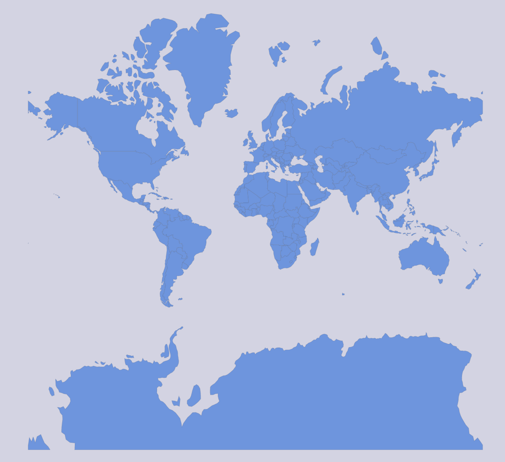
- d3.geoOrthographic() 正射投影，适合制作半球地图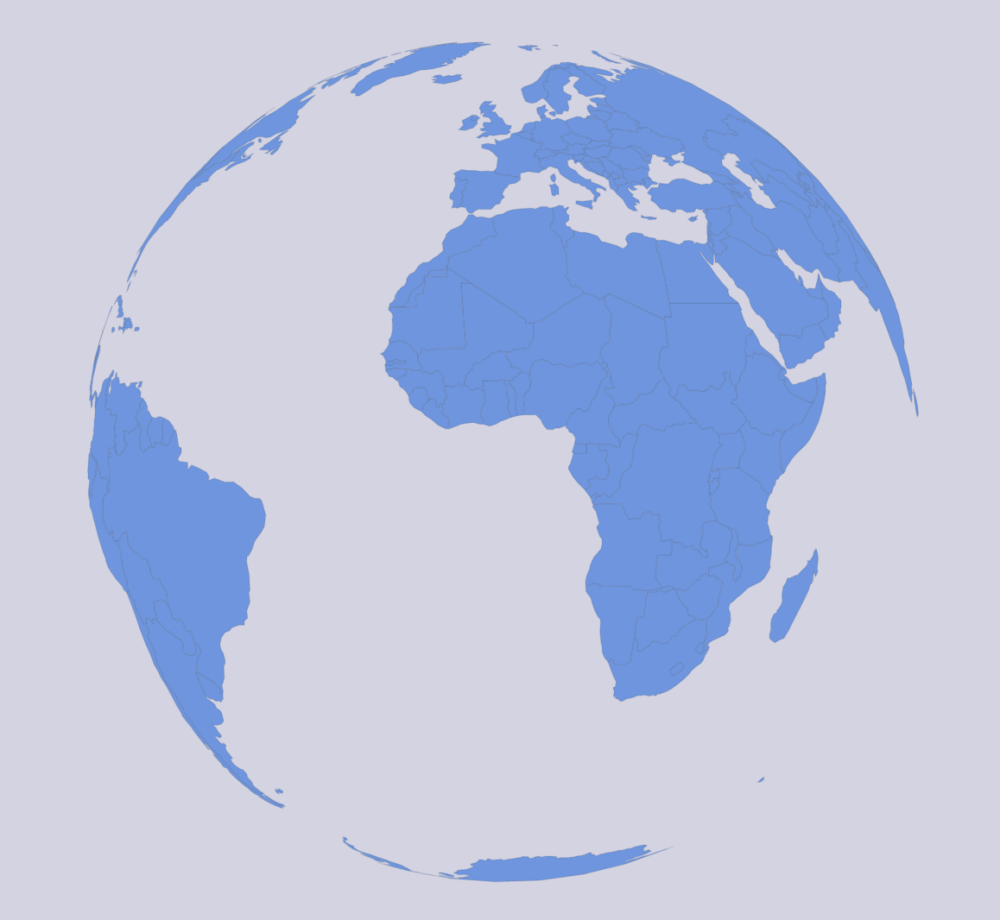
- d3.geoStereographic() 球极平面投影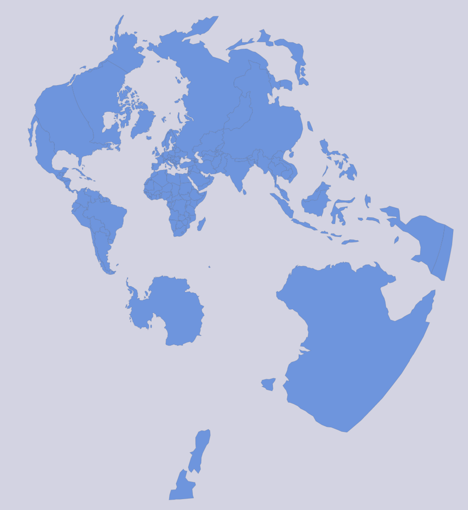
- d3.geoEquirectangular() 等距圆筒投影，包括GPS在内的大多数与地理位置相关的数据采用这个，国际通用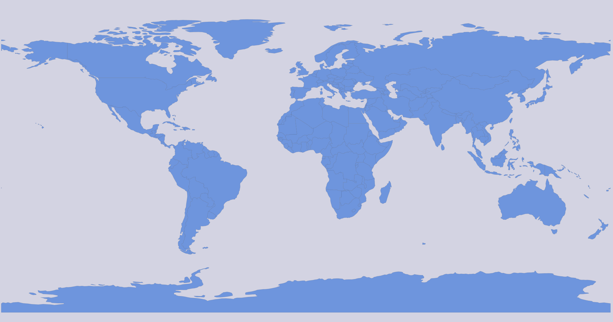
- d3.geoNaturalEarth1() 自然投影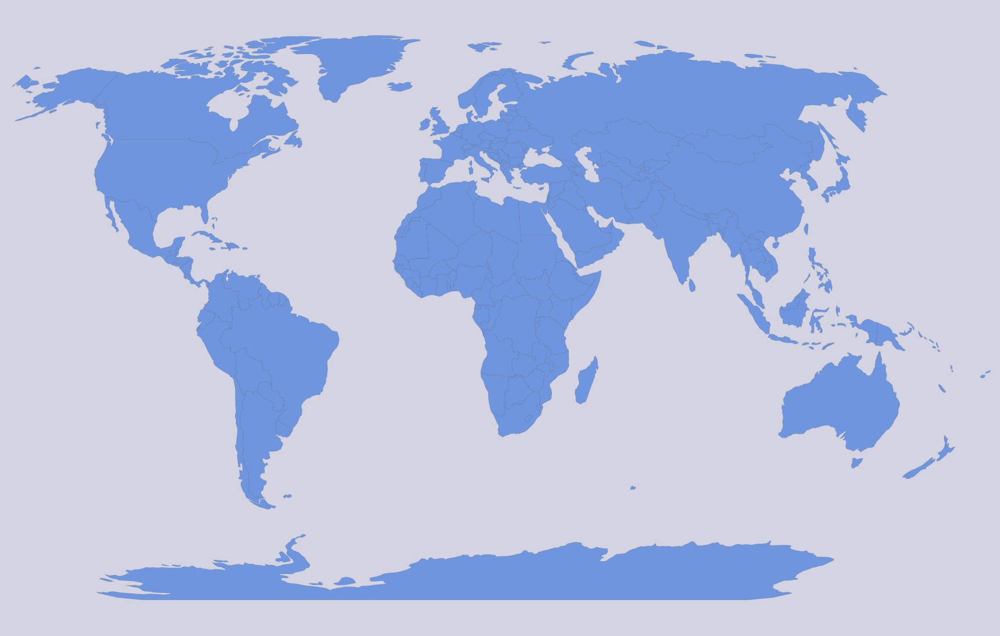
- d3.geoTransverseMercator() 横轴墨卡托投影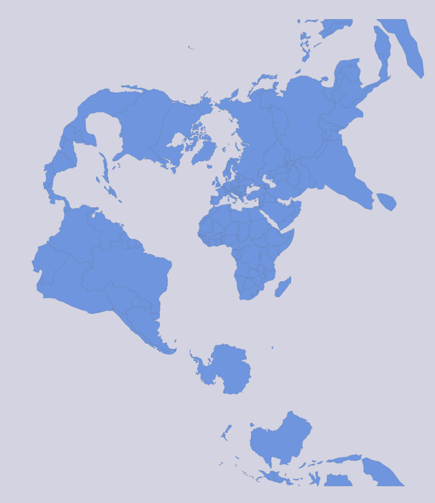


#### 投影中心

`projection.center([经度, 维度])`，默认参数为[0, 0]，即本初子午线和赤道的交汇点位于图形中心

#### 平移

`projection.translate([x, y])`，以容器原点为起点，将投影中心平移[x, y]个像素

比例尺

1. `projection.fitSize([width, height], data)`

第一个参数是数组，由地图path的宽、高组成（就像`scale.range()`）

第二个参数是地图数据，其中蕴含了地图的经纬度范围（就像`scale.domain()`）

2. `projection.scale()`

设置缩放因子，默认为150

#### 投影函数的应用

`projection([经度，维度])`返回SVG中的坐标

`projection.invert(SVG坐标)`返回经纬度

`projection.clipExtent()`设定剪切区域，剪切区域以外的内容将被减掉

### 地理路径生成器

#### 创建和生成

`d3.geoPath()`生成匿名函数，传给path selection的d属性。这个匿名函数作用于GeoJson格式的数据，便可以将其转变为DOM中path元素的d参数的value。

#### 设置点半径

`geoPath.pointRadius([radius])`

#### 计算函数

- `geoPath.area(feature)`计算指定几何体的投影面积，单位是“平方像素”。如果feature的类型为Point、MultiPoint、LineString、MultiLineString，则面积为0；如果类型为Polygon和MultiPolygon，则先计算外部环的面积，然后减去内部的空洞。
- `geoPath.centroid(feature)`计算几何体的中心，单位是像素。==在给地图加标签时很有用==
- `geoPath.bounds(feature)`计算几何体的边界框，单位是像素。

### 地图实现


### 高级技巧

#### 合并地区

`topojson.merge（topology, objects）`，objects是一个数组，包含Polygon和MultiPolygon对象。此函数能将objects中的集合体组合而成一个整体。

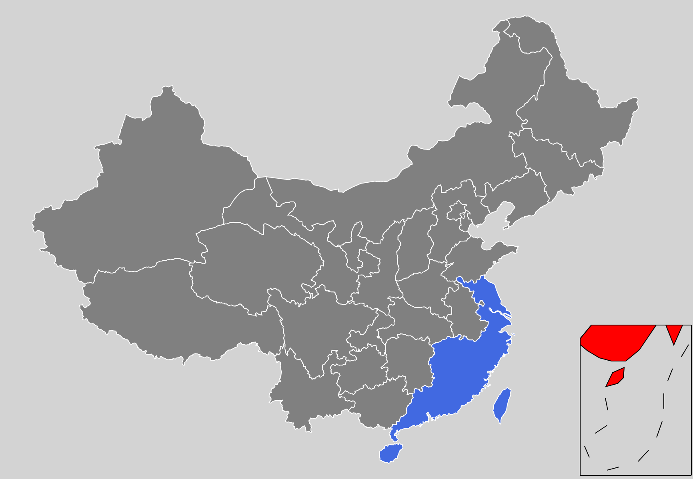

```html
<html>

<head>
  <meta charset="utf-8">
  <title>11.2.2.2 合并东南地区</title>
  <script src="../../../d3/4.x/d3.min.js"></script>
  <script src="../../../d3/topojson.js"></script>
</head>
<style>
  .svg {
    fill: gray;
  }

  .province {
    stroke: white;
    stroke-width: 1px;
    fill: gray;
  }

  .southchinasea {
    stroke: black;
    stroke-width: 1px;
    fill: red;
  }
</style>

<body>

  <script>

    const width = 900, height = 600;
    const margin = { top: 20, bottom: 20, left: 50, right: 50 };
    let innerWidth = width - margin.left - margin.right;
    let innerHeight = height - margin.top - margin.bottom;
    let color = d3.scaleOrdinal(d3.schemeCategory20); //序数颜色比例尺

    const svg1 = d3.select("body").append("svg")
      .attr("width", width).attr("height", height);
    svg1.append("rect") //一块浅灰色背景板
      .attr("width", "100%").attr("height", "100%")
      .attr("fill", "lightgray");
    const svg2 = d3.select("body").append("svg")
      .attr("width", width).attr("height", height);
    svg2.append("rect") //一块浅灰色背景板
      .attr("width", "100%").attr("height", "100%")
      .attr("fill", "lightgray");

    //geojson格式数据
    d3.json("china.geojson", function (dataGeoJson) {

      //定义地图的投影
      let projection = d3.geoMercator()
        .fitSize([innerWidth, innerHeight], dataGeoJson)
      //定义地理路径生成器
      let geoPath = d3.geoPath().projection(projection);

      groups = svg1.append("g")
        .attr("id", "mainGroup1")
        .attr("transform", `translate(${margin.left},${margin.top})`);
      groups.selectAll("path")
        .data(dataGeoJson.features)
        .enter()
        .append("path")
        .attr("class", "province")
        .attr("d", geoPath)	//使用路径生成器
        .style("fill", (d, i) => color(i))
    });


    //topojson格式数据
    d3.json("china.topojson", function (dataTopoJson) {

      //将TopoJSON对象转换成GeoJSON，保存在georoot中
      let dataGeoJson = topojson.feature(dataTopoJson, dataTopoJson.objects.china);

      //定义地图的投影
      let projection = d3.geoMercator()
        .fitSize([innerWidth, innerHeight], dataGeoJson)
      //定义地理路径生成器
      let geoPath = d3.geoPath().projection(projection);

      //东南各省名称的集合
      let southeast = d3.set([
        "广东", "海南", "福建", "浙江", "江西", "江苏", "台湾", "上海", "香港", "澳门"
      ]);

      //合并东南各省
      let mergedPolygon = topojson.merge(dataTopoJson,
        dataTopoJson.objects.china.geometries
          .filter(d => southeast.has(d.properties.name))
      );

      //绘制除了东南各省之外的中国地图，颜色为灰色
      let groups = svg2.append("g")
        .attr("id", "mainGroup2")
        .attr("transform", `translate(${margin.left},${margin.top})`);
      groups.selectAll("path")
        .data(dataGeoJson.features
          .filter(d => !southeast.has(d.properties.name)))
        .enter()
        .append("path")
        .attr("class", "province")
        .attr("d", geoPath)

      //绘制东南各省，颜色为蓝色
      groups.append("path")
        .datum(mergedPolygon)
        .attr("class", "province")
        .style("fill", "royalblue")
        .attr("d", geoPath);
    });


    //请求southchinasea.svg
    d3.xml("southchinasea.svg", function (xmlDocument) {

      svg1.html(function (d) {
        return d3.select(this).html() + xmlDocument.getElementsByTagName("g")[0].outerHTML;
      });

      d3.select(".southchinasea") //svg1引入了南海svg文件后，立即给它改一个id，然后移动。不改id的话，会与svg2引入的南海svg对象id重复，从而无法选中第二个南海进行操作
        .attr("id", "southchinasea1")
        .attr("transform", `translate(${width - margin.right - 150},${height - margin.bottom - 200})scale(1)`);

      svg2.html(function (d) {
        return d3.select(this).html() + xmlDocument.getElementsByTagName("g")[0].outerHTML;
      });

      d3.select("#southchinasea")
        .attr("id", "southchinasea2")
        .attr("transform", `translate(${width - 150},${height - 200})scale(1)`);
    });

  </script>
</body>

</html>
```

#### 绘制边界线   

`topojson.mesh（topology, object, [filter]）`，filter是一个接受二元参数的过滤器函数，返回一个布尔值

```javascript
//获取西藏和新疆的边界
var boundary = topojson.mesh(toporoot, toporoot.objects.china, function (a, b) {
    return a.properties.name === "西藏" && b.properties.name === "新疆";
});

svg.append("path").datum(boundary)
    .attr("class", "boundary")
    .attr("d", geoPath);
```

#### 查找某地区的相邻地区

`topojson.neighbors（objects）`

#### 绘制经纬线和网格

`d3.geo.graticule（）`和`d3.geo.circle（）`


### 地图应用

#### 区域关联数据

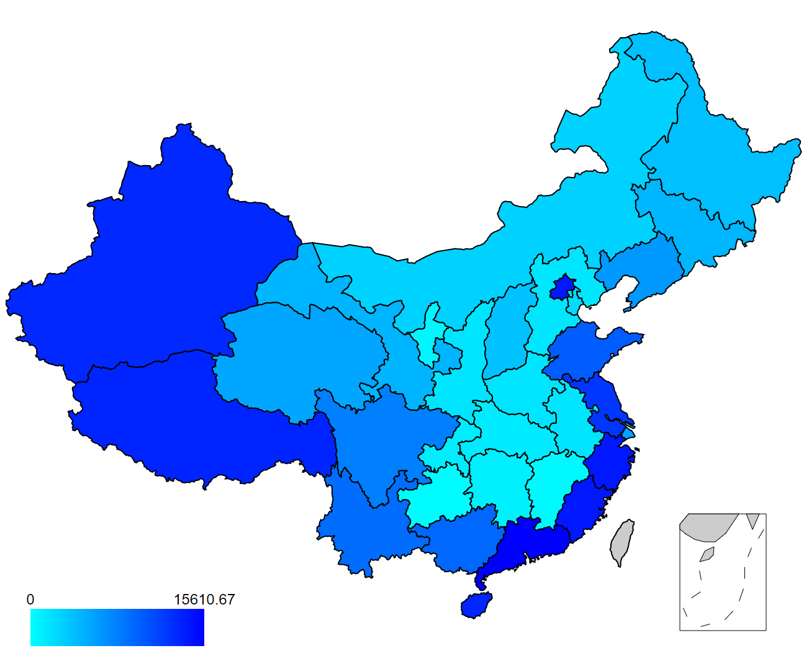

#### 经纬度坐标关联数据

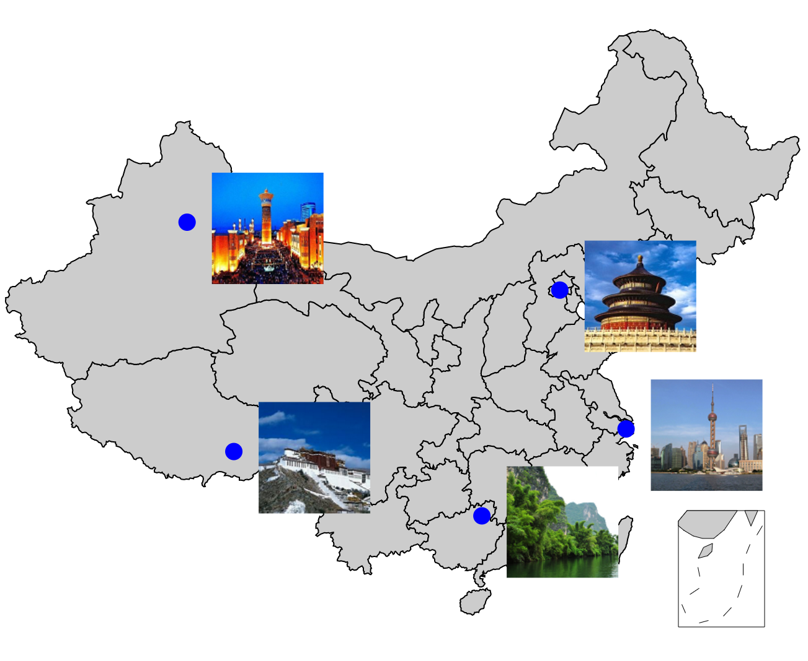


#### 起点-终点关联数据

用于绘制标线的图形元素有两种：线段元素＜line＞和路径元素＜path＞。如果是在平面地图上，且不要求两点之间有曲线，＜line＞已足够；如果是在球面地图上，或对于平面地图上的曲线，则需要使用＜path＞。标线有时带有箭头，表示方向。

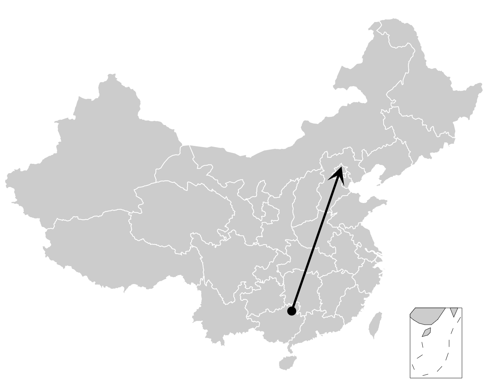


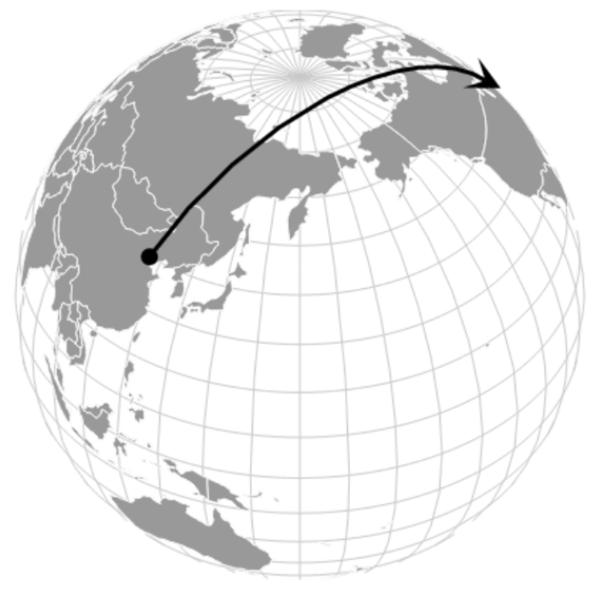

#### 可以拖拽和缩放的地图

使用百度地图或谷歌地图的时候，用户可以通过鼠标拖曳地图以观看其他地方，也可以滑动滚轮以放大或缩小地图，此功能也可能会出现在地图的可视化里。

投影里有scale（），用于控制缩放量；有translate（），用于控制平移量；有rotate（），用于控制旋转量。因此，通过修改投影，然后重绘，便可拖曳和缩放地图。

#### 力导向地图


