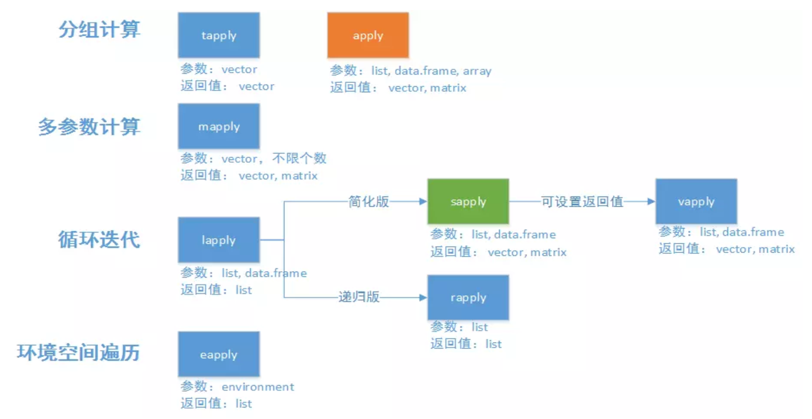

```{r setup, include = FALSE}

## global options
knitr::opts_chunk$set(
  fig.width = 6, fig.asp = 0.618,
  out.width = "80%", fig.align = "center",
  fig.path = 'Figures/', fig.show = "hold",
  warn = 1, warning = FALSE, message = FALSE, echo = TRUE, 
  comment = '', collapse = F, 
  cache = T, cache.comments = F, autodep = TRUE
  )


## use necessary packages
library('pacman')
p_load(tidyverse)
```

> 依次执行、相互依赖为循环，分别执行、相互独立为迭代。

> 迭代基本都可以使用向量化操作来实现，不需要显式循环。向量化操作函数基于C，运行效率远高于显式循环。"


# 循环

## 预先分配空间

在开始循环前，你**必须预先为输出结果分配足够的空间，这对循环效率非常重要**。

例：

```{r}
df <- tibble(
  a = rnorm(10),
  b = rnorm(10),
  c = rnorm(10),
  d = rnorm(10)
)

## 求df各列的中位数
# 预先为输出分配空间，长度为ncol(df)的向量
output <- vector("double", ncol(df)) 
# 循环计算
for (i in seq_along(df)) { 
# seq_along(df)即1:length(df)，这样写最大的好处是兼容df长度为0的情况
  output[[i]] <- median(df[[i]]) 
# 要记住使用"[["，而不是"["，因为前者是一个向量，后者是一个tibble
}
output
```

否则，就不得不使用`c()`或`rbind()`合并每次循环的结果，R会复制全部数据再赋值；因此如果在每次循环中都写这种语句，时间复杂度会是$\mathrm{O}\left(\mathrm{n}^{2}\right)$级的。

## 以一个 list 作为循环处理的中间过渡变量

更好的解决方式是将循环结果储存在一个 list 中，循环结束后再组成一个对象，对于向量元素用`unlist()`，数据框对象用`dplyr::bind_rows()`，这就像`paste()`将许多字符串合并成一个一样。

# 映射函数

R 是一门函数式编程语言，允许将函数作为参数，被另一个函数调用。purrr 包中的`map()`函数族就是利用了 R 这一强大特性。purrr 的函数都是用 C 语言实现的。

## `map_*()`的基本语法

-   map() 返回列表；
-   map_lgl() 返回逻辑型向量
-   map_int() 返回整型向量
-   map_dbl() 返回双精度型向量
-   map_chr() 返回字符型向量
-   map_dfr() 对各元素的运算产生若干个行向量，并把它们粘在一起，返回数据框
-   map_dfc() 对各元素的运算产生若干个列向量，并把它们粘在一起，返回数据框

每个函数都使用一个向量或列表（**数据框可以视为所有列排成的一个列表**）作为输入，并对向量的每个元素应用一个函数，然后返回和输入同样长度（同样名称）的一个新向量或列表。

```{r}
df %>% map_dbl(mean)
```

`map_*(data, .f, ...)` 使用 ... 向 .f 传递一些附加参数，供其在每次调用时使用。

```{r}
map_dbl(df, mean, trim = 0.5)
```

## `map_*()`参数的各种符号

### 自定义函数的定义式

还可以直接在 `map()` 参数中写一个自定义匿名函数

```{r}
models <- mtcars %>% 
  split(.$cyl) %>% 
  map(function(df) lm(mpg ~ wt, data = df))
```

还可以简写为：

```{r}
models <- mtcars %>% 
  split(.$cyl) %>% 
  map(~lm(mpg ~ wt, data = .))
```

### `~`和`.`

其中，`~`说明这是一个自定义函数；`.`是代词，指代被管道传入的对象

然后提取$\mathrm{R}^{2}$

```{r}
models %>% 
  map(summary) %>% 
  map_dbl(~.$r.squared)
```

### 字符串和整数

`map_*()`的参数还可以是字符串，提取对应的以之命名的成分；可以使整数，作为索引，提取对应位置的成分。

```{r}
models %>% 
  map(summary) %>% 
  map_dbl("r.squared")

x <- list(list(1, 2, 3), list(4, 5, 6), list(7, 8, 9))
x %>% map_dbl(2)
```

## 多参数映射

### 双参数映射

想获得均值分别为 5, 10, -3 的几个正态分布：

```{r}
mu <- list(5, 10, -3)
mu %>% 
  map(rnorm, n = 5) %>% 
  str()
```

若想获得均值、方差都不同的几个正态分布，要用`map2()`。`map2()`可以使函数对前两个参数进行操作，因而前两个参数可以都是向量或列表。即`rnorm()`所用到的参数，变化的放在其前面，不变的放在其后面。

```{r}
sigma <- list(1, 5, 10)
map2(mu, sigma, rnorm, n = 5) %>% str()
```

### 多参数映射

`pmap()`可以将一个列表作为参数。如果你想生成均值、标准差和样本数量 都不相同的正态分布，那么就可以使用这个函数：

```{r}
n <- list(5, 10, 100)
args1 <- list(n, mu, sigma)
args1 %>% 
  pmap(rnorm) %>% 
  str()
```


为了让代码更易读，应该为列表元素命名，名称分别为rnorm()的参数的名称。这样即使list中各向量的顺序不对，rnorm()也能正确识别。

```{r}
args2 <- list(mean = mu, sd = sigma, n = n)
args2 %>% 
  pmap(rnorm) %>% 
  str()
```

也可以将参数保存在数据框中

```{r}
params <- tribble(
  ~mean, ~sd, ~n,
  5, 1, 1,
  10, 5, 3,
  -3, 10, 5
)
params %>% 
  pmap(rnorm)
```

## 多参数、多函数映射

```{r}
f <- c("runif", "rnorm", "rpois")
param <- list(
  list(min = -1, max = 1),
  list(sd = 5),
  list(lambda = 10)
)
invoke_map(f, param, n = 5) %>% str()
```


```{r}
sim <- tribble(
  ~f, ~params,
  "runif", list(min = -1, max = 1),
  "rnorm", list(sd = 5),
  "rpois", list(lambda = 10)
)
sim %>% mutate(sim = invoke_map(f, params, n = 10))
```

## 游走函数

调用函数不在乎其返回值，只是为了函数内部某些指令的操作过程（如保存、打印），就应该使用游走函数族，包括 walk(), walk2() 和 pwalk()

```{r}
x <- list(1, "a", 3)
x %>% 
  walk(print)


plots <- mtcars %>% 
  split(.$cyl) %>% 
  map(~ggplot(., aes(mpg, wt)) + geom_point())
paths <- str_c(names(plots), ".pdf")
pwalk(list(paths, plots), ggsave, path = tempdir())
```

walk()、 walk2() 和 pwalk() 都会隐式地返回 .x，即第一个参数。这使得它们非常适用于管道操作。

## 其他映射函数

### 递归和累计

一个list，元素依次两两运算，每次运算得到一个同样类型的元素，再与下一个元素运算。递归函数reduce()直接得到最后的结果；累计函数accumulate()同时显示中间的步骤[^1] 。

[^1]: 例如，一个list中储存着格式一致的数据框，用rbind()将他们合并在一起，reduce()返回合并的最终结果，而accumulate()返回一个list，每个元素是合并的某一步的结果，即前k个数据框的合并。

```{r}
# 求交集
vs <- list(
c(1, 3, 5, 6, 10),
c(1, 2, 3, 7, 8, 10),
c(1, 2, 3, 4, 8, 9, 10)
)
vs %>% reduce(intersect)

# 求连乘积
x <- sample(10)
x
x %>% accumulate(`*`)
```

# 向量化运算：`*apply()`



**apply()函数有一个功能`map_*()`无法取代，那就是apply(x, 1, f)允许将行作为元素传递给f()，而`map_*()`在处理数据框时永远将列作为元素传递给f。**

更多内容详见<http://blog.fens.me/r-apply/>

## apply

`apply(A, MARGIN, function, ...)`	

参数为**矩阵或数组**。要求所有的元素都是同一种数据类型。如果误用于其它类型，如数据框，则会首先把数据转换为矩阵或数组形式，再处理。
MARGIN 表示函数的作用维度，1为对行运算，2为对列运算。

`apply(A,2,sum) `

对A矩阵的列求和。同样可以将sum换为mean,var,sd...

## lapply

`lapply(list,function,...)`

对列表、dataframe的每个对象/列分别进行操作，**返回一个新列表**

## sapply

`sapply(list,function,…,simplify=T)`

sapply相比lapply的主要优点在于使返回值看起来更友好

- simplify=F：返回值的类型是list，此时与lapply完全相同。

- simplify=T：返回值的类型由计算结果定，如果函数返回值长度为1，则sapply将list简化为vector；如果返回的列表中每个元素的长度都大于1且长度相同，那么sapply将其简化位一个矩阵"

```{r}
sapply(list,"[", 1)

# 本例中，"["是提取对象的一部分的函数，意为提取列表的所有分量的第一个元素，返回一个由这些元素组成的向量。
# "["函数的用法为："["(object, 元素位置)"	
```

```{r}
# 定义判断质数的函数
is_prime <- function(x){
  divisor <- seq(3,floor(sqrt(x)),by=2)
  notprime <- any(x%%divisor==0) 
  # divisor是一个向量，所以x%%divisor==0也变成了一个bool向量
  # any(boolVector)即向量中只要任意一个元素为true，返回true；都是false才返回false
  return(!notprime)
}

prime_sapply <- function(n){
  xx <- seq(9,n,by=2)
  a <- c(2,3,5,7,xx[sapply(xx,is_prime)])
}
print("检索100以内的质数:")
prime_sapply(100)
```

## vapply

`vapply(x, function, fun.value, ..., USE.NAMES = TRUE)`	

相比sapply可以在参数中通过fun.value设置行名，节省一行代码。	

vapply是sapply的安全升级版，如果不能按照既定模板进行输出，函数就会终止，并产生错误信息。

## mapply

`mapply(function, object1, object2, ...)`，多参数计算

对多个object按顺序执行f运算，f的参数是每个object的相应元素。即
`fuction(x[1],y[1],z[1]), fuction(x[2],y[2],z[2]), ...` 	

```{r}
set.seed(1)
x<-1:10; 
y<-5:-4; 
z<-round(runif(10,-5,5)); z
a <- mapply(max,x,y,z)
```

```{r}
firstlist<-list(A=matrix(1:16,4),B=matrix(1:16,2))
secondlist<-list(A=matrix(1:16,4),B=matrix(1:16,8))
mapply(identical,firstlist,secondlist) # identical()意为是否严格相等
```

## tapply

`tapply(X, INDEX, function, ..., simplify = TRUE)`

INDEX为用于分组的索引，对X按INDEX分组操作	
```{r}
d <- data.frame(list(gender = c("M", "M", "F", "M", "F", "F"), 
                     age = c(47, 59, 21, 32, 33, 24) , 
                     income = c(55000, 88000, 32450, 76500, 123000, 45650)))
tapply(d$income, d$gender, mean) # income先对gender分组，再求平均值
```

```{r}
x<-1:10
t<-round(runif(10,1,100)%%2);t
tapply(x,t,sum)
```

## rapply

`rapply(object, function, classes = "ANY", deflt = NULL, how = c("unlist", "replace", "list"),...)`	

有了rapply就可以对list类型的数据进行方便的数据过滤了。	
		
## eapply

环境空间遍历

## aggregate	

`aggregate(formula, data, FUN, ...,subset, na.action = na.omit)`	

```{r}
# 按cut和color分组，对price按照mean函数进行计算，数据来源为diamonds	
aggregate(price ~ cut + color, diamonds, mean)
```
		
```{r}
# plyr包的each函数，可以使aggregate使用多个函数对数据进行计算
aggregate(price~cut,diamonds,plyr::each(mean,median))
```

		

