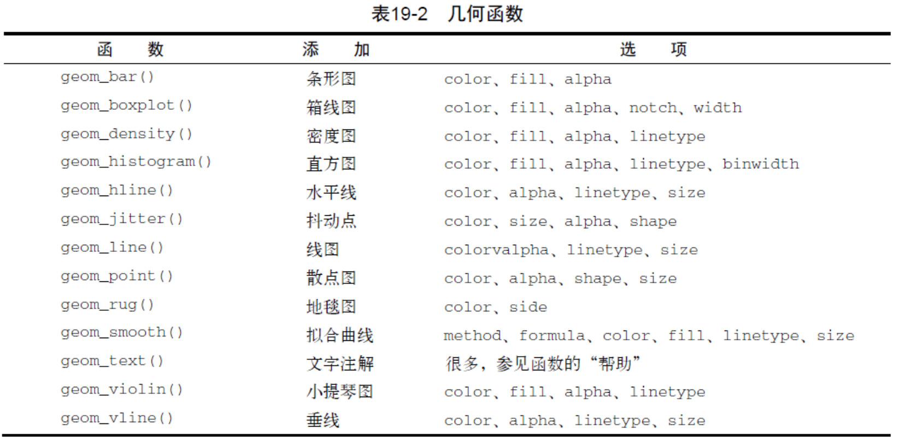
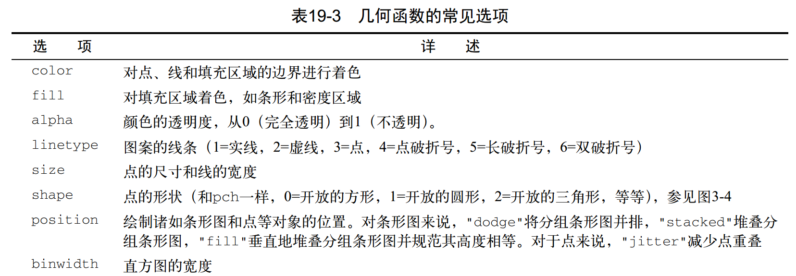
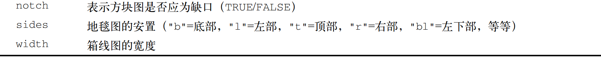
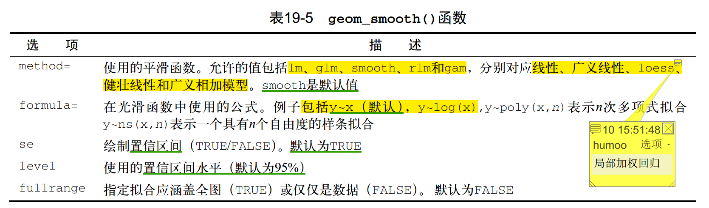
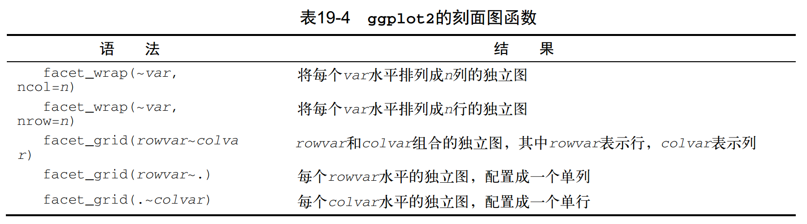
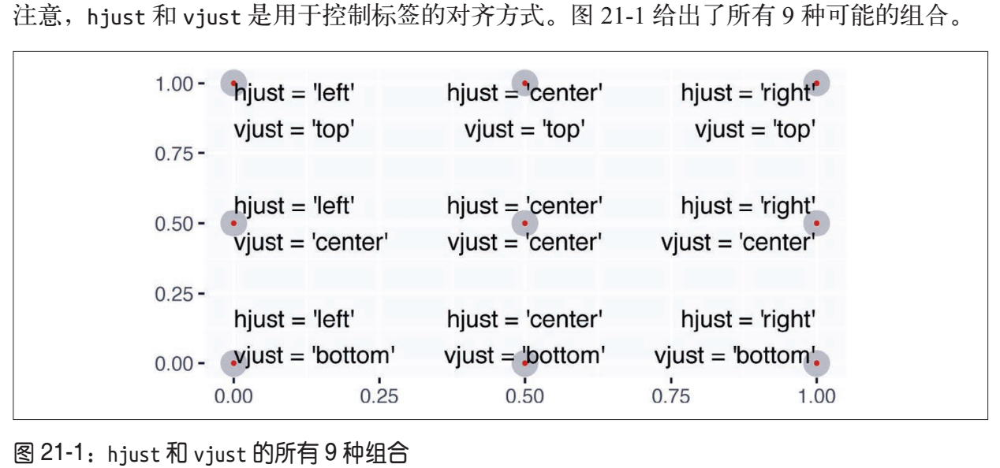
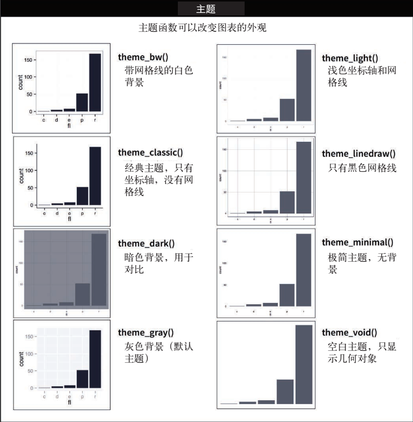

```{r global_options, include=FALSE}
knitr::opts_chunk$set(
  fig.width=6, fig.asp = 0.618,
  out.width = "70%",fig.align = "center",
  fig.path='Figs/',fig.show = "hold",
  warning=FALSE, message=FALSE, 
  cache = T, cache.comments = F, comment = '')
# fig.show='hold'，待代码块结束后再输出图片
```

```{r setup, results="hide"}
# use necessary packages
library('pacman')
p_load(tidyverse, car, readxl, xlsx, lubridate, reshape2, ggthemes, gridExtra, RColorBrewer)

# 自定义偏好字体
windowsFonts(H = windowsFont("微软雅黑"))    

# 使保存为pdf时，图支持中文，需要配合fig.showtext=TRUE选项
pdf.options(family = "GB1")
# ggplot2图形需要加一行 + theme(text = element_text(family = 'GB1'))来定义字体，才能正常显示
```

# 图形分层语法

图形语法：建立图形的一个正式语法系统，使绘图过程模块化

```{r}
# ggplot(data = <DATA>) +
   # <GEOM_FUNCTION>(     
     # mapping = aes(<MAPPINGS>), 
     # stat = <STAT>, 
     # position = <POSITION>) + 
   # <COORDINATE_FUNCTION> + 
   # <FACET_FUNCTION>
```

可以将任何图形精确地描述为**数据集(data)、几何对象(geom_function)、映射集合(aes)、统计变换(stat)、位置调整(position)、坐标系(coordinate)和刻面模式(facet)**的一种组合。

按照上述模板，可以使用代码构建你能够想象到的任何图形！

# ggplot()

> ggplot(data=NULL, mapping=aes(), ...,environment=parent.frame())  

ggplot()创建了一个坐标系，可以通过几何对象函数向其中添加需要的各种图层。
```{r}
# aes()定义了如何将数据中的变量映射为图形属性
# 本例中，将mtcars中的wt变量映射为x轴，将mpg变量映射为y轴
ggplot(mtcars, aes(x=wt, y=mpg)) +
  geom_point(pch=17, color="blue", size=2) +
  geom_smooth(method="lm", color="red", linetype=2) + 
  labs(title="Automobile Data", x="Weight", y="Miles Per Gallon")
```

# 几何对象函数

## 常用几何对象
下表列出了比较常见的几何函数，以及经常使用的选项。


```{r}
# 直方图
data(singer, package = "lattice")
 
ggplot(singer, aes(x=height)) + 
  geom_histogram()
#geom_histgrom()函数在y变量没有指定时默认对x轴变量统计频数
```

```{r}
# 箱线图
ggplot(singer, aes(x=voice.part, y=height)) + geom_boxplot()
```

## 几何对象的参数



```{r}
data(car::Salaries)
ggplot(Salaries, aes(x = rank, y = salary)) +
  geom_boxplot(fill = "cornflowerblue", # fill为填充色，color为外框色
               color = "black", notch = TRUE)+ # notch表示有缺口的箱线图
  geom_point(position = "jitter", color = "blue", alpha = .5)+ # jitter将重叠数据打散，alpha表示透明度
  geom_rug(side="l", color="black") # rug为轴须图，左侧，黑色
```


## 平滑曲线
**注意**：geom_smooth()中method参数的值都是字符串，如'lm'，不能直接method=lm

```{r, fig.show='asis'}
data(Salaries, package="car")
# 默认拟合和线性拟合
p1 <- ggplot(data=Salaries, aes(x=yrs.since.phd, y=salary)) +
  geom_point() + geom_smooth()
p2 <- ggplot(data=Salaries, aes(x=yrs.since.phd, y=salary)) +
  geom_point() + geom_smooth(method=lm)
grid.arrange(p1,p2,ncol=2)

# 按性别拟合二次多项式线性回归
ggplot(data=Salaries, aes(x=yrs.since.phd, y=salary,
                          linetype=sex, shape=sex, color=sex)) +
  geom_smooth(method=lm, formula=y~poly(x,2),se=FALSE, size=1) +
  geom_point(size=2)
```

## 多个几何对象的叠加

**当几何对象组合形成新类型的图时，ggplot2包的真正力量就会得到展现：实现多图层的叠加。**
```{r}
data(singer, package="lattice")
ggplot(singer, aes(x=voice.part, y=height)) +
  geom_violin(fill="lightblue") +
  geom_boxplot(fill="lightgreen", width=.2)
```

# 映射

ggplot()和几何对象函数的mapping参数(aes())用以定义从变量到图形属性的映射。

图形属性，即可以表示数据信息的可视化属性。

要注意，图形属性不仅包括数据点的大小、形状和颜色等，数据点的x轴位置和y轴位置本身也是图形属性。

## 全局与局部映射

如果将一组映射传递给ggplot()函数。这些映射会作为全局映射应用到图中的每个几何对象中；如果将映射放在几何对象函数中，则会成为局部映射，将扩展或覆盖全局映射，仅对该图层有效。这样一来，我们就可以在不同的图层中显示不同的图形属性。
```{r}
# x和y的映射是全局的，两个几何对象共享之
ggplot(data = mpg, mapping = aes(x = displ, y = hwy)) + 
# color的映射是局部的，仅对这一句有效
  geom_point(mapping = aes(color = class)) + 
  geom_smooth()
```

## 全局与局部数据

同理，可以为不同的图层指定不同的数据。
```{r}
ggplot(data = mpg, mapping = aes(x = displ, y = hwy)) +
  geom_point(mapping = aes(color = class)) +
  geom_smooth(data = filter(mpg, class == "subcompact"),se = FALSE)
# geom_smooth()中的局部数据参数覆盖了ggplot()中的全局数据参数
# 当然仅对这个图层有效
```

## 映射与分组
几何对象函数的mapping参数/aes()函数是一个分配分组变量的自然的地方。最基本的分组语法是将分组变量映射为图形的group属性，即aes(group=variable)，也可以将分组变量映射为其他更具视觉效果的图形属性(图中对象的可视化属性)。

在函数aes()中将图形属性名称和变量名称关联起来后，ggplot2会自动为每个变量值分配唯一的图形属性水平，这个过程称为标度变换。ggplot2还会添加一个图例，以表示图形属性水平和变量值之间的对应关系。

```{r, fig.show='asis'}
data(Salaries, package="car")

# 在aes()中用rank分组，将rank映射为图形的fill（填充色）属性
ggplot(data=Salaries, aes(x=salary, fill=rank)) +
  geom_density(alpha=.3)

# 根据sex和rank分组，共分为6组
ggplot(Salaries, aes(x=yrs.since.phd, y=salary, color=rank,shape=sex)) + 
  geom_point()
```

# 刻面

刻面(faceting)可以显示数据子集的子图。这种方法特别适合添加分类变量。



```{r}
# 刻面图
data(singer, package="lattice")
ggplot(data=singer, aes(x=height)) +
  geom_histogram() +
  facet_wrap(~voice.part, ncol=4)
# voice.part变量共有8个值，因列数为4，行数自动为2。先行后列排列
```
```{r, fig.show='asis'}
# 分组+刻面图+散点图
ggplot(Salaries, aes(x=yrs.since.phd, y=salary, color=rank,
                     shape=rank)) + 
  geom_point() + facet_grid(.~sex)
ggplot(Salaries, aes(x=yrs.since.phd, y=salary, color=rank,
                     shape=rank)) + 
  geom_point() + facet_grid(sex~.)

# 分组+刻面+密度图
data(singer, package="lattice")
ggplot(data=singer, aes(x=height, fill=voice.part)) +
  geom_density() +
  facet_grid(voice.part~.)
```


# 统计变换：ggplot2的绘图原理

很多图形绘制的是数据集的原数据，比如散点图；另外一些图形则可以绘制那些计算出的新数据，比如条形图。

```{r}
ggplot(data = diamonds) + geom_bar(mapping = aes(x = cut))
```


**绘图时用来计算新数据的算法称为stat（statistical transformation，统计变换）。**通过查看stat参数的默认值，你可以知道几何对象函数使用了哪种统计变换。

> geom_bar(mapping = NULL, data = NULL, stat = "count", position = "stack", ..., width = NULL, binwidth = NULL, na.rm = FALSE, show.legend = NA, inherit.aes = TRUE)

?geom_bar显示出stat的默认值是count，这说明geom_bar()使用stat_count()函数进行统计变换。stat_count()在文档中与geom_bar()位于同一页。想要找出由统计变换计算出的变量，可以查看帮助文件中的“Computed variables”
一节，它告诉我们stat_count()会计算出两个新变量：count和prop

通常来说，几何对象函数和统计变换函数可以互换使用。可以这样做的原因是，每个几何对象函数都有一个默认统计变换，每个统计变换函数都有一个默认几何对象。例如，可以使用stat_count()替换geom_bar()来重新生成前面那张图。
```{r}
ggplot(data = diamonds) + stat_count(mapping = aes(x = cut))
```

想要显式使用某种统计变换的3个原因如下。

## 覆盖默认的统计变换
```{r}
demo <- tribble(
  ~a, ~b,
  "bar_1", 20,
  "bar_2", 30,
  "bar_3", 40
  )

# 将geom_bar()函数的统计变换从默认的'count'改为'identity'，这样就可以将条形的高度映射为y轴变量的初始值。
ggplot(data = demo) + 
  geom_bar(mapping = aes(x = a, y = b), stat = "identity")
```

## 覆盖从统计变换生成的变量到图形属性的默认映射
```{r}
# 显示一张表示比例（而不是计数）的条形图。
ggplot(data = diamonds) + 
  geom_bar(mapping = aes(x = cut, y = ..prop.., group = 1))
```

## 在代码中强调统计变换
可以使用stat_summary()函数将人们的注意力吸引到你计算出的那些摘要统计量上。stat_summary()函数为x的每个唯一值计算y值的摘要统计。
```{r}
ggplot(data = diamonds) + 
  stat_summary(mapping = aes(x = cut, y = depth),fun.ymin = min,fun.ymax = max,fun.y = median)
```

ggplot2提供了20多个统计变换以供你使用。每个统计变换都是一个函数，因此你可以按照通用方式获得帮助，例如?stat_bin。如果想要查看全部的统计变换，可以使用ggplot2速查表。

# 位置调整

position参数|含义
-------|-----
'identity'|不调整位置
'dodge'|并列放置，如簇状条形图
'stack'|堆叠放置
'fill'|堆叠且显示比例
'jitter'|加入随机扰动防止图形重合


```{r}
# position='identity',将每个对象直接显示在图中，原地不动，不调整位置。
ggplot(diamonds,aes(x = cut, fill = clarity)) + # 没有映射y轴，geom_bar()默认计数
  geom_bar(position = "identity") 

ggplot(diamonds,aes(x = cut, color = clarity)) +
  geom_bar(fill = NA, position = "identity")
```

```{r}
# position="fill"，堆叠显示比例(计数后求比例)
ggplot(diamonds) +
  geom_bar(aes(cut, fill=clarity), position="fill")
```

```{r}
# position="dodge"，并列显示
ggplot(diamonds) +
  geom_bar(aes(cut, fill=clarity), position="dodge")
```

```{r}
# position="stack"，堆叠显示
ggplot(diamonds) +
  geom_bar(aes(cut, fill=clarity), position="stack")
```

```{r, fig.show='asis'}
# position="jitter"，添加随机扰动，防止散点重叠
ggplot(data = mpg) +
  geom_point(aes(displ, hwy))

ggplot(data = mpg) +
  geom_point(aes(displ, hwy),position = "jitter")

# 或用函数geom_jitter()实现
ggplot(data = mpg, aes(x=displ, y=hwy)) +
  geom_point() + geom_jitter()
```


# 坐标系
ggplot2中最复杂的部分

## 交换x轴和y轴 coord_flip() 
当想要绘制水平箱线图时，这非常有用。它也非常适合变量长标签的使用，否则在x轴上不重叠地安排好它们是非常困难的。
```{r, fig.show='asis'}
ggplot(mpg, mapping = aes(x = class, y = hwy)) +
  geom_boxplot()

ggplot(mpg, mapping = aes(x = class, y = hwy)) +
  geom_boxplot() +
  coord_flip()
```

## 为地图设置合适的纵横比 coord_quickmap() 

```{r, fig.show='asis'}
nz <- map_data("nz")
ggplot(nz, aes(long, lat, group = group)) +
  geom_polygon(fill = "white", color = "black")
ggplot(nz, aes(long, lat, group = group)) +
  geom_polygon(fill = "white", color = "black") +
  coord_quickmap()
```

## 极坐标系 coord_polar() 
```{r, fig.show='asis'}
bar <- ggplot(data = diamonds) +
  geom_bar(aes(x = cut, fill = cut),
           show.legend = FALSE,width = 1) +
  theme(aspect.ratio = 1) +
  labs(x = NULL, y = NULL)

bar + coord_flip()
bar + coord_polar()
```

## 对数坐标轴
```{r}
ggplot(diamonds, aes(carat, price)) +
  geom_bin2d()

ggplot(diamonds, aes(carat, price)) +
  geom_bin2d() +
  scale_x_log10() +
  scale_y_log10()
```

## 缩放：控制图形显示的范围

由三种方法：

* 调整绘图所用数据（取子集）

* 设置标度范围（缩小标度范围的效果基本等同于对数据取子集）

* **在coord_cartesian()函数中设置xlim和ylim参数值（推荐）**

```{r}
# 比较两种方法
ggplot(mpg, mapping = aes(displ, hwy)) + 
  geom_point(aes(color = class)) +
  geom_smooth() +
  coord_cartesian(xlim = c(5, 7), ylim = c(10, 30))

mpg %>%
  filter(displ >= 5, displ <= 7, hwy >= 10, hwy <= 30) %>%
  ggplot(aes(displ, hwy)) +
  geom_point(aes(color = class)) +
  geom_smooth() # 数据取子集使拟合曲线的置信区间变得很宽
```


```{r}
# 在两张图形中使用相同的标度
suv <- mpg %>% filter(class == "suv")
compact <- mpg %>% filter(class == "compact")

range_displ <- range(mpg$displ)
range_hwy <- range(mpg$hwy)
# color使用全集的标度，保证颜色的一致性
col_scale <- scale_color_discrete(limits = unique(mpg$drv)) 

ggplot(suv, aes(displ, hwy, color = drv)) +
  geom_point() +
  col_scale +
  coord_cartesian(xlim = range_displ, ylim = range_hwy)

ggplot(compact, aes(displ, hwy, color = drv)) +
  geom_point() +
  col_scale +
  coord_cartesian(xlim = range_displ, ylim = range_hwy)
```

# 进一步的注释和美化(与数据无关)

## 注释性图层之一：标题、坐标轴和图例的名称 

> labs(..., title = waiver(), subtitle = waiver(), caption = waiver(),
  tag = waiver())

### 标题、副标题和下标
title = ''，主标题
使用图形标题的目的是概括主要成果。尽量不要使用那些只对图形进行描述的标题，如“发动机排量与燃油效率散点图”

subtitle = ''，副标题
可以在标题下以更小的字体添加更多附加信息

caption = ''，下标
caption 可以在图形右下角添加文本，常用于描述数据来源
```{r}
ggplot(mpg, aes(displ, hwy)) +
  geom_point(aes(color = class)) +
  geom_smooth(se = FALSE) +
  labs( 
    title = paste("Fuel efficiency generally decreases with","engine size"),
    subtitle = paste("Two seaters (sports cars) are an exception",
                     "because of their light weight"),
    caption = "Data from fueleconomy.gov")
```

###  坐标轴和图例的标题
使用labs()的参数设置来替换坐标轴和图例中的标题，将简短的变量名称替换为更详细的描述并加上单位
```{r, fig.show='asis'}
# 气泡图
ggplot(mtcars, aes(x=wt, y=mpg, size=disp)) + # 将disp变量映射为图形的size属性，本例中即为散点的大小。同时生成size图例
  geom_point(shape=21, color="black", fill="cornsilk") + # shape=21表示散点取有框圆形（不同于单一颜色的小圆点）
  labs(x="Weight (1000 lbs)", y="Miles/(US) gallon",
       title="Bubble Chart", size="Engine\nDisplacement (cu.in.)") # labs()中的size意为对图例添加标签
```

### 在标题中使用数学公式quote()代替字符串文本
使用?plotmath命令查看可用选项
```{r}
df <- tibble(
  x = runif(10),
  y = runif(10)
)

ggplot(df, aes(x, y)) +
  geom_point() +
  labs(
    x = quote(sum(x[i] ^ 2, i == 1, n)),
    y = quote(alpha + beta + frac(delta, theta)))
```

## 注释性图层之二：图内的标签和说明

> geom_text()和ggrepel::geom_text_repel()图层，添加数据标签

> geom_label()和ggrepel::geom_label_repel()图层，添加文本框

### 数据点旁的标签
```{r, fig.show='asis'}
# 先选取出每类汽车中效率最高的型号，然后在图形中标记出来
best_in_class <- mpg %>%
  group_by(class) %>%
  filter(row_number(desc(hwy)) == 1) # desc()排序


ggplot(mpg, aes(displ, hwy)) + # 全局映射和全局数据
  geom_point(aes(color = class)) +
  geom_text(aes(label = model), data = best_in_class) # 用局部数据添加标签

ggplot(mpg, aes(displ, hwy)) +
  geom_point(aes(color = class)) +
  geom_label(aes(label = model), data = best_in_class, 
             nudge_y = 2,alpha = 0.5) # nudge_y参数可以调整标签相对于数据点的位置

# ggrepel包非常有用，可以自动调整标签的位置，使它们免于重叠
ggplot(mpg, aes(displ, hwy)) +
  geom_point(aes(color = class)) +
  geom_point(size = 3, shape = 1, data = best_in_class) + 
  # 添加了一个图层，用较大的空心圆来强调添加了标签的数据点
  ggrepel::geom_label_repel(aes(label = model),data = best_in_class)


# 将标签直接放在图形上，以替代图例
# 分组，对每组取数据分布的中位数，在该处放置组名
class_avg <- mpg %>%
  group_by(class) %>%
  summarize(displ = median(displ),hwy = median(hwy))

ggplot(mpg, aes(displ, hwy, color = class)) +
  ggrepel::geom_label_repel(aes(label = class), data = class_avg, size = 6,
                            label.size = 0, segment.color = NA) +
  geom_point() +
  theme(legend.position = "none") # 不显示图例
```

### 图中空白处的说明

创建一个数据点，位置在空白处，借这个数据添加标签
```{r, fig.show='asis'}
# 创建只有一个观测的数据框，用以保存标签的坐标
label <- mpg %>% 
  summarize(displ = max(displ),hwy = max(hwy),
            label = paste("Increasing engine size is \nrelated to",
                          "decreasing fuel economy.")
            )

ggplot(mpg, aes(displ, hwy)) +
  geom_point() +
  geom_text(aes(label = label),data = label,vjust = "top",hjust = "right")


# 如果想让标签紧贴着图形的边界，可以使用+Inf和-Inf值
label <- tibble(displ = Inf,hwy = Inf,
                label = paste(
                  "Increasing engine size is \nrelated to",
                  "decreasing fuel economy.")
                )

ggplot(mpg, aes(displ, hwy)) +
  geom_point() +
  geom_text(aes(label = label),data = label,vjust = "top",hjust = "right")


# 自动为标签断行的方法
"Increasing engine size related to decreasing fuel economy." %>%
stringr::str_wrap(width = 40) %>%
writeLines()
```

### vjust和hjust参数

设置标签相对于坐标的对齐方式



## 其他注释性图层

* 可以使用geom_hline()和geom_vline()添加参考线。我们经常使用加粗（size = 2）和白色（color = white）的直线作为参考线，并将它们绘制在基本数据层的下面。这样的参考线既清晰可见，又不至于喧宾夺主，影响我们查看数据。

* 可以使用geom_rect()在我们感兴趣的数据点周围绘制一个矩形。矩形的边界由图形属性 xmin、 xmax、 ymin 和 ymax 确定。

* 可以使用geom_segment()及arrow参数绘制箭头，指向需要关注的数据点。使用图形属性 x 和 y 来定义开始位置，使用 xend 和 yend 来定义结束位置。


## 标度

### 标度的命名模式和用途

如果输入以下代码：

> ggplot(mpg, aes(displ, hwy)) + 
>   geom_point(aes(color = class))

ggplot2 会自动在后台为代码添加默认标度：

> ggplot(mpg, aes(displ, hwy)) +
>   geom_point(aes(color = class)) +
>   scale_x_continuous() +
>   scale_y_continuous() +
>   scale_color_discrete()

标度的命名模式：scale_图形属性的名称_标度的名称。
默认情况下，标度是以变量最可能的类型来命名的：连续型、离散型、日期时间型或日期型。还有很多非默认标度，我们会在后面的内容中进行介绍。


基于以下两种原因，你可以不使用默认标度。
（1）你或许要对默认标度的一些参数进行调整。例如，当想要修改坐标轴刻度或图例中的项目标签时，就需要进行这些调整。
（2）你或许想要整体替换默认标度，从而使用一种完全不同的算法。因为你对数据更加了解，所以使用与默认方式不同的标度通常能达到更好的效果。


### 坐标轴刻度与图例项目

坐标轴和图例统称为引导元素。坐标轴用于表示x和y图形属性；图例则用于表示其他的引导性信息。

参数breaks控制坐标轴刻度的位置，以及与图例项目相关的数值显示。labels控制与每个坐标轴刻度或图例项目相关的文本标签。

```{r}
# breaks的最常见用途是替换默认的刻度
data(Salaries,package="car")
ggplot(data=Salaries, aes(x=rank, y=salary, fill=sex)) +
  geom_boxplot() +
  scale_x_discrete(breaks=c("AsstProf", "AssocProf", "Prof"),
                   labels=c("Assistant\nProfessor",
                            "Associate\nProfessor",
                            "Full\nProfessor")) +
  scale_y_continuous(breaks=c(50000, 100000, 150000, 200000),
                     labels=c("$50K", "$100K", "$150K", "$200K")) +
  labs(title="Faculty Salary by Rank and Sex", x="", y="")
```

还可以将labels设置为 NULL，这样可以不显示刻度标签，对于地图或不适合展示数值的图表来说，这种方式是非常有用的。
```{r}
ggplot(mpg, aes(displ, hwy)) +
  geom_point() +
  scale_x_continuous(labels = NULL) +
  scale_y_continuous(labels = NULL)
```

对于日期型和日期时间型标度来说，刻度和标签的格式有一些不同

* date_labels 接受一个格式说明，说明的形式与 parse_datetime() 函数中的相同   

* date_breaks（这个示例中没有出现）则使用类似“2 天”或“1 个月”这样的字符串
```{r}
# 需要使用breaks的另一种情况：数据点相对较少，又想要强调观测的确切位置
# 例如，以下图形展示了每位美国总统任期的开始时间和结束时间：
presidential %>%
  mutate(id = 33 + row_number()) %>%
  ggplot(aes(start, id)) +
  geom_point() +
  geom_segment(aes(xend = end, yend = id)) + # geom_segment()图层绘制箭头
  scale_x_date(NULL,breaks = presidential$start,date_labels = "'%y")
```

## 图例布局

theme()中的legend.position可以控制图例的整体位置：
```{r}
base <- ggplot(mpg, aes(displ, hwy)) + 
  geom_point(aes(color = class))

base + theme(legend.position = "left")
base + theme(legend.position = "top")
base + theme(legend.position = "bottom")
base + theme(legend.position = "right") # 默认设置
base + theme(legend.position = "none")
```

也可以指定一个二元素向量，表示图例的中心相对于整张图左下角的距离（都用比例表示）
```{r}
data(Salaries,package="car")
ggplot(data=Salaries, aes(x=rank, y=salary, fill=sex)) +
  geom_boxplot() +
  scale_x_discrete(breaks=c("AsstProf", "AssocProf", "Prof"),
                   labels=c("Assistant\nProfessor",
                            "Associate\nProfessor",
                            "Full\nProfessor")) +
  scale_y_continuous(breaks=c(50000, 100000, 150000, 200000),
                     labels=c("$50K", "$100K", "$150K", "$200K")) +
  labs(title="Faculty Salary by Rank and Gender",
       x="", y="", fill="Gender") +
  theme(legend.position=c(0.1,0.8)) 
# 图例中心相对于整张图左下角的距离，0.1和0.8都是相对于整个画面的比例
```

要想控制单个图例的显示，可以配合guide_legend()（负责离散型图例）或guide_colorbar()（负责连续型图例）来使用guides()
```{r}
ggplot(mpg, aes(displ, hwy)) +
  geom_point(aes(color = class)) +
  geom_smooth(se = FALSE) +
  theme(legend.position = "bottom") +
  guides(color = guide_legend(nrow = 1,override.aes = list(size = 4)))
# nrow使图例排列为1行，size = 4使图例中的数据点更大一些
```


## 主题
theme()可以定制图形中的非数据元素，使图表有自己的风格，在做图表时不考虑格式，最后一次性应用主题。

### ggplot2内置的八种主题


默认主题使用灰色背景，这样可以在网格线可见的情况下更加突出数据。白色网格线既是可见的（这非常重要，因为它们非常有助于位置判定），又对视觉没有什么严重影响，我们完全可以对其视而不见。图表的灰色背景不像白色背景那么突兀，与文本印刷颜色非常相近，保证了图形与文档其他部分浑然一体。最后，灰色背景可以创建一片连续的颜色区域，使图形成为形象鲜明的一个独立视觉实体。

### 自定义主题

参数|设置的对象
----|--
plot.title|图标题
plot.caption|图标注（一般是资料来源）
axis.title|轴标题
axis.text|轴标签
panel.background|画图区域（fill填充，color边框）
panel.grid.major.y|y轴（水平）主网格
panel.grid.minor.y|y轴（水平）次网格
panel.grid.major.x|x轴（竖直）主网格
panel.grid.minor.x|x轴（竖直）次网格
legend.position|图例的位置
legend.title|图例的标题
legend.text|图例各项的文字


```{r}
data(Salaries, package="car")

# 定义自己的主题mytheme
mytheme <- 
  theme(plot.title=element_text(face="bold.italic", 
                                size=14, color="brown"),
    axis.title=element_text(face="bold.italic",size=10,
                            color="brown"),
    axis.text=element_text(face="bold", size=9,
                           color="darkblue"),
    panel.background=element_rect(fill="white",
                                  color="darkblue"),
    panel.grid.major.y=element_line(color="grey",linetype=1),
    panel.grid.minor.y=element_line(color="grey",linetype=2),
    panel.grid.major.x = element_blank(),
    panel.grid.minor.x = element_blank(),
    legend.position="top")

# 在画图时，应用自己的主题mytheme
ggplot(Salaries, aes(x=rank, y=salary, fill=sex)) +
  geom_boxplot() +
  labs(title="Salary by Rank and Sex", x="Rank", y="Salary")+
  mytheme
```


### 套用现成主题：ggthemes包
```{r}
ggplot(Salaries, aes(x=rank, y=salary, fill=sex)) +
  geom_boxplot() +
  labs(title="Salary by Rank and Sex", x="Rank", y="Salary")+
  theme_wsj()+
  scale_fill_wsj()

ggplot(Salaries, aes(x=rank, y=salary, fill=sex)) +
  geom_boxplot() +
  labs(title="Salary by Rank and Sex", x="Rank", y="Salary")+
  theme_wsj()+
  scale_fill_wsj("rgby", "")+
  theme(axis.ticks.length=unit(0.5,'cm'))+
  guides(fill=guide_legend(title=NULL))

ggplot(Salaries, aes(x=rank, y=salary, fill=sex)) +
  geom_boxplot() +
  labs(title="Salary by Rank and Sex", x="Rank", y="Salary")+
  theme_economist(base_size=14)+
  scale_fill_economist()+
  theme(axis.ticks.length=unit(0.5,'cm'))+
  guides(fill=guide_legend(title=NULL))
```


## 多重图
mfrow参数和layout()组合图形的方法对于ggplot图形不适用，因为ggplot2包认为它提供的刻面功能已经足够了。

为了组合ggplot图形，需要使用gridExtra包中的函数

### grid.arrange()可以组合多幅图
```{r}
data(Salaries, package="car")
# ggplot()画的图可以保存为一个对象！
p1 <- ggplot(data=Salaries, aes(x=rank)) + geom_bar()
p2 <- ggplot(data=Salaries, aes(x=sex)) + geom_bar()
p3 <- ggplot(data=Salaries, aes(x=yrs.since.phd, y=salary)) + geom_point()

library(gridExtra)
grid.arrange(p1, p2, p3, ncol=3)
```

### arrangeGrob()则可以处理一个由图对象组成的列表（循环作图时很有用）
```{r}
p = list(p1, p2, p3)
graph <- arrangeGrob(grobs = p, ncol = 3)
grid.arrange(graph)
```


## 配色

### 创建调色板

#### 与色彩相关的函数
函数|功能
----|----
palette()|调色板
colors()|生成R的颜色
rgb()|生成颜色编码
col2rgb()|将颜色转为rgb色值。
rgb2hsv(col2rgb("blue"))|

#### R自带的六个调色板

传入获取颜色的个数，就获得相应个数的颜色列表，gray()的参数需在[0,1]。

rainbow()

heat.colors()

terrain.colors()

topo.colors()

cm.colors()

gray()

#### RColorBrewer包
```{r, fig.width=10, fig.height=10}
# 通过下列代码观察预先设定的颜色集
library(RColorBrewer)
display.brewer.all()
```

#### ggthemes包

其中的色彩方案都是打包好，命名过的，引用的时候，只需赋值即可。

### 颜色替换
将变量映射为颜色时，默认以一种非常均匀的方式在色环上选择颜色；如果不喜欢，可以进行颜色特换

#### 替换为预先设定的调色板

使用scale_color_brewer()和scale_fill_brewer()来替换调色板。其中，scale_color_x()对应于color图形属性，scale_fill_x()则对应于fill图形属性

```{r}
# 常用的一种配色方式是使用ColorBrewer标度。
# 以下的两幅图非常相似，但右边图中（Set1调色板）的红色和绿色的对比更加强烈
# 即使患有红绿色盲症的人也可以区别出来
p1 <- ggplot(mpg, aes(displ, hwy)) +
  geom_point(aes(color = drv))

p2 <- ggplot(mpg, aes(displ, hwy)) +
  geom_point(aes(color = drv)) +
  scale_color_brewer(palette = "Set1")

grid.arrange(p1, p2, ncol=2)
```

```{r}
# 如果只有很少几种颜色，可以再添加一种形状映射
# 虽然有些冗余，但这样可以确保图表在黑白方式下也可以为人所理解
ggplot(mpg, aes(displ, hwy)) +
  geom_point(aes(color = drv, shape = drv)) +
  scale_color_brewer(palette = "Set1")
```

#### 手动指定颜色

通过scale_color_manual()，可以自己指定颜色

```{r}
presidential %>%
  mutate(id = 33 + row_number()) %>%
  ggplot(aes(start, id, color = party)) +
  geom_point() +
  geom_segment(aes(xend = end, yend = id)) +
  scale_colour_manual(values = c(Republican = "red", Democratic = "blue"))
```

#### 其他颜色标度
对于连续的颜色标度，可以使用内置函数scale_color_gradient()或scale_fill_gradient() 来表示。如果想要表示发散性的颜色标度，可以使用scale_color_gradient2()函数，它可以使用正数和负数来表示不同的颜色。如果想要区分出位于平均值以上和以下的点，那么这个函数是非常合适的。

另一个可以选用的函数是由viridis包提供的scale_color_viridis()，它是对ColorBrewer分类标度的一种连续模拟。以下是来自于 viridis 使用指南中的一个示例：
```{r}
df <- tibble(
  x = rnorm(10000),
  y = rnorm(10000)
)

p1 <- ggplot(df, aes(x, y)) +
  geom_hex() +
  coord_fixed()

p2 <- ggplot(df, aes(x, y)) +
  geom_hex() +
  viridis::scale_fill_viridis() +
  coord_fixed()

grid.arrange(p1, p2, ncol=2)
```


# 保存图形ggsave()

```{r}
# 稍详细的设置，保存到当前目录
myplot <- ggplot(mpg, aes(displ, hwy)) + geom_point()
ggsave(file="mygraph.png", plot=myplot, 
       width=5, height=4)

# 简略设置，自动保存最新创建的图
ggplot(mpg, aes(displ, hwy)) + geom_point()
ggsave(file="mygraph.pdf")
```

## 图形尺寸

* fig.width和fig.asp设置R生成的图形（并非向文档输出的图形）的宽度和宽高比（默认黄金比例）。如果需要修改，建议只改宽高比。
* out.width和out.height设置图片在输出文档中的宽高。out.width将宽度设置为行宽的百分比，默认设置为out.width = "70%" 和fig.align = "center"。这样一来，图形既不会占用过多空间，也不会显得太拥挤。
* 如果想在一行中放置多个图形，可以将out.width设置为50%以放置2个图形、设置为33%以放置3个图形，或者设置为25%以放置4个图形，同时还要设置fig.align ="default"
* 如果想要为图形添加说明文字，可以使用fig.cap。在RMarkdown中，这样做会将图形从“内联”模式修改为“浮动”模式。

## 输出高清光栅图(用于Office)

>  注：由于MS office对矢量图的支持很差，当生成用于word的图像时，可以将ggsave()的参数dpi（光栅图形的分辨率）设置为600（默认为300），用于向word的高品质图形输出。