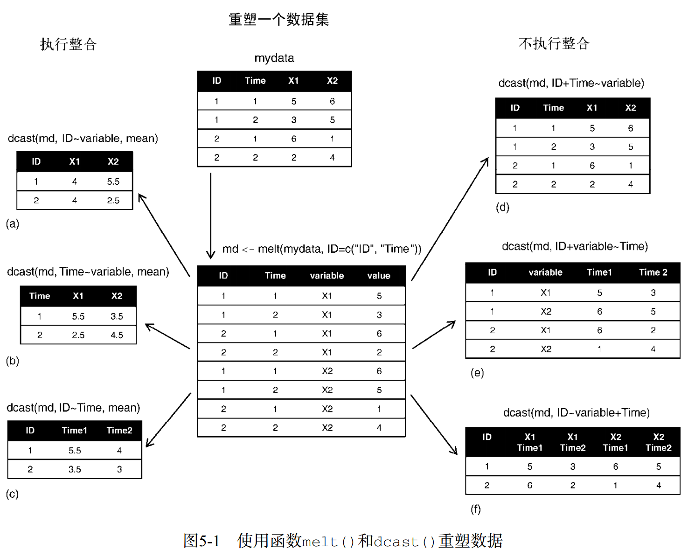

```{r setup, include = FALSE}

## global options
knitr::opts_chunk$set(
  fig.width = 6, fig.asp = 0.618,
  out.width = "80%", fig.align = "center",
  fig.path = 'Figures/', fig.show = "hold",
  warn = 1, warning = FALSE, message = FALSE, echo = TRUE, 
  comment = '', collapse = F, 
  cache = T, cache.comments = F, autodep = TRUE
  )


## use necessary packages
library('pacman')
p_load(tidyverse, lubridate, data.table, # 数据整理，最新版tidyverse已包含管道操作符
       ggthemes, showtext, gridExtra, # 可视化
       lmtest, plm, orcutt, stats, forecast, zoo, # 统计分析  
       rvest, httr, xml2, # 爬虫
       sqldf, DT, # I/O，其中sqldf包含了RSQLite包
       jiebaR, wordcloud2, webshot, htmlwidgets, tidytext # 文本分析
       )
options(sqldf.driver = "SQLite") 


## pdf中图形内部的中文字体设置
pdf.options(family = "GB1")
# 安装字体文件
# font_add('YaHei','MS YaHei.ttf')
windowsFonts(YaHei = windowsFont("Microsoft YaHei"))
showtext_auto(enable = TRUE)
# 包含图的代码块需要fig.showtext = TRUE选项
# ggplot2图形需要在主题中显式指定中文字体才能正常显示图中的中文


## 自定义一般图形主题
mytheme <- theme_economist_white() +
  theme(text = element_text(family = 'YaHei'),
        plot.title = element_text(face = 'bold', size = 14), 
        plot.subtitle = element_text(size = 12),
        plot.caption = element_text(hjust = 0, size = 10, margin = margin(2,0,0,0,'pt')),
        plot.margin = margin(12,10,12,0,'pt'),
        legend.position = 'top',
        legend.justification = 'left',
        legend.margin = margin(4,0,0,0,'pt'),
        legend.key.size = unit(1,'lines'),
        legend.title = element_text(size = 12),
        legend.text = element_text(size = 10, margin = margin(0,0,0,0,'pt')),
        axis.text = element_text(size = 10, margin = margin(2,0,2,0,'pt')),
        axis.ticks.length = unit(-4,'pt')
        )

# 自定义柱状图主题
theme_bar <- theme_economist_white() +
  theme(text = element_text(family = 'YaHei'), # 所有的文本字体
        plot.title = element_text(face = 'bold', size = 14), 
        plot.subtitle = element_text(size = 12),
        plot.caption = element_text(hjust = 0, size = 10,
                                    margin = margin(0,0,0,0,'pt')),
        plot.margin = margin(12,0,12,10,'pt'),
        legend.position = 'top',
        legend.justification = 'left',
        legend.margin = margin(4,0,0,0,'pt'),
        legend.key.size = unit(0.7,'lines'),
        legend.title = element_blank(),
        legend.text = element_text(size = 10, margin = margin(0,8,0,4,'pt')),
        axis.text = element_text(size = 10),
        axis.ticks.length = unit(0,'pt') # 不要坐标轴须
        )
```


# 处理缺失值

## 删除含缺失值的行 `drop_na()`

`tidyr::drop_na()` 可以对数据框指定一到多个变量，删去指定的变量有缺失值的行。**不指定变量时有任何变量缺失的行都会被删去**，此时功能同 `na.omit()`。

## 填充缺失值

- `tidyr::fill(data, ..., direction=c("down", "up"))`，填充缺失值，填充值根据参数是缺失值附近的数值

- `tidyr::replace_na(data, replace=list(), ...)`，将数据中的缺失值替换为别的值


# 拆分、合并数据列 

## 拆分列

`tidyr::separate()`，有时应该放在不同列的数据用分隔符分隔后放在同一列中了，应拆开。一般可用于日志数据或日期时间型数据的拆分。

```r
separate(data, col, into, sep = "[^[:alnum:]]+", remove = TRUE, convert = FALSE, extra = "warn", fill = "warn", ...)
```

- col：需要被拆分的列，列名或位置索引均可
- into：拆分后新建的列名，为字符串向量
- sep：被拆分列的分隔符
- remove：是否删除被分割的列 
- convert=TRUE 要求自动将分割后的值转换为适当的类型

```{r}
d.sep <- read_csv("testid, succ/total
1, 1/10
2, 3/5
3, 2/8
")
d.sep

d.sep %>%
  separate(
    `succ/total`,
    into = c("succ", "total"),
    sep = "/",
    convert = TRUE
  )
```

## 拆分行

`tidyr::separate_rows(data, ..., sep)`，将某列数据中的每个值拆分为同一列的两行

- data 原始数据
- ... 待分数据所在的列(字段、变量)
- sep 分割数据时使用的风格符


## 合并列

`tidyr::unite()` 函数可以将同一行的两列或多列的内容合并成一列。是 `separate()` 的反向操作

```r
unite(data, col, …, sep = “_”, remove = TRUE)
```

- col：合并的新列名称
- …：指定哪些列需要被组合
- sep：组合列之间的连接符，默认为下划线
- remove：是否删除被组合的各列

```{r}
d.sep %>%
  separate(`succ/total`, into = c("succ", "total"), 
           sep = "/", convert = TRUE) %>%
  unite(ratio, succ, total, sep = ":")

## 另外一个例子
# 先虚构一数据框
set.seed(1)
date <- as.Date('2016-11-01') + 0:14
hour <- sample(1:24, 15)
min <- sample(1:60, 15)
second <- sample(1:60, 15)
event <- sample(letters, 15)
data <- data.table(date, hour, min, second, event)

# 把date，hour，min和second列合并为新列datetime
# R中的日期时间格式为"Year-Month-Day Hour:Min:Second"
dataNew <- data %>% unite(datehour, date, hour, sep = ' ') %>% unite(datetime, datehour, min, second, sep = ':')
dataNew
```


# 数据表变形：长宽数据转换

## 基础包

```{r data}
# input data
mydata <- read.table(header = TRUE, sep = " ", text = "
ID Time X1 X2
1 1 5 6
1 2 3 5
2 1 6 1
2 2 2 4
")
mydata
```

### 宽转长 melt()

将宽数据转换长数据，id 参数接受一个列名向量，其中的列会保留。其余列的列名会变为新variable列的值，值会变成新value列的值。

```{r melt, dependson='data'}
# id参数中的变量维持属性地位，其他变量的值都成为value，因此其他变量被合并成一列variable
md <- melt(mydata, id = c("ID", "Time")) #or md <- melt(mydata, id=1:2)
md
```

### 长转宽

`dcast()`返回一个数据框，`acast()`返回一个向量/矩阵/数组



```{r cast, dependson='melt'}
# dcast(md, formula, fun.aggregate)
# formula参数中，~左边的变量保持不变，右边的变量作为一个因子，各取值水平分别成为一个变量名。
dcast(md, ID+Time~variable)
dcast(md, ID+variable~Time)
dcast(md, ID~variable+Time)
dcast(md, ID~Time+variable)
# formula中没有涉及的变量将从数据中消失，由fun.aggregate参数执行整合功能。
dcast(md, ID~Time,mean)
dcast(md, ID~variable,mean)
```

## tidyr 包

这个包可以在 tidyverse 体系下实现整合与重构的功能。

### 宽转长 tidyr::gather()

`gather(data, key, value, …, na.rm = FALSE, convert = FALSE)`

- key：将不打算保留的列的列名赋给一个新变量key
- value：将不打算保留的列的值赋给一个新变量value
- …：选中要gather的列（不打算保留的列），若此参数不赋值则gather所有列。
- na.rm：是否删除缺失值

```{r}
mtcars <- head(datasets::mtcars)

# 为方便处理，在数据集中增加一列car
mtcars$car <- rownames(mtcars)    
#将添加的一列从最后一列移到最前列
mtcars <- mtcars[, c(12, 1:11)]   
head(mtcars)

# 除了car列外，其余列gather成两列，分别命名为attribute和value
mtcarsNew <- mtcars %>% 
  gather(key = attribute, value = value, -car)
head(mtcarsNew)

# gather在map和gear之间的所有列，从而保持carb和car列不变
mtcarsNew <- mtcars %>% gather(attribute, value, mpg:gear)
head(mtcarsNew)

# 只gather() `gear`和`carb`两列
mtcarsNew <- mtcars %>% 
  gather(key = attribute, value = value, gear, carb)
head(mtcarsNew)
unique(mtcarsNew$attribute)


## 或用上一节的例子
md <- mydata %>% gather(variable, value, X1, X2)
md
```

### 长转宽 tidyr::spread()

`spread(data, key, value, fill = NA, convert = FALSE, drop = TRUE)`

- key：需要将变量值拓展为字段的变量名
- value：需要分散的值的变量名
- fill：对于缺失值，可将fill的值赋值给被转型后的缺失值

```{r}
mtcarsSpread <- mtcarsNew %>% 
  spread(key = attribute, value = value)
head(mtcarsSpread)

## 或用上一节的例子
md %>% spread(variable, value)
```


# 数据表的简单合并

- `bind_cols(table1, table2)` 纵向合并
- `bind_rows(table1, table2)` 横向合并
- `bind_rows("tableName1" = table1, "tableName2" = table2, .id = NULL)` 横向合并。可选参数 `.id` 不为NULL而接收一个字符串时，可以添加一列，列名为 `.id` 的参数，用以标识各行数据的来源。新添加的这一列的各行值为 `tableName1` 和 `tableName2`


