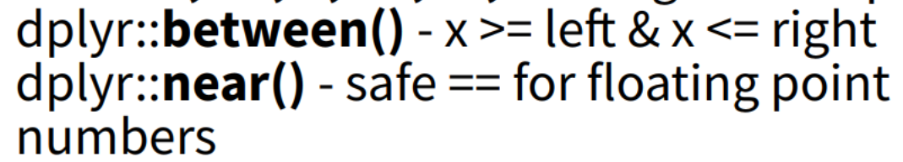
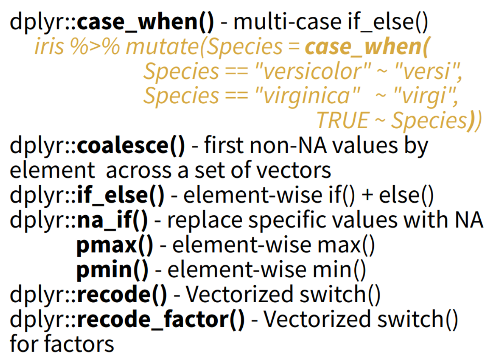

```{css, echo=FALSE}
/* 还可以在 yaml 头部加入 css:"style.css" 来使用外部css文件 */
  
  
/* 全局 */

body {
    font-size: 16px;
    color: #333333;
    font-family: sans-serif, 'Segoe UI', Tahoma, Geneva, Verdana, SimSun;
}

p,
blockquote,
ul,
ol,
dl,
table {
    margin: 0.8em 0;
}


/* 多级标题 */

h1 {
    font-size: 32px;
    margin-top: 1em;
    margin-bottom: 1em;
    color: red;
    font-weight: bold;
}

h2 {
    font-size: 28px;
    margin-top: 1em;
    margin-bottom: 1em;
    color: purple;
    font-weight: bold;
}

h3 {
    color: darkslateblue;
    font-size: 24px;
    margin-top: 0.5em;
    margin-bottom: 0.5em;
}

h4 {
    font-size: 20px;
}

h1.title,
h3.subtitle,
h4.author,
h4.date {
    margin-top: 0.5em;
    margin-bottom: 0em;
}

h4.date {
  margin-bottom: 2em;
}

/* 链接 */

a {
  color: blue;
}

/* 代码 */

code,
.md-fences {
  color: darkred;
  font-family: Courier;
  font-weight: bold;
}

div.sourceCode code {
  font-size: 14px;
  color: black;
  font-family: Consolas;
  font-weight: normal;
}

div.sourceCode code.sourceCode span.fu {
  color: #F75000;
}

div.sourceCode code.sourceCode span.sc {
  color: blue;
}

div.sourceCode code.sourceCode span.st {
  color: green;
}

div.sourceCode code.sourceCode span.co {
  color: grey;
}

div.sourceCode code.sourceCode span.dv {
  color: BlueViolet;
}

div.sourceCode code.sourceCode span.cn {
  color: darkcyan;
}

div.sourceCode code.sourceCode span.at {
  color: royalblue;
}

/* 粗体 */
strong {
  font-family: 'Microsoft YaHei';
}

/* 列表项 */

ul,
ol {
    margin: 0 0 1.5em 0.5em;
}

h3+ul,
h4+ul,
h5+ul,
h6+ul,
h3+ol,
h4+ol,
h5+ol,
h6+ol {
    margin-top: 0.5em;
}

p+ul,
p+ol {
    margin-top: 0.5em;
}

li>ul,
li>ol {
    margin-top: inherit;
    margin-bottom: 0;
    margin-left: 0.5em;
}

ul>li {
    list-style-type: disc;
    list-style-position: outside;
}

li ul>li {
    list-style-type: circle;
}

ol>li {
    list-style-type: decimal;
    list-style-position: outside;
}

li ol>li {
    list-style-type: upper-alpha;
}

li li ol>li {
    list-style-type: lower-greek;
}


/* 首行缩进 */

p {
    text-indent: 0em;
}


/* 表格 */
  
div.pagedtable{
  font-size:12px;
}

table {
    padding: 0;
    word-break: initial;
}

table tr {
    border-top: 1px solid #dfe2e5;
    margin: 0;
    padding: 0;
}

table tr:nth-child(2n),
thead {
    background-color: #fafafa;
}

table tr th {
    font-weight: bold;
    border: 1px solid #dfe2e5;
    border-bottom: 0;
    text-align: left;
    margin: 0;
    padding: 6px 13px;
}

table tr td {
    border: 1px solid #dfe2e5;
    text-align: left;
    margin: 0;
    padding: 6px 13px;
}

table tr th:first-child,
table tr td:first-child {
    margin-top: 0;
}

table tr th:last-child,
table tr td:last-child {
    margin-bottom: 0;
}


/* 侧边栏 */
div.col-lg-3 {
  width: 25%;
  max-width: 250px;
}

div.tocify {
  width: 20%;
  max-width: 200px;
  max-height: 90%;
  font-size: 16px;
}

div.toc-content {
  padding-left: 0px;
  padding-right: 40px;
}
```


```{r YAML, include=FALSE}
# 文件头设置见
# https://bookdown.org/yihui/rmarkdown/html-document.html#table-of-contents
```

```{r global_options, include=FALSE}
knitr::opts_chunk$set(fig.width = 7, fig.asp = 0.618, 
                      fig.path = 'Figs/', warning = FALSE, 
                      message = FALSE, cache = T, 
                      cache.comments = F, comment = '')
# include=FALSE意为仅运行代码，但隐藏所有代码和结果的输出。
# out.width和out.height设置图片在输出文档中的宽高。
# echo为是否显示代码，eval为是否执行代码。
# results='hide'可以隐藏文本输出，fig.show='hide'可以隐藏图形输出
# error=TRUE，即使有错误，也能生成最终报告。


# cache = TRUE 只要代码块没有被修改，就不重新计算该代码块；dependson = c("代码块名",...)，只有dependson参数的代码块没有被修改，且本代码块没有被修改，才不重新计算该代码块。
# 最好使用代码段生成的主要对象来命名代码段，这样可以使dependson设置更容易理解。
# 缓存策略会逐渐变得复杂，所以应该定期使用knitr::clean_cache() 命令清除所有缓存。
```

```{r setup, include=FALSE}
# load necessary packages
library('tidyverse')
library('reshape2')
library('nycflights13')
library('data.table')
library('magrittr')

# define necessary functions
# 若需在行内插入数值，自定义保留小数位数、增加千位分隔符的函数comma
comma <- function(x) format(x, digits = 2, big.mark = ",")
```

> **tidyverse 框架最大的优点在于所有函数的输入输出都是数据框，从而可以通过管道操作连续运算。**


```{r}
## 数据准备
nycflights13::flights # flights depart from New York in 2013
d.class <- 
  read_csv("class.csv", 
           col_types = cols(
             .default = col_double(), 
             name = col_character(), 
             sex = col_factor(levels = c("M", "F"))
))
library(NHANES)
data(NHANES)
```


# 操作行 Manipulate Row

return a subset of rows as a new data

-   `filter()` 条件筛选行
-   `slice` 索引切片行
-   `distinct()` 去重，指定以哪些列作为评价基准（其他列舍弃）
-   `top_n` 选择最大的n行，要指定用以比较的列
-   `arrange()` 排序
-   `add_row` 添加行

```{r}
(top_n(iris, 5, Sepal.Width) %>% setDT()) # 因为并列第5都是3.9，所以筛出来6行
add_row(faithful, eruptions = 1, waiting = 1)
```


## 筛选行 `filter()`

筛选行可以用下标实现，如`flights[8:12,]`，`head(x, n)`和`tail(x, n)`也能取最前或后若干行。但`dplyr::filter()`是最灵活的。

```{r filter1}
# 选取1月1日的航班
new1 <- filter(flights, month == 1, day == 1)
head(new1)

# 选取11月或12月的航班，注意%in%的用法
nov_dec <- flights %>% filter(month %in% c(11, 12))
nov_dec

# 使用管道操作
not_cancelled <- flights %>% 
  filter(!is.na(dep_delay), !is.na(arr_delay))
```

filter() 只能筛选出条件为 TRUE 的行；它会排除那些条件为 FALSE **和 NA 的行。如果想保留缺失值，需要明确指出**。

## 索引切片 `silce()`

`dplyr::slice(data, ...)` 可以选择指定序号的行子集，正的序号表示保留，负的序号表示排除。如：
```{r}
flights %>% slice(3:5)
```

## 去重行 `distinct()`

`dplyr::distinct()` 可以对数据框指定若干变量，然后筛选出所有不同值，每组不同值仅保留一行。
```{r}
d.class %>% distinct(sex, age, .keep_all = TRUE )
#  .keep_all=TRUE 保留数据框中其它变量
```


## 排列行 `arrange()`

```{r arrange}
# 依次按year, month, day排序；默认升序
new2 <- arrange(flights, year, month, day)
head(new2)

# 使用desc()可以按列进行降序排序
new2 <- arrange(flights, desc(arr_delay))
head(new2)
```
排序时不论升序还是降序，所有的缺失值都自动排到末尾。


# 操作列 Manipulate Coloum


## 提取列 `pull()`

选出一列并从数据框**转化为向量**

```{r}
d.class %>% pull(name)
```

`pull()`可以指定单个变量名，也可以指定变量序号，负的变量序号从最后一个变量数起。


## 挑选列 `select()`

```{r select1}
new3 <- select(flights, year, month, day)
head(new3)

# 冒号":"选择 year 和 arr_time 之间的所有列
flights %>% select(year:arr_time) %>% head()
# 也可以用数字序号表示范围
flights %>% select(1:7) %>% head()

# 符号表示扣除
new3 <- select(flights, -(year:day))
head(new3)
```

可以在select()的参数中使用一些辅助函数，界定符合条件的变量

* starts_with("abc") 匹配以'abc'开头的名称。
* ends_with("xyz") 匹配以'xyz'结尾的名称
* contains("ijk") 匹配包含'ijk'的名称
* matches("(.)\\1") 选择匹配正则表达式的那些变量
* num_range("x", 1:3) 匹配x1、x2和x3
- one_of()

```{r select2}
new3 <- select(flights,starts_with("c"))
head(new3)

# 如果要选择的变量名已经保存为一个字符型向量
# 可以用 one_of() 引用，直接引用向量名会报错
vars <- c("name", "sex")
d.class %>%
  select(one_of(vars))
```

## 排列列 `select(...,  everything())`

将select()函数和everything()辅助函数结合起来使用。当想要将几个变量移到数据框开头时，这种用法非常奏效。
```{r select4}
new3 <- select(flights, time_hour, air_time, everything())
head(new3)
```

## 重命名列 `rename()`

```{r select3}
# 这个语法有点怪，前者是新列名，后者是旧列名
flights %>% rename(tail_num = tailnum) %>% head()
```

注意这样改名字不是对原始数据框修改而是返回改了名字后的新数据框。


## 添加列 `mutate()`


以下都是向量化函数，一行一行地依次操作

-   `mutate()`，新变量添加在最后一列，且创建的新变量可以立即使用在参数中
-   `transmute()`, 如果只想保留新变量和一部分旧变量，可以使用transmute()函数，未被提及的变量不会被保留。
-   `mutate_all()`, 计算新列覆盖同名旧列
-   `mutate_if()`, 按一定条件计算新列覆盖同名旧列
-   `add_column()`，合并列

```{r}
flights %>% 
  select(year:day, ends_with("delay"), distance, air_time) %>%
  mutate(gain = arr_delay - dep_delay, 
         hours = air_time / 60, speed = distance / hours)

d.class %>%
  mutate(
    cheight = height - mean(height))

flights %>% transmute(dep_time, 
                      hour = dep_time %/% 60, 
                      minute = dep_time %% 60)

mutate_all(faithful, funs(log(.), log2(.)))
mutate_if(iris, is.numeric, funs(log(.)))
mutate_at(iris, vars(-Species), funs(log(.)))
add_column(mtcars, new = 1:32)
rename(iris, Length = Sepal.Length)
```


## 计算新列的函数

这些函数配合 `mutate()` 和 `transmutate()`，input一个列向量，output一个列向量

### 顺序序号

- `seq_along(along.with)` 根据输入的列的长度，产生一列从1到N的顺序序号，很像 data.table 包中的`1:.N`

### 偏移 offset

-   `dplyr::lag()` 后退偏移
-   `dplyr::lead()` 前进偏移

### 累计 cumulative

-   `cumsum()` 累计和，分组后计算1-12月累计值非常有用
-   `cumprod()` 累计积
-   `cummin()/cummax` 累计最小/大值
-   `dplyr::cummean()` 累计平均值
-   `dplyr::cumall()` 累计all（逻辑判断）
-   `dplyr::cumany()` 累计any（逻辑判断）

### 排序位置 rank


### 数学运算



### 其他




# 分组行 Group Row

-   `group_by()` 创建一个分好组的原数据的copy，等待进一步指令，然后分组执行。
-   `ungroup()` 逆操作，生成一个数据的 ungrouped copy

```{r}
mtcars %>% group_by(cyl) %>% summarise(avg = mean(mpg))
g_iris <- group_by(iris, Species)
ungroup(g_iris)
```

虽然group_by()与summarize()结合起来使用是最有效的，但分组也可以与filter()和mutate()结合，以完成非常便捷的操作：如

* 找出每个分组中最差的成员
* 找出大于某个阈值的所有分组
* 对数据进行标准化以计算分组指标

```{r}
# 每天到达延误时间最长的航班
flights %>% 
  select(year:day,ends_with("delay"),distance,air_time) %>% 
  group_by(year, month, day) %>% 
  filter(rank(desc(arr_delay)) < 10)

# 大于365个航班的航线
popular_dests <- flights %>% 
  group_by(dest) %>% 
  filter(n() > 365) 
popular_dests

# 对数据进行标准化以计算分组指标
popular_dests %>% 
  filter(arr_delay > 0) %>% 
  mutate(prop_delay = arr_delay / sum(arr_delay)) %>% 
  select(year:day, dest, arr_delay, prop_delay)
```

## 按多个变量分组

当使用多个变量进行分组时，每次的摘要统计会用掉一个分组变量。这样就可以轻松地对数据集进行循序渐进的分析。

```{r multigroup}
daily <- group_by(flights, year, month, day)
(per_day <- summarize(daily, flights = n()))
(per_month <- summarize(per_day, flights = sum(flights)))
(per_year <- summarize(per_month, flights = sum(flights)))
```

## 取消分组

取消分组，并回到未分组的数据继续操作，可以使用 ungroup()
```{r ungroup, dependson='multigroup'}
daily %>% 
  ungroup() %>% # 取消分组
  summarize(flights = n()) # 全年所有航班
```

# 摘要统计 Summarise Row 

* **summarize()与group_by()的组合构成了使用dplyr包时最常用的操作之一——分组摘要统计。**
* summarize()将生成一个新的数据框，包含的变量只有分组依据变量和写进summarize()参数的统计摘要变量。

-   `summarise()`
-   `count()`，计数

```{r}
mtcars %>% summarise(avg = mean(mpg));
iris %>% count(Species);
```


## 摘要统计函数

配合在summarise()内部使用，占据第二个参数位置。input一个向量，output一个值。

-   `sum()`, `mean()`, `cumsum()`
-   统计总/去重后/非空行数 `n()`, `n_distinct()`, `sum(!is.na())`
-   定位度量 `first()`, `last()`, `nth()`
-   秩的度量 `min()`, `max()`, `quantile(x, 0.25)`
-   离散程度 `sd()`、`var()`, `mad()`, `IQR()`

例1 观察航班数据的若干统计量
```{r example1}
# by_date是flights按年月日分组后的新数据
by_date <- group_by(flights, year, month, day)
# 由此得到每一天的平均延误时间。
summarize(by_date, delay = mean(dep_delay, na.rm = T))

# 也可以用管道操作写成
flights %>% group_by(year, month, day) %>% 
  summarize(delay = mean(dep_delay, na.rm = TRUE))

# 也可以预先去掉存在NA（航班取消）的行，写成
not_cancelled <- flights %>% 
  filter(!is.na(dep_delay), !is.na(arr_delay))

not_cancelled %>% group_by(year, month, day) %>% 
  summarize(delay = mean(dep_delay))

# 观察平均正延误时间
not_cancelled %>% group_by(year, month, day) %>% 
  summarize(delay_pos = mean(dep_delay[dep_delay > 0]))
```

例2 按目的地分组，按目的地分组，研究平均飞行距离与平均延误时间之间的关系
```{r example2}
# 根据目的地分组
by_dest <- group_by(flights, dest)

# 用mean()统计平均飞行距离和平均延误时间
# 用n()统计航班数，sum(!is_na())非缺失值记数
sum_data <- summarize(by_dest, count = n(), 
                  dist = mean(distance, na.rm = TRUE), 
                  delay = mean(arr_delay, na.rm = TRUE))

# 筛选出航班数大于20（去除小样本）且目的地不为'HNL'的行
# HNL这个机场在夏威夷，距离太远属于异常值
delay <- filter(sum_data, count > 29, dest != "HNL")

# 作图
ggplot(data = delay, mapping = aes(x = dist, y = delay)) + 
  geom_point(aes(size = count), alpha = 1/3) + 
  geom_smooth(se = FALSE) 


# 管道操作
# 这样写代码很清晰，每一行是一步操作
flights %>% 
  group_by(dest) %>% # 分组
  summarize(count = n(), dist = mean(distance, na.rm = TRUE), 
            delay = mean(arr_delay, na.rm = TRUE)) %>% # 统计
  filter(count > 29, dest != "HNL") %>% # 筛选观测
  ggplot(mapping = aes(x = dist, y = delay)) + 
  geom_point(aes(size = count), alpha = 1/3) + 
  geom_smooth(se = FALSE) # 作图
```
可见，750英里内，平均延误时间会随着距离的增加而增加，接着会随着距离的增加而减少。或许，随着飞行距离的增加，延误时间有可能会在飞行中弥补回来。

例3 查看具有最长平均延误时间的航班
```{r example3-1, dependson='example1'}
# 通过尾号（tailnum）对航班进行分组识别
not_cancelled %>% 
  group_by(tailnum) %>% 
  summarize(delay = mean(arr_delay)) %>% 
  ggplot(mapping = aes(x = delay)) + 
  geom_freqpoly(binwidth = 10)
```
有些航班的平均延误时间长达300分钟，这是怎么回事呢？

```{r example3-2, dependson='example1'}
# 作航班架次数量和平均延误时间的散点图
not_cancelled %>% 
  group_by(tailnum) %>% 
  summarize(delay = mean(arr_delay), n = n()) %>% 
  ggplot(mapping = aes(x = n, y = delay)) + 
  geom_point(alpha = 0.1)
```
由图可见，当航班数量非常少时，平均延误时间的变动特别大。

注：这张图的形状非常能够说明问题：当绘制均值（或其他摘要统计量）和分组规模的关系时，总能看到随着样本量的增加，变动在不断减小。因此，查看此类图形时，**通常应该筛选掉那些观测数量非常少的分组，这样就可以避免受到特别小的分组中的极端变动的影响，进而更好地发现数据模式**。

```{r example3-3, dependson='example1'}
# 作去掉小样本后，航班架次数量和平均延误时间的散点图
not_cancelled %>% 
  group_by(tailnum) %>% 
  summarize(delay = mean(arr_delay), n = n()) %>% 
  filter(n >= 30) %>% 
  ggplot(mapping = aes(x = n, y = delay)) + 
  geom_point(alpha = 0.1) + 
  geom_smooth(method = 'lm',se = FALSE)
```
这时我们发现，平均延误时间大多在20分钟以下；飞行架次在30以上的航班，平均延误时间最长的也只有60分钟。


例4 棒球击球手的安打率与击球次数之间的关系（能力与出场机会的关系）
```{r example4}
# 棒球比赛数据，转换成tibble使输出更美观
batting <- as_tibble(Lahman::Batting)

# 根据球员ID分组统计，总击打数ab和安打率ba（安打数/击打数）
# 分组统计后包含playerID, ab, ba变量的新数据框为batters
batters <- batting %>% 
  group_by(playerID) %>% 
  summarize(ba = sum(H, na.rm = TRUE)/sum(AB, na.rm = TRUE), 
            ab = sum(AB, na.rm = TRUE))

# 按安打率排名，发现位次最靠前的是一些总击打数几乎为零、
# 靠好运气获得极高安打率的球员——而这并不表明能力强。
batters %>% arrange(desc(ba))
batters %>% ggplot(mapping = aes(x = ab, y = ba)) + 
  geom_point(alpha = 0.1)

# 忽略小样本，绘制安打率~击打数散点图，发现安打率基本小于35%
# 正相关关系，说明安打率较高的球员击打数较多（出场机会多）
# 由图可见，拥有20%以上的安打率，才有机会成为球队主力
batters %>% filter(ab > 100) %>% 
  ggplot(mapping = aes(x = ab, y = ba)) + 
  geom_point(alpha = 0.1) + geom_smooth(se = FALSE)
```

```{r other1, dependson='example1'}
# 从N.Y.到其他机场飞行距离的标准差
not_cancelled %>% 
  group_by(dest) %>% 
  summarize(distance_sd = sd(distance)) %>% 
  arrange(desc(distance_sd))
```

```{r other2, dependson='example1'}
# 每天最早和最晚航班的出发时间
not_cancelled %>% group_by(year, month, day) %>% 
  summarize(first = min(dep_time), last = max(dep_time))

# 找出每天最早和最晚出发的航班
# min_rank(x)可以返回一个序列各元素的升序位置向量
# min_rank(desc(x))返回降序位置向量
# 对出发时间排序后，用range()取出最大值和最小值
# 再用filter()取出每天出发最早和最晚的航班
not_cancelled %>% group_by(year, month, day) %>% 
  mutate(r = min_rank(desc(dep_time))) %>% 
  filter(r %in% range(r))
```

```{r other4, dependson='example1'}
# 纽约至哪个目的地的航线有最多的航空公司运营
# n_distinct()函数统计唯一值的数量
not_cancelled %>% 
  group_by(dest) %>% 
  summarize(carriers = n_distinct(carrier)) %>% 
  arrange(desc(carriers))

# 纽约出发的每条航线有多少个航班
not_cancelled %>% count(dest)

# 加权记数，计算每个航班的总飞行距离
not_cancelled %>% count(tailnum, wt = distance)
```

```{r other5, dependson='example1'}
# 若x为逻辑向量，sum(x)可以找出x中TRUE的数量，mean(x)可以找出x中TRUE的比例。
# 每天有多少架航班是早上5点前出发的
not_cancelled %>% 
  group_by(year, month, day) %>% 
  summarize(n_early = sum(dep_time < 500))

# 延误超过1小时的航班比例是多少
not_cancelled %>% 
  group_by(year, month, day) %>% 
  summarize(hour_perc = mean(arr_delay > 60))
```