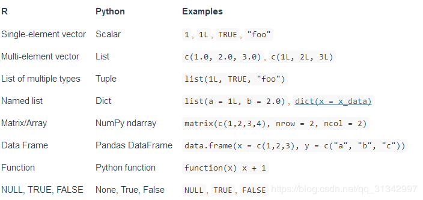

```{r setup, include = FALSE}

## global options
knitr::opts_chunk$set(
  fig.width = 6, fig.asp = 0.618,
  out.width = "80%", fig.align = "center",
  fig.path = 'Figures/', fig.show = "hold",
  warn = 1, warning = FALSE, message = FALSE, echo = TRUE, 
  comment = '', collapse = F, 
  cache = T, cache.comments = F, autodep = TRUE
  )


## use necessary packages
library('pacman')
p_load(tidyverse, lubridate, data.table, magrittr, # 数据整理
       ggthemes, showtext, gridExtra, igraph, ggraph, # 可视化
       lmtest, plm, orcutt, stats, forecast, zoo, # 统计分析  
       rvest, httr, # 爬虫
       sqldf, DT, # I/O
       jiebaR, wordcloud2, webshot, htmlwidgets, tidytext # 文本分析
       )
options(sqldf.driver = "SQLite") 


## pdf中图形内部的中文字体设置
pdf.options(family = "GB1")
# 安装字体文件
# font_add('YaHei','MS YaHei.ttf')
windowsFonts(YaHei = windowsFont("Microsoft YaHei"))
showtext_auto(enable = TRUE)
# 包含图的代码块需要fig.showtext = TRUE选项
# ggplot2图形需要在主题中显式指定中文字体才能正常显示图中的中文
```

<br/><br/><br/>
官方教程：<https://rstudio.github.io/reticulate/index.html>


# 在 R 中创建 Python Console

通过 `repl_python()` 函数，交互地使用 R 与 Python 的 Console

在 Python 中创建的对象可在 R 中使用，利用 py 对象引用 python 里的对象，eg：`py$train_data`  
在 R 中创建的对象也可在 Python 中使用，利用 r 对象引用 R 里的对象，eg：`r.mydata`

```
repl_python() 

# 加载 panda 数据集
import pandas as pd 

py_s = 'aaa'

# 回到R Console
quit
 
# 利用 py 对象引用 python 里的对象
print(py$py_s)

r_s = 'bbb'
 
repl_python()

# 利用 r 对象引用 R 里的对象
print(r.r_s)

exit
```
# 载入 Python 脚本并调用其变量

`source_python("xxx.py")`

**注意**：R 只能调用 .py 脚本中的全局变量，写在函数内的变量（即使是 main 函数）是无法被 R 调用的

```{r}
library(reticulate)
py_run_file("./python_code_test.py") 
py$result # 调用 .py 脚本中生成的 result 变量
```

其中，python_code_test.py 的代码如下：
```{python}
def add(x, y):
  return(x + y)

result = add(5,10)
```

# R Markdown 中 R 与 Python 代码块的互相调用

一个 Python 代码块：
```{python}
def add(x, y):
  return(x + y)

multiply = add(10,10)
```

在 R 代码块中调用：
```{r}
print(py$multiply) # 调用 Python 代码块中生成的 multiply 变量
s <- 'aaa'
```

Python 代码块调用 R：
```{python}
print(r.s)
```

注：

1. R Markdown 文件很长时，代码块之间的互相调用可能会失效。载入 Python 脚本并调用其变量的方法更可靠一些。
2. R 中函数的嵌套层级不要太深，否则可能产生错误。

# R 与 Python 变量的类型转换

