```{r setup, include=FALSE}
source("../Rmarkdown-template/Rmarkdown_config.R")

## global options ===================================
knitr::opts_chunk$set(
  width = config$width,
  fig.width = config$fig.width,
  fig.asp = config$fig.asp,
  out.width = config$out.width,
  fig.align = config$fig.align,
  fig.path = config$fig.path,
  fig.show = config$fig.show,
  warn = config$warn,
  warning = config$warning,
  message = config$message,
  echo = config$echo,
  eval = config$eval,
  tidy = config$tidy,
  comment = config$comment,
  collapse = config$collapse,
  cache = config$cache,
  cache.comments = config$cache.comments,
  autodep = config$autodep
)

## use necessary packages ==============================
library("pacman")
p_load(
  lubridate, reshape2, # 数据整理
  ggthemes, showtext, gridExtra
)

# pdf中图形中文设置
windowsFonts(H = windowsFont("微软雅黑"))
pdf.options(family = "GB1")
# 代码块需要fig.showtext=TRUE选项，且ggplot2图形需要明确定义字体，才能正常显示图中的中文。
```


# 参考文献 {-}


[*R Markdown Cookbook*](https://bookdown.org/yihui/rmarkdown-cookbook/)

[*R Markdown: The Definitive Guide*](https://bookdown.org/yihui/rmarkdown/)

<a href="../pdf/cheatsheet-rmarkdown.pdf">*Rmarkdown Cheatsheet.pdf*</a>

<object data="../pdf/cheatsheet-rmarkdown.pdf" type="application/pdf" width="100%" height="100%"></object>

<a href="../pdf/rmarkdown-reference-guide.pdf">*Rmarkdown Reference Guide.pdf*</a>

<object data="../pdf/rmarkdown-reference-guide.pdf" type="application/pdf" width="100%" height="100%"></object>

<a href="../pdf/LaTeX-Table-in-pdf.pdf">*LaTeX-Table-in-pdf.pdf*</a>

<object data="../pdf/LaTeX-Table-in-pdf.pdf" type="application/pdf" width="100%" height="100%"></object>


# html 语法

html 语法大都可以在Rmarkdown中使用

## 文字颜色

```html
<span style='color: blue'> 蓝色文字。</span>
```

<span  style='color: blue'>蓝色文字。</span>

## 字号

```html
<font size = 4> 4 号字。</font> <font size = 6> 6 号字。</font>
```

<font size = 4> 4 号字。</font> <font size = 6> 6 号字。</font>

## 图片

```html
<center><center/>
<div align = center>  </div>
```

<center></center>

<div align = center>  </div>

# markdown基本语法 {#markdown}

## 段内换行

行末`<br/>`或两个以上空格 + 回车为段内换行，连续两个回车为新起一段

我是第一段第一行  
我是第一段第二行

我是第二段，注意行间距和段间距的差异

## 增加段间距

用`<br>`，每多一个就多一次换行；或`&nbsp;`，表示一个空段落。

正常段间距

正常段间距<br/><br/>
连续两次换行`<br>`后得到本行，虽然看上去行距很大，但仍在一段中

&nbsp;

中间隔了一个空段落，显然段间距更大。空段落可以叠加

## 注释

用`<!--  -->`括住的内容会被注释掉，不显示在最终输出中。

<!--
括住的内容会被注释掉，不显示在最终输出中。
-->

## 脚注

markdown 脚注的标准格式为：

1. 在需要加脚注处用 `[^footnote]` 标识。
2. 在下文任意处新起一行，用 `[^footnote]: blabla...` 将脚注补全。

## 参考文献

markdown 其实并无格式化参考文献的语法，但可以利用 html 的脚注语法手动实现——只适合写简易文章的场合。

```{html}
This is a test sentence.<sup><a href="#ref1">[101]</a></sup>
This is a test sentence.<sup><a href="#ref2">[102]</a></sup>
```

最后在文章结尾处写：
```{html}
Reference
<a name="ref1">[101] 文献引用1</font></a>
<a name="ref2">[102] 文献引用2</font></a>
```

效果为：

This is a test sentence.<sup><a href="#ref1">[101]</a></sup>

This is a test sentence.<sup><a href="#ref2">[102]</a></sup>


Reference

<a name="ref1">[101] 文献引用1</font></a>

<a name="ref2">[102] 文献引用2</font></a>


## 引用

在引用中可以使用其他 Markdown 语法

### 单层和嵌套引用

```markdown
> 张三说：李四这样说过    
> 
>> 不想当将军的木匠不是好厨子。
```

> 张三说：李四这样说过   
> 
>> 不想当将军的木匠不是好厨子。

### 多行引用

仍然是一段（推荐）：

```markdown
> 第一行  
> 第二行  

> 第一行
> 
> 第二行
```

> 第一行  
> 第二行  

> 第一行
> 
> 第二行

变成了两段（不推荐）：

```markdown
> 第一段

> 第二段
```

> 第一段

> 第二段

## 分隔线

三个以上的`*/-/_`

---

## 链接

### 直接表示：

格式为`<地址>`或`地址`(仅限 http 和 www 开头，这是 GFM 扩展语法)。如：百度的网址是 <http://www.baidu.com> 或 www.baidu.com，我的邮箱是 <humoonruc@126.com>。

### 行内链接

格式为`[链接名](地址)`。如：点击超链接[百度](http://www.baidu.com)

### 引用式链接

当链接被重复使用时，最好使用引用链接形式。可以将链接标记理解为一个地址变量。

在某处（比如文章结尾）定义一些链接标识符，语法为：`[链接标识符]:网址`。定义语句不会显示在输出中。正文中使用时，语法为：`[链接名][链接标识符]`，如：

在[ Google 首页][Google]查询 IT 资料通常是第一步，虽然在中文搜索方面[这个国际巨头][Google]的用户体验常常不如[百度](https://www.baidu.com)。

[Google]: https://www.google.com.hk

## 图片

1. 行内图片：    
``
不建议使用这种方法，编译pdf有时会报错。

2. 引用式图片：与链接类似，也可以在文章某处定义图片的标识符，然后把行内图片引用中图片地址替换成图片标识符即可。

## 列表

### 列表嵌套

用`Tab`缩进表示下一级

- 第一级
  - 第二级
    - 第三级
    - 第三级
  - 第二级

### 列表缩进

若列表项无换行，一个空格即可；若列表项有换行，建议无序列表用三个空格如`-   xxx`，有序列表用两个空格如`1.  xxx`

-   这个列表项  
    有换行
-   这个没有

1.  这个有序列表项  
    有换行
2.  这个没有

### 列表项间空行

无换行的列表项之间不建议空行；有换行的列表项之间建议空一行；列表开始和末尾都空一行

无换行：

- 抽烟
- 喝酒
- 烫头

有换行：

-   抽很多的  
    烟

-   喝酒

-   烫头

## 任务列表

**2019年读书计划**

```markdown
- [x] 《R in Action》
- [x] 《R for Data Science》 
- [ ] 《Python 疯狂讲义》
```

- [x] 《R in Action》
- [x] 《R for Data Science》 
- [ ] 《Python 疯狂讲义》


## 管道表

Table:(\#tab:easytable) 管道表

Tables|Are|Cool
------------- |:-------------:| -----:
col 3 is| right-aligned | $1600
 col 2 is| centered|$12 
 zebra stripes| are neat|$1 

注：

1. 英文冒号 : 使列获得了某种对齐方式。
2. 代码块和引用块不能插入表格。
3. 管道表不允许输入单元格换行，单元格内容太宽时转换结果可能自动换行。
4. `Table: (\#tab:label) text`，为markdown简易表自动加表编号和表名(text)，写在简易表的前后均可。


## 代码

markdown 中的代码，只是显示，不可执行。

### 行内代码

写在两个反引号之间，例：

在命令行中用`cd`命令切换目录

### 代码块

`Tab`或四个空格`    `开头

    pipenv shell

或使用成对的三个反引号包裹，并可以显示声明语言，这是 GFM 扩展语法

```python
def print_name():
    print("Markdown")
```

## 转义

`\` + 符号

转义时要使用 \\ 这个符号，比如美元符号 \$，否则，\$ 会表示嵌入行内的公式。

## 删除线

成对的双波浪线`~~`之间：

他是个~~天才~~疯子。

## 公式

### 行内公式

将公式包在`$ $`之间，如 $\sin\pi/2=1$  

```markdown
$\sin\pi/2=1$ 
```

### 独立成行的公式

将公式包含在`$$ $$`之间，如：

```markdown
$$
f(x)=\frac{1}{2} \sum_{j=1}^{\infty} \int_{0}^{1} \sin ^{2}(j t x) d t
$$
```

$$
f(x)=\frac{1}{2} \sum_{j=1}^{\infty} \int_{0}^{1} \sin ^{2}(j t x) d t
$$


为了产生对齐的公式，或在某些 markdown 编辑器中成功渲染出独立成行的公式，可使用 aligned 环境。

公式中的环境以`\begin{环境名}`开始，以`\end{环境名}`结束，用`\\`表示换行，用`&`表示一个上下对齐位置。如：

```markdown
$$
\begin{aligned}
  f(x) =& \sum_{k=0}^\infty \frac{1}{k!} x^k \\
  =& e^x
\end{aligned}
$$
```

$$
\begin{aligned}
  f(x) =& \sum_{k=0}^\infty \frac{1}{k!} x^k \\
  =& e^x
\end{aligned}
$$

### 为公式手动编号

```markdown
$$
y = f(x) \tag{label}
$$
```


$$
y = f(x) \tag{label}
$$


## 锚点

`[锚点描述](#锚点名)`，锚点名仅限完整的各级标题

[跳转到引用](#单层和嵌套引用)

## 排版风格建议

1. 中文字符和英文字符（不包括标点符号）之间加空格，
2. 使用半角符号时，无论是中文还是英文，都要在两边加空格。
3. “/”表示路径时，前后都不加空格。
4. 负号后面接数字不加空格。

## Mermaid

### 什么是Mermaid？

* Mermaid是一种基于Javascript的绘图工具，使用类似于Markdown的语法，使用户可以方便快捷地通过代码创建图表。
* 项目地址：https://github.com/mermaid-js/mermaid

### 图类型

- 饼状图：使用`pie`关键字，具体用法后文将详细介绍
- 流程图：使用`graph`关键字，具体用法后文将详细介绍
- 序列图：使用`sequenceDiagram`关键字
- 甘特图：使用`gantt`关键字
- 类图：使用`classDiagram`关键字
- 状态图：使用`stateDiagram`关键字
- 用户旅程图：使用`journey`关键字

### 饼图

- 在线渲染器：[Online FlowChart & Diagrams Editor](https://mermaidjs.github.io/mermaid-live-editor/#/edit/eyJjb2RlIjoicGllXG5cIkRvZ3NcIiA6IDQyLjk2XG5cIkNhdHNcIiA6IDUwLjA1XG5cIlJhdHNcIiA6IDEwLjAxIiwibWVybWFpZCI6eyJ0aGVtZSI6ImRlZmF1bHQifX0)

- 语法
  - 从`pie`关键字开始图表
  - 然后使用`title`关键字及其在字符串中的值，为饼图赋予标题。（这是**可选的**）
  - 数据部分
    - 在`" "`内写上分区名。
    - 分区名后使用`:`作为分隔符
    - 分隔符后写上数值，最多支持2位小数——数据会以百分比的形式展示

* 实例

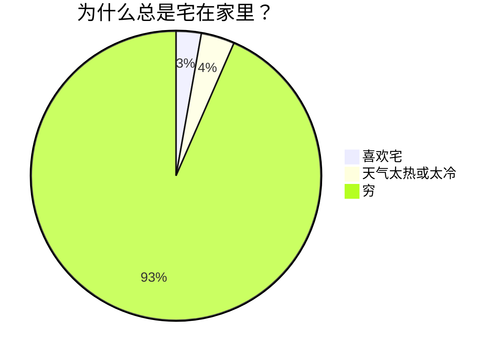

### 流程图

- 在线渲染器：[Online FlowChart & Diagrams Editor](https://mermaidjs.github.io/mermaid-live-editor/#/edit/eyJjb2RlIjoiZ3JhcGggVERcbiAgICBBW0hhcmRdIC0tPnxUZXh0fCBCKFJvdW5kKVxuICAgIEIgLS0-IEN7RGVjaXNpb259XG4gICAgQyAtLT58T25lfCBEW1Jlc3VsdCAxXVxuICAgIEMgLS0-fFR3b3wgRVtSZXN1bHQgMl0iLCJtZXJtYWlkIjp7InRoZW1lIjoiZGVmYXVsdCJ9fQ)

#### 实例

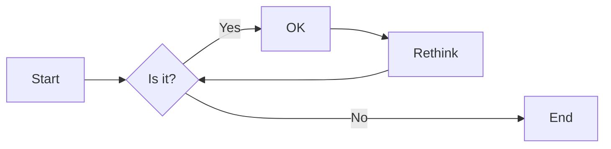

#### 方向

用于开头，声明流程图的方向。

* `graph`或`graph TB`或`graph TD`：从上往下
* `graph BT`：从下往上
* `graph LR`：从左往右
* `graph RL`：从右往左

#### 结点

* 无名字的结点：直接写内容，此时结点边框为方形；节点内容不能有空格
* 有名字的结点：节点名后书写内容，内容左右有特定符号，结点边框由符号决定；节点内容可以有空格

> 下面的实例中，没有为graph指定方向，因此默认是从上往下的。但是由于各个结点之前没有箭头，所以他们都处于同一排。


#### 连线样式

* 实线箭头：分为无文本箭头和有文本箭头，有文本箭头有2种书写格式

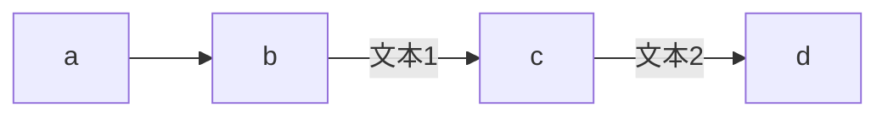

* 粗实线箭头：分为无文本箭头和有文本箭头

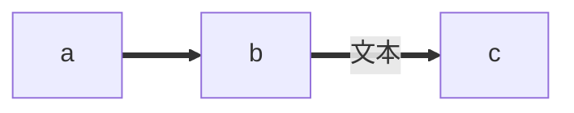

* 虚线箭头：分为无文本箭头和有文本箭头

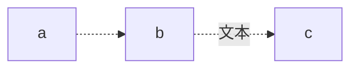

* 无箭头线：即以上三种连线去掉箭头后的形式

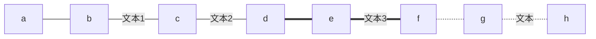

* 其他连线：需要将`graph`关键字改为`flowchart`，除了新增加的连线形式外，上面三种线的渲染效果也会不同

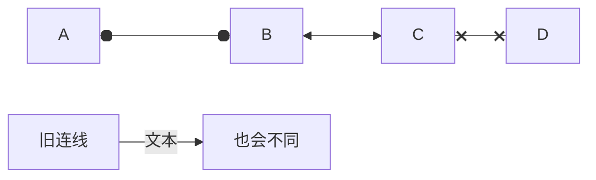

* 延长连线：增加相应字符即可，如下图中的B到E，连线中增加了一个`-`。字符可多次添加。

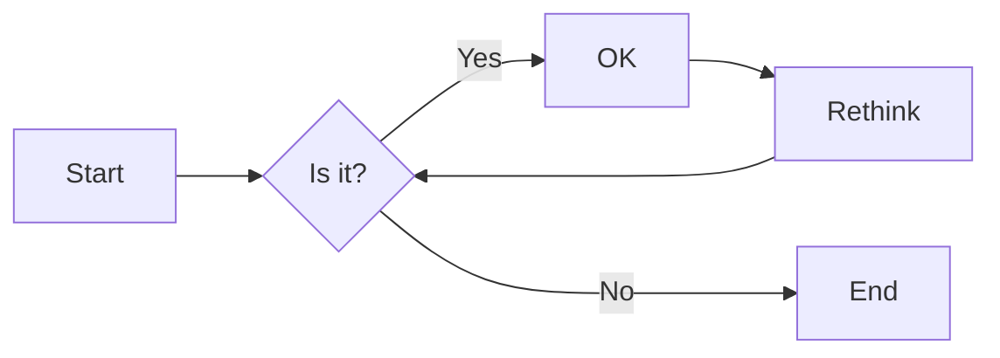


#### 连线形式

* 直链

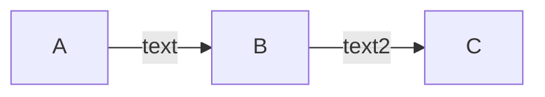

* 多重链：可以使用`&`字符，或单个描述

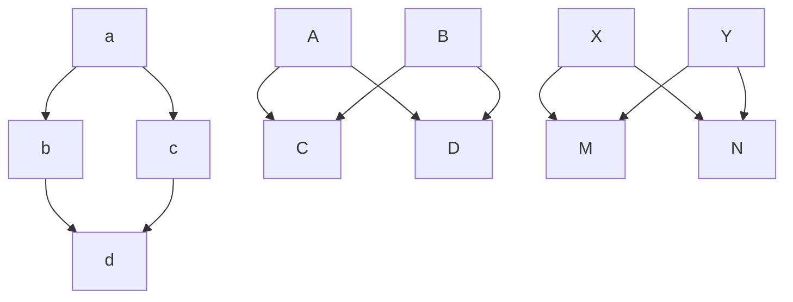

#### 其他

* 子图：需要将`graph`关键字改为`flowchart`，在代码段的开始加入`subgraph`，尾部加入`end`

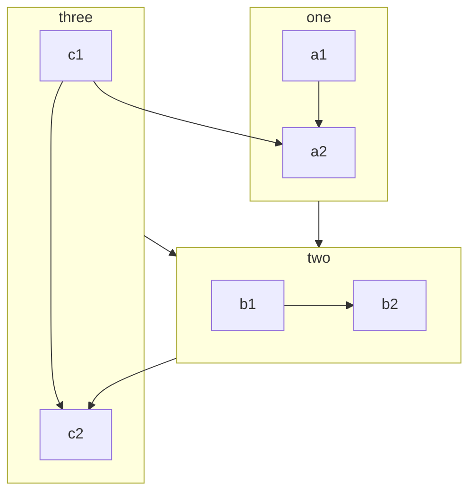

- 注释：在行首加入`%%`即可。

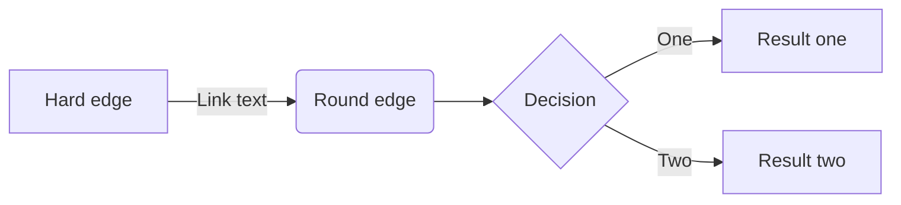


# Rmarkdown语法{#Rmarkdown}

## 基本语法

* 上标 `text^supscript^` a^2^
* 下标 `text~subscript~` k~1~
* 脚注 `text^[footnote] ` 某观点^[文献题录。] 

```{right, type="flushright", html.tag="p"}
代码块设置，使块中文字右对齐，仅适用于 pdf
```

## 编译PDF

```{r eval=FALSE}
install.packages("tinytex")
tinytex::install_tinytex(dir = "D:\\Tinytex", force = T)
```

Rmd 文件的 metadata：
```markdown
---
output:
  pdf_document: 
    latex_engine: xelatex
    extra_dependencies:
      ctex: UTF8
    number_sections: yes
    df_print: kable
    toc: yes
classoptions: "hyperref, 12pt, a4paper"
---
```

## R 代码（可执行）

行内代码：`r Sys.Date()`  

代码块

Python
```{python}
def print_name():
    print("Markdown")
```

R
```{r}
sin(pi / 2)
```

## R表格

表格尽量使用代码块，便于统一编号
```{r}
table <- tibble::tibble(ID = 1:5, name = letters[1:5])
knitr::kable(table, caption = "order of letters") # 用三线表格显示数据
```

### kableExtra package

更强大、优美的表格。主要包括：

1. 表格整体风格，包括斑马纹、悬浮效果、行高、响应式表格宽度、浮动位置、字体大小
2. 行、列的样式，参数中可以用 CSS 语法
3. 格子的样式
4. 行、列的分组，以及分组下部分行的缩进
5. 表格的脚注
6. 表格的保存

文档参见：

https://haozhu233.github.io/kableExtra/

http://haozhu233.github.io/kableExtra/awesome_table_in_html_cn.html


```{r}
# 例
library(kableExtra)

mtcars[1:5, 1:4] %>%
  kable("html") %>%
  kable_styling(
    bootstrap_options = c(
      "striped", # 明暗条纹
      # "hover", # 鼠标划过高亮
      # "condensed", # 紧凑行高
      "responsive" # 响应屏幕宽度
    ),
    full_width = F
  ) %>%
  add_header_above(c(" " = 1, "Group1" = 2, "Group2" = 2))
```

### `bruceR::print_table()`

输出三线表至 console 或 .doc

- 主要参数
  - `x`：矩阵（`matrix`）、数据框（`data.frame`、`data.table` 等）或**能够提取出模型系数表的统计模型（`lm`、`glm`、`lmer`、`glmer` 等）**
  - `digits`：保留的小数位数，默认是 3 位小数
  - `file`：保存的 Word 文档（`.doc`），默认输出到 R 控制台
  - ……（见原始帮助文档）

```{r}
model <- lm(Temp ~ Month + Day + Wind + Solar.R, data = airquality)
print_table(model)
print_table(model, file = "./export/Results.doc")
```

## R图

插图不用 markdown 语法，而使用 R 代码块，便于统一编号
```{r img1, fig.cap='xx图'}
# knitr::include_graphics("figs/myfig01.png")
```

## 制表式截面 {.tabset}

仅适用于html格式

### By Product

(tab content)

### By Region

(tab content)

## 下载资源文件/文件夹

### `xfun` package

在页面中显示一个下载链接。

该包理论上有三个函数，`xfun::embed_file()`, `xfun::embed_files()`和`xfun::embed_dir()`，但只有第一个能用，后两个似乎有bug.

`xfun::embed_file(path, name = basename(path), text = paste("Download", name), ...)`，后两个参数均可省略。

```{r}
# a single file
xfun::embed_file(
  path = "./figure/resource.png",
  name = "scatter",
  text = "Download resource files"
)
```

### `downloadthis` package

#### Data frames, lists, or any R object

```{r}
mtcars %>%
  downloadthis::download_this(
    output_name = "mtcars data set",
    output_extension = ".csv",
    button_label = "Download data: mtcars",
    button_type = "success"
  )
```

```{r}
vector_example <- 1:10
linear_model <- lm(mpg ~ gear, data = mtcars)

list(mtcars, iris, vector_example, linear_model) %>%
  downloadthis::download_this(
    output_name = "datasets, vector, and linear model",
    output_extension = ".rds",
    button_label = "Download data as rds",
    button_type = "success"
  )
```

#### Web address

```{r}
downloadthis::download_link(
  link = "https://github.com/fmmattioni/downloadthis/raw/master/inst/example/file_1.pdf",
  button_label = "Download online pdf",
  button_type = "warning",
  self_contained = FALSE
)
```


#### Local files and directory

```{r}
downloadthis::download_file(
  path = c("./figure/resource.png", "./figure/resource.pdf"),
  output_name = "scatter",
  button_label = "Download local files",
  button_type = "danger",
  self_contained = FALSE
)
```

```{r}
downloadthis::download_dir(
  path = "./figure",
  output_name = "figures",
  button_label = "Download figure dir",
  button_type = "danger",
  self_contained = FALSE
)
```


# Metadata & Config

详见：

[*R Markdown Cookbook*](https://bookdown.org/yihui/rmarkdown-cookbook/)

[*R Markdown: The Definitive Guide*](https://bookdown.org/yihui/rmarkdown/)

## output

Rmarkdown 文件的Metadata 采用了 YAML 文件头的形式

输出部分往往单独保存在一个 _output.yml 文件中，放在与 .Rmd 平级的目录下

```{r, echo=FALSE}
downloadthis::download_file(
  path = c("./resources/_output.yml"),
  output_name = "_output",
  button_label = "output config in YAML header of an Rmarkdown file",
  button_type = "danger",
  self_contained = FALSE
)
```

## config

可以将大部分的代码块设置、包的引入声明和一些工具函数放在一个 .R 脚本中，在最初的 setup 代码块中由 source() 引入，避免了每个 .Rmd 文件中都要写一遍。

```{r, echo=FALSE}
downloadthis::download_file(
  path = c("./resources/Rmarkdown_config.R"),
  output_name = "Rmarkdown_config",
  button_label = "packages and options needed",
  button_type = "danger",
  self_contained = FALSE
)
```

<br>
setup 代码块的设置形如 `{r setup, include = FALSE}`（在表示代码块起始的三个反引号后加入这个大括号），代码块内部只需要写

```R
source("../Rmarkdown-template/Rmarkdown_config.R")

## global options ===================================
knitr::opts_chunk$set(
  width = config$width,
  fig.width = config$fig.width,
  fig.asp = config$fig.asp,
  out.width = config$out.width,
  fig.align = config$fig.align,
  fig.path = config$fig.path,
  fig.show = config$fig.show,
  warn = config$warn,
  warning = config$warning,
  message = config$message,
  echo = config$echo,
  eval = config$eval,
  tidy = config$tidy,
  comment = config$comment,
  collapse = config$collapse,
  cache = config$cache,
  cache.comments = config$cache.comments,
  autodep = config$autodep
)
```

# bookdown语法{#bookdown}

bookdown 比 Rmarkdown 的主要升级之处在于自动编号和交叉引用。

## 章节编号和引用

### 编号
`# (PART) 第一篇 {-}` 部分（篇）
`# References {-}` 参考文献
`# (APPENDIX) 附录 {-}` 附录 

### 引用
1. `{#tag}`,自动为标题编号，并定义标题的标签，便于引用。标签只能含字母、数字和连字符"-"，图、表标签同
2. `{-}`,不为标题编号，也不定义标签
3. `{#tag .unnumbered}`,设置标题的标签，但不为标题编号
4. `\@ref(tag)`,引用标题编号。如第\@ref(bookdown)节是关于bookdown的。


## 图形自动编号 {#usage-writing-fig}

用R代码块生成的图形，只要具有代码块标签label，且提供代码段选项`fig.cap="图题"`，就可对图形自动编号，并且可以用如`\@ref(fig:label)`的格式引用图形。如：

```{r u-w-f-ex01, fig.cap="测试图"}
plot(1:10)
```

引用如：参见图\@ref(fig:u-w-f-ex01)，其中的`fig:`是必须的。


## 表格自动编号 {#usage-writing-tab}

用R代码`knitr::kable()`生成的表格，只要具有代码块标签，并且在`knitr::kable()`调用时加选项`caption="表题"`，就可以对表格自动编号，并且可以用如`\@ref(tab:label)`的格式引用表格。如：

```{r u-w-tab-ex01}
d <- data.frame("自变量" = 1:10, "因变量" = (1:10)^2)
knitr::kable(d, caption = "1到10的平方", longtable = TRUE)
```

引用如：参见表\@ref(tab:u-w-tab-ex01)，其中的`tab:`是必须的。


## 数学公式编号 {#usage-writing-math}

不需要编号的公式，仍可以按照一般的Rmd文件使用行内的`$ $`或独立的`$$ $$`公式块。

需要编号的公式，写在`\begin{align}`和`\end{align}`之间。然后，对不需要编号的**行**在末尾用`\nonumber`标注；对需要编号的**行**用`(\#eq:mylabel)`添加自定义标签，在正文的引用中使用与上面相同的格式`\@ref(eq:mylable)`。如：

\begin{align}
f(x) =& \sum_{k=0}^\infty \frac{1}{k!} x^k (\#eq:efunc-sum) \\
  = e^x (\#eq:efunc-ex)
\end{align}


\begin{align}
\Sigma =&  (\sigma_{ij})_{n\times n} \nonumber \\
=& E[(\boldsymbol{X} - \boldsymbol{\mu}) (\boldsymbol{X} - \boldsymbol{\mu})^T ] (\#eq:var-mat-def)
\end{align}

引用如：协方差定义见式\@ref(eq:var-mat-def)。


## 文献引用与文献列表

1. 将所有文献用bib格式保存为一个`.bib`文献库，如模板中的样例文件`mybib.bib`。用`@item`和`[@item]`引用文献题录，如^[没有方括号时，题录前后一定要加空格。]:

源代码|效果
---|---
` @MWP06-HighStat `|@MWP06-HighStat
`@Lin2018 [page. 33]`|@Lin2018 [page. 33]
`[@Lin2018, page. 33]`|[@Lin2018, page. 33]
`[@Lin2018; @MWP06-HighStat]`|[@Lin2018; @MWP06-HighStat]
`[see @Lin2018, page. 33-35; also @MWP06-HighStat, ch. 1]`|[see @Lin2018, page. 33-35; also @MWP06-HighStat, ch. 1]
`[-@Lin2018]`|[-@Lin2018]

2. 将
```
nocite:|
@item1,@item2
```
写在YAML文件头中，表示某些文献不直接引用，只在末尾参考文献列表中出现。

被引用的文献将出现在一章末尾以及全书的末尾，对PDF输出则仅出现在全书末尾。

## 索引

`\index{索引词汇}`，标记为索引，仅适用于pdf格式，输出在文末。

## 编译

`bookdown::render_book('index.Rmd', 'bookdown::epub_book')`

`bookdown::render_book('index.Rmd', 'bookdown::pdf_book')`

`bookdown::render_book('index.Rmd', 'bookdown::gitbook')`

只编译一章：    
`bookdown::render_book('chapter1.rmd', 'bookdown::gitbook', preview = T)`


# Xaringan 语法{#Xaringan}

本项目基于 remark.js，幻灯片的 markdown 书写语法可参考 [Markdown · gnab/remark Wiki (github.com)](https://github.com/gnab/remark/wiki/Markdown)

Xaringan 官方文档：[Chapter 7 xaringan Presentations | R Markdown: The Definitive Guide (bookdown.org)](https://bookdown.org/yihui/rmarkdown/xaringan.html)

## 特点

1. 完全兼容 HTML
2. 如果善于鼓捣 CSS 和 JS，可以做出极其强大的 Slides.

## 快捷键

`h`/`?` 显示快捷键列表

`Home`/`End` 跳转到第一页/最后一页

`b` 黑屏（比如你的当前页面上有测验答案暂时不想给观众看）

`f` 全屏

`p` presenter mode

`c` 打开克隆窗口。若有双屏，可以将一个窗口展示给观众；另一个窗口开 presenter mode，可以显示注释和下一页提示

## 语法

### Slides and Properties

- `<!-- -->` 注释
- `---` 分隔页

- `--` 递增（incremental）显示分隔符，但该符号不能出现在 content classes 中

- `???` presenter notes，仅出现在演讲者模式中，演讲者可见
  - 在 presentation 中一个常见的错误，就是在幻灯片中塞进太多的内容。结果要么是演讲者上气不接下气地大声朗读这么多单词，要么是观众开始自己安静地阅读幻灯片，不听。幻灯片不是纸或书，所以你应该尽量在幻灯片的视觉内容上简短，但在口头叙述上冗长。如果你对一张幻灯片有很多要说的，但不能记住所有的内容，你可以考虑使用 presenter notes
- 页属性，写在每页的开头，均兼容标准 css 语法
  - `class: ` 定义本页类，然后再 css 中可以定义具体类的实现
    - `left`/`center`/`right`，水平对齐方式
    - `top`/`middle`/`bottom`，竖直对齐方式
      - `class: bottom`与递增显示分隔符`--`连用，即可创建逐行上升的动画效果
    - `inverse`，颜色反转
  - `background-image: url()`，定义背景图片
  - `background-position: `，背景图片位置
    - `50%, 80%`，图片中心在屏幕中的位置，横向左起，纵向上起
  - `background-size: `，背景图片大小\
    - `contain`
    - `cover`
    - `200px`
    - `15%`
  - `layout:`
    - `true`，定义一页为母版，该页本身不会显示，但其后的幻灯片都会继承母版的属性
    - `false`，停止继承母版
  - `name: xxx`，定义一页为模板，该页本身不会显示，后面可以引用该名称多次使用
    - `{{content}}`在模板中定义占位符，使用模板时，所写的 markdown 内容会出现在占位符处
  - `template: xxx`，使用定义好的 slide


### YAML

```yaml
title: "幻灯忍者"
subtitle: "写轮眼"
author: "黄蒙 &#9993;huangmeng@ucass.edu.cn"
institute: "RStudio, PBC"
date: "2016/12/12"
output:
  xaringan::moon_reader:
    css:
      - default # 提供了几个默认类，所以这行必须有，哪怕用了别的主题
      - default-fonts
      - fc
      - fc-fonts
      - zh-CN.css
      - "https://cdnjs.cloudflare.com/ajax/libs/animate.css/3.7.0/animate.min.css"  # animation in transition, https://github.com/yihui/xaringan/issues/184
    self_contained: no # Whether to produce a self-contained HTML file by embedding all external resources into the HTML file.（可能需要科学上网，才能将Xaringan所依赖的js脚本、谷歌字体等文件嵌入本地 html）
    lib_dir: libs
    seal: true # 是否根据 YAML 信息自动生成首页
    nature:
      ratio: '16:9' # 默认4:3
      # titleSlideClass: ["center", 'inverse',"middle"] # 默认首页的样式
      highlightStyle: github
      highlightLines: true # 当一行 R 代码被 {{ }} 包裹时，允许其高亮
      countIncrementalSlides: yes
      # beforeInit: "macro/macro.js" # 在 remark.js 渲染前插入js脚本，例如该脚本可以快捷定义图片的size
      autoplay: 
        interval: 60000 # 自动播放一页时间间隔（单位：毫秒）
        loop: false # 是否循环
      countdown: 60000 # 每页的倒计时
```


### Content Classes

ramark.js 一个非常强大的功能，是 markdown 中的任何内容都可以用一个 CSS 类来规范，语法为 `.className[content]`. 甚至可以连用，如`.center.red[]`

default 主题提供的默认类包括：`.left[]`, `.center[]`, `.right[]`, `.left-column[ ]`, `.right-column[ ]`（宽度为20%-75%）, `.pull-left[]`, `.pull-right[]`（宽度为 50%-50%）, `.footnote[]`（出现于屏幕左下角）

其他类需要自己在 CSS 文件中设置。

https://cdnjs.cloudflare.com/ajax/libs/animate.css/3.7.0/animate.min.css 提供了一些动画类，如 `.animated`, `.zoomIn`, `zoomInDown` 

## CSS and Themes

已有的内置主题（均为 .css 文件）

- default
- fc, fc-fonts. 橙色主题
- metropolis, metropolis-fonts. 每页最上方都有深色标题栏，放置一级标题。很规整，但有点死板


`r if (knitr::is_html_output()) '# 参考文献 {-}'`
