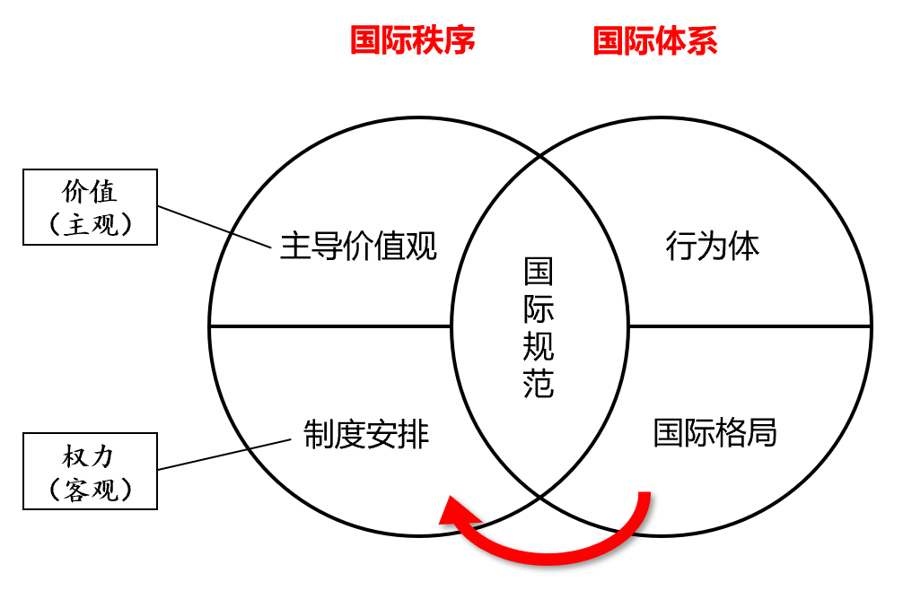
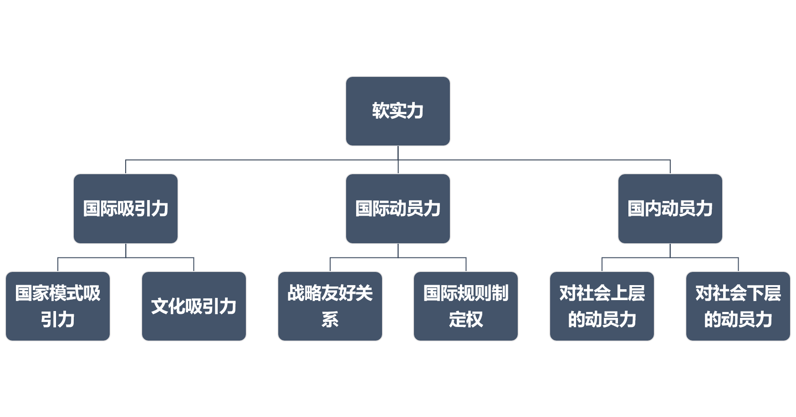

# 阎学通《国际关系分析（第三版）》（2017年9月）概念整理

[TOC]

## 第一章 学科概况和研究方法

#### §1 学科范畴

|内容         | 成果与目的                   |
| ------------ | ---------------------------- |
| 理论研究     | 学术论文和学术著作，论证规律 |
| 政策研究     | 政策报告，提出政策建议       |
| 国际时事评论 | 表达个人或组织的看法和立场   |

#### §2 研究内容

1. 国别和地区研究
2. 问题研究

#### §3 国际关系学的主要流派

|            | 关注问题   | 核心变量       | 解决途径     |
| ---------- | ---------- | -------------- | ------------ |
| 现实主义   | 安全、冲突 | 权力、国家利益 | 维持均势     |
| 自由主义   | 发展、合作 | 制度、共同利益 | 改善制度     |
| 建构主义   | 和谐、进化 | 观念、文化环境 | 改变观念     |
| 马克思主义 | 剥削、斗争 | 依附、阶级利益 | 改变国际秩序 |

#### §4 学习路径

1. 概念，一个学科的基础知识
2. 历史
3. 理论，一个学科的顶层知识。应该先打好概念基础，再精研理论。

## 第二章 国际体系与国际秩序

#### §1 国际体系三要素

1. 国际行为体（international actors），改变最缓慢
2. 国际格局（international configuration），改变最频繁
3. 国际规范（international norm）

#### §2 国际秩序三要素

1. 国际主导价值观（international dominant values），常常是主导国的价值观

2. 国际制度安排（international institutional arrangements）

   1. 国际机构设置

   2. **权力分配**[^1]

   [^1]: 这才是国际秩序中最重要的。

3. 国际规范，一国是否遵守取决于（1）利益（2）价值观

#### §3 国际体系与国际秩序的区别

1. 前者是客观的，后者由于价值观这个因素是主观的，有了评价成分。
2. “**建立国际新秩序**”侧重于三要素中的权力，其**本质是国际权力再分配**；相对而言，“**全球治理**”则主要指**国际责任再分配**。
3. 国际格局是国际体系的一部分，但不是国际秩序的一部分。国际格局影响国际秩序，二者是**实力基础与上层建筑的关系**；前者的变化快于后者的调整，这种内在矛盾成为国际秩序中权力之争的主要原因。

图 2-1 国际秩序与国际体系

#### §4 国际格局

1. 极（polarity）：国际体系中相互对立的主导力量。
2. 国际格局两要素
   1. 大国实力对比：实力发展不平衡规律（the rule of unbalanced power development）
   2. 大国战略关系
3. 不同格局下大国与中小国家的行为空间不同。
   1. 单极格局：超级大国到的约束小于中小国家
   2. 两极格局：超级大国与普通大国受到的约束大于中小国家
   3. 多极格局：大国与小国受到相似的格局影响力

## 第三章 国际行为体和国家主权

## 第四章 国家利益和民族认同

#### §1 民族认同形成的社会条件

1. **青少年时期**的生活环境。这一时期形成的民族认同一般会伴随一个人终生。
2. 群体性民族认同变化的所需的时间一般为 35 到 50 年，即大概两代人。

#### §2 民族主义的形成原因

1. 这是一个非常复杂的问题，种种理论在解释上各有侧重。
2. 但总得来说，民族主义是近现代社会的产物。

## 第五章 综合国力与大国崛起

#### §1 实力与权力

1. 实力是物理概念，权力是关系概念。但 power 在英文中是双义的，存在一定程度的概念混乱。中文则不存在这个问题。

2. 权力具有**目标和手段的双重性质**。国家有时将权力作为目标来争夺，有时以权力为手段扩大和维护国家利益。

3. 国际权力由三个因素决定

   1. 国家实力对比

   2. 国际规范[^2]

   [^2]: 主要体现路径依赖的历史因素。

   3. 该国与他国的关系

4. 权力不等于权威。国际权威需要靠不断地成功来赢得被领导国的信任。

#### §2 综合国力

1. 综合国力（comprehensive national power）包括政治实力和军事实力、经济实力、文化实力。前者为**操作性实力（operational power）**，后三者为**资源性实力（resourceful power）**，政治实力会对资源性实力产生乘数放大作用，即[^3] $综合国力=\underbrace{\overbrace{(军事实力+经济实力}^{硬实力}+文化实力)}_{资源性实力} \times \underbrace{政治实力}_{操作性实力}$

   [^3]: 美国前中央情报局副局长克莱因（Ray S. Cline）最早提出了物质实力要素与精神实力要素之间相乘而非相加的关系。这个洞察太重要、太关键了。

2. 综合国力的质量：实力要素的平衡度。定义式为 $CP_q=e^{-\sigma}$，其中 $\sigma$ 为四个实力要素值的标准差。四种实力越接近，综合国力的质量越好。

3. 实力要素的不可替代性（the irreplaceability of power elements）。不同实力要素发挥的功能不同，国家把一种实力要素转换成另一种需要花费较长的时间，因此四个实力要素在短期内不能互相替代。

4. 政治实力是软实力的核心，中国提升软实力需要从政治实力入手[^4]。

[^4]:政治实力与行政技术、政体、社会结构（阶级关系）乃止历史传统、革命传统等因素都有关，而不是由政体这个单一因素决定的。特别是，在冷战后政体趋同的背景下，政体的差别更像一张皮，对政治实力的影响并不大。

 
图 5-1 对软实力构成的分解

#### §3 大国崛起/世界中心转移

1. 崛起不是一般的发展，崛起是**新兴大国与霸权国之间**相对实力差距的缩小和实力地位的换位。崛起通常是国际关系学研究的问题，核心内容是赶超霸权国。
2. 结构性矛盾（structural conflict），与双方的国家战略无关，不因人的主观意志而转移。
3. 新兴大国的崛起战略
   1. 兼并战略（annexation strategy）
   2. 结盟战略（alliance strategy），以本国为盟主，通过向盟友提供好处获得盟友的追随
   3. 搭车战略（free ride strategy），以霸权国为盟主，从霸权国那里获得好处。只适用于崛起的早期阶段

## 第六章 国际安全与世界和平

#### §1 和平与安全

| 概念 | 定义                                 |
| ---- | ------------------------------------ |
| 和平 | 没有战争的客观状态                   |
| 安全 | 利益受到保障的主观与客观相结合的状态 |

1. **国家可能在和平状态下面临严重的安全威胁，也可能在战争状态下安全无虞**。
2. 和平不能保证一个国家的生存和利益，国家首要追求的是安全。
3. “安全”侧重不损失利益；“发展”侧重拓展利益。

#### §2 国际安全困境

1. 安全困境（security dilemma）是一种典型的囚徒博弈。
2. 传统安全威胁：国家之间相互构成的（以政治、军事手段为主的）安全威胁。
3. 非传统安全威胁：（1）**非国家行为体**或（2）**其他国家政府的非军事行为**造成的国家安全威胁。
4. 战略互信（strategic mutual trust）：双方在重大战略利益问题上有着相互认为对方不会采取与己敌对立场的信任。

#### §3 国际和平

1. 保障和平有两个非常传统的方法：（1）维持均势；（2）建立单极霸权。

## 第七章 国际冲突与国际合作

#### §1 国际合作

1. 国际合作：有关当事方选择的**相互妥协**的行为。
2. 合作与屈服的区别：合作是妥协行为，双方或多方都做出让步；屈服则是单方做出让步。
3. 合作与和谐的区别：合作以利益冲突为前提，有冲突才有妥协和协调立场；和谐则不存在利益冲突。
4. 战略互信不是战略合作的前提条件。只要有共同的战略利益存在，即使没有互信，也能开展合作。

#### §2 绝对收益和相对收益

1. 绝对收益（absolute gain）：与自己纵向比较。
2. 相对收益（relative gain）：与他方横向比较。
3. 高阶政治（high politics）：有关安全（军事）利益和政治利益方面的问题。
4. 低阶政治（low politics）：有关经济利益和文化利益方面的问题。

|          | 更多考虑相对收益 | 更多考虑绝对收益 |
| -------- | ---------------- | ---------------- |
| 合作领域 | 高阶政治         | 低阶政治         |
| 合作对象 | 敌人             | 朋友             |
| 合作期限 | 长期             | 短期             |

#### §3 积极合作与消极合作

1. 积极合作（positive cooperation）：合作者共同应对第三方，如军事同盟。

2. 消极合作（negative cooperation）或预防性合作（preventive cooperation）：应对合作者之间冲突的合作，如[欧洲安全与合作组织](http://en.bosimedia.com/wiki/Organization_for_Security_and_Co-operation_in_Europe)。

3. 敌对国家之间也可以达成积极合作[^5]；友好国家之间也可以达成消极合作。

   [^5]: 20 世纪 60 年代，美苏英三国达成《部分禁止核试验条约》，合作的目的是组织中国、法国进行核试验。

#### §4 全球治理

1. 全球治理（global governance）：通过制定**有约束力**的国际规制来解决人类面临的全球性问题。全球治理的核心是国际责任的分配，**本质上是要求大国承担更多的国际责任**。
2. 现实主义者认为中国不可对全球治理抱有过高期望，防止奋发有为的外交政策落入好大喜功的歧途。

#### §5 区域合作和区域（一体）化

1. 区域合作（regional cooperation）和区域化（regionalization）的根本区别在于，是否存在部分国家主权让渡给地区组织机构的现象。
2. 区域合作的原因
   1. 应对其他地区国家的竞争压力（扩大版的国家保护主义）
   2. 缓解全球化的危害，如增强国际谈判能力
   3. 增强与邻国的政治和安全互信
   4. 为国内改革创造条件
3. 大国的政治领导是区域合作成功的先决条件。

## 第八章 危机管理和对外决策

#### §1 国际危机

1. 国际危机：**高强度的、有可能引发战争的国际冲突**事件。如 1962 年古巴导弹危机、2012 年钓鱼岛危机。
2. 三个特征：
   1. 事发突然，用于解决冲突的决策时间有限。处理危机时，一个及时错误的决策比一个迟到的完美决策更有意义。
   2. 国家重大利益受到严重威胁
   3. 冲突本身有升级为军事冲突的危险
3. 政治解决国际危机的几种方式
   1. 谈判：直接交涉和交换意见
   2. 协商：有时也邀请中立国参加
   3. 斡旋（good offices）：第三方采取和提供协助
   4. 调停（mediation）：第三方就争端解决提出方案，并直接参加或主持谈判
   5. 仲裁（arbitration）：具有公认地位的中立机构或第三方作出裁决。**仲裁需要双方自愿**。
4. 国际维和：为政治解决国际军事冲突提供条件，使冲突方和第三方有更多的时间和相对稳定的环境进行谈判、调解、斡旋。

#### §2 决策与政策研究

1. 影响决策正功率的因素
   1. 领导者的决策能力。决策要对复杂的利益关系进行多维度的平衡，本质上是一种艺术。
   2. 作为基础的政策研究水平。政策研究更多地遵循科学方法，其水平高低会影响决策者的艺术表现。
   3. 合理的制度安排，如一个允许多种意见争论的决策机制、对错误决策进行及时纠偏的机制。决策过程的科学化有助于提高决策的成功率，但不能保证决策不出现失误。
2. 影响决策成功率的因素是复杂的，单一方面的发达并不能保证决策的成功。要对总体决策水平有更好的把握，多因素分析方法中必须融入**历史感**，即在一个组织、国家的兴衰周期中，多种因素的强势期不一致，使总的决策能力呈现一定的起伏规律。例如，霸主末世的研究积累一般基础雄厚、无人能敌，但一系列其他因素会腐蚀其作出成功决策的能力。新兴组织进行决策的制度安排可能不完善，但经历复杂斗争环境的领导者的决策能力可能非常高超。

#### §3 政策分析的角度

1. 国家目标
   1. 普世性理性/工具理性：说人们具有这种理性，指他们的目标可能不同，但实现目标的手段是一致的、可预期的。
   2. 特殊理性：指人们的目标不尽相同。在国际关系领域，说不同国家具有不同理性，指不同国家对国家利益的排序标准不同。如冷战后的美国具有民主理性，伊朗具有伊斯兰理性或什叶理性，中国具有发展理性。
2. 部门利益/官僚化分析（bureaucratic analysis）
3. 组织行为分析

#### §4 国家类型、领导类型和对外战略取向

1. 四种领导类型
   1. 无为型：自知实力不足，（至少暂时）放弃战略利益以缓和矛盾。其他三种领导类型都不放弃战略利益，只是追求战略利益时倾向优先使用的手段不同。
   2. 守成型：倾向使用经济/互利手段追求战略利益
   3. 主动型：倾向使用政治/妥协手段追求战略利益
   4. 争斗型：倾向使用军事/威慑手段追求战略利益
2. 领导人
   1. 同一个领导人可能随着时间的推移呈现出不同的领导类型
   2. 领导人的意识形态越复杂，认知能力越强，越能在危机时刻保持头脑清醒，制定出最有效的对外政策

|          |     无为     |       守成       |   主动   |        争斗        |
| :------- | :----------: | :--------------: | :------: | :----------------: |
| 主导国   |     绥靖     | 军事收缩、拼经济 | 集体干预 |      全面遏制      |
| 崛起国   |   放弃崛起   | 拓展全球经济合作 | 睦邻结盟 | 军事扩张、挑战禁脔 |
| 地区大国 | 防止外部介入 | 强化区域经济合作 | 地区同盟 |      地区扩张      |
| 小国     |   对外中立   |      不结盟      | 参加同盟 |      自我封闭      |

## 第九章 国际军控和战略威慑

#### §1 国际军控

1. 军控的目的是期望对方也采取同样的政策
2. 原理：战略博弈

#### §2 战略威慑

1. 战略威慑（strategic deterrence）专指核威慑

   1. 相互确保摧毁战略（mutual assured destruction）
   2. 不可接受的损失（unacceptable losses），如三分之一的人口和二分之一的工业
   3. 二次打击能力
2. 确保核武库的足够规模和相互平衡是实现有效战略威慑的根本保障。相反，不审慎的核裁军行动非但不能带来和平，反而有可能成为诱发核战争的因素。

#### §3 外空和网络

1. 外空战与核战争一样不会有赢家。外空战遗留的无数碎片会阻止新的航天器进入太空，导致人类再也无法利用太空资源、从事太空活动。
2. 网络安全（cyber security）

## 第十章 意识形态和宗教

#### §1 意识形态对国际关系的影响

1. 意识形态（ideology）：一组用来解释人类社会应当如何运作的观念和原则，并且提供了建设某种社会秩序的蓝图。

2. 意识形态的功能

   1. 提供了认识和理解世界的思想框架
   2. 帮助人们明确他们的行动目的和行动指南
   3. 帮助人们建立共同的政治身份认同，从而促进他们之间的合作

3. 意识形态为国家利益披上了一层温情脉脉的面纱；但“政治正确”的泛滥可能导致意识形态原教旨主义，使国家利益受损。

4. 意识形态因素在中国对外工作中的“回归”：中国总结“文革”教训，以及美国冷战后在全球推行民主价值观的教训，一度认将国家利益和意识形态对立起来，要求不以意识形态指导对外政策。但近年来，中国发现只讲国家利益无法在国际上提高道义感召力，不利于维护国家利益[^6]。因此政府提出要建立核心价值观，意识形态对中国外交政策的影响力明显上升。

   [^6]: 如台湾人不是不知道大陆的快速发展，但他们认为大陆唯利是图、缺乏道德感，认为普通人生活在这样的社会中毫无幸福感可言，因此强烈地反对统一。

#### §2 宗教与国际关系

1. 由于一神教在中国历史上没有占据主导地位[^7]，绝大多数中国人对于宗教信仰的政治力量理解不深刻

   [^7]: 不像多神教用神与神的冲突和差异粉饰人与人的冲突和差异，一神教为所有信徒允诺了平等的地位（所谓“上帝面前人人平等”），就像古代的国际共运，因而具有深刻的道德感和广泛的号召力。但中国的社会形态刚好也是平等的、非世袭的，因而不需要一神教的这一功能。

2. 宗教国家有其特殊理性，追求的目标与世俗国家有较大差异。

## 第十一章 国际组织与国际规范

#### §1 联合国改革问题

> 韩国与日本在二战后结下世仇，因此反对日本入常。意大利和德国都是二战的战败国，而且都被视为法西斯国家。**德国入常意味着德国成为正常国家，而意大利仍要背负历史污名。因此意大利要求与德国同时入常**。巴基斯坦与印度还处于全面军事对抗关系，因此担心印度入常后利用手中的权力打击巴基斯坦。**智利担心巴西入常后成为南美的主导国，使自己失去目前与巴西平等的地位，因此宁可拉美没有常任理事国，也不能让巴西独自入常**。埃及要求入常成为非洲的代表，但**尼日利亚和南非都认为自己比埃及更能代表非洲**。
>
> 
——P289

所以，这真的不是一本正经地在讲笑话吗？(￣▽￣)~* 

## 第十二章 国际经济关系和经济制度

> 国际政治经济学（IPE）已经成为国际关系学中的一个独立的专业学科，有了成体系的理论和专业术语。
>
> 
——P308

> 相对于世界上的绝大多数国家，包括绝大多数发达国家，我国在 IPE 方面的研究是比较先进的，但与美国相比还有较大差距。……我国 IPE 专业有巨大的发展潜力，值得青年学者进行研究。
>
> 
——P331

#### §1 经济相互依存的敏感性和脆弱性

1. 敏感性（sensitivity）：一个国际经济事件对一国内部的影响速度
2. 脆弱性（vulnerable）：一国受到国际经济冲击后所要付出的代价大小
3. 反全球化运动
   1. 推动区域化的政府力量
   2. 反对全球化带来的全球不平等的民间力量

## 第十三章 国际关系预测方法和未来五年预测

