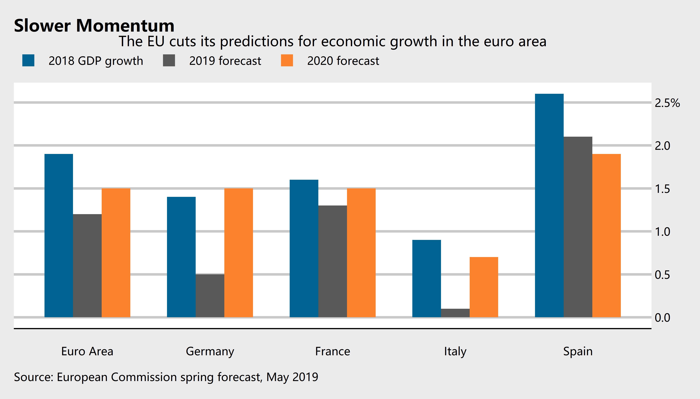
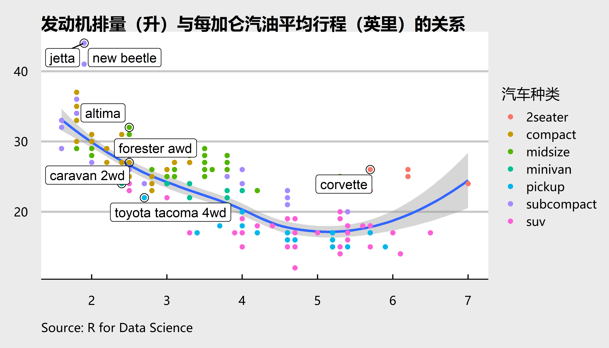

```{r global_options, include=FALSE}
knitr::opts_chunk$set(
  fig.width = 6, fig.asp = 0.618,
  out.width = "70%", fig.align = "center",
  fig.path = 'Figs/',fig.show = "asis",
  warning = FALSE, message = FALSE, 
  cache = T, cache.comments = F, comment = '', 
  options(digits = 4))
```

```{r setup, include=FALSE, cache=FALSE}
# use necessary packages
library('pacman')
p_load(tidyverse, reshape2, magrittr, readxl,
       ggthemes, ggrepel,
       lmtest, nycflights13, car, 
       rvest)

options(htmltools.dir.version = FALSE)

# 自定义偏好字体
windowsFonts(H = windowsFont("微软雅黑"))
# 代码块需要fig.showtext=TRUE选项，ggplot2图形再加一行 + theme(text = element_text(family = 'H'))来定义字体，才能正常显示图中的中文。

# 自定义主题
mytheme <- theme_economist_white() +
  theme(text = element_text(family = 'H'),
        plot.title = element_text(face = 'bold', size = 14), 
        plot.subtitle = element_text(size = 12),
        plot.caption = element_text(hjust = 0, size = 10, margin = margin(2,0,0,0,'pt')),
        plot.margin = margin(12,10,12,0,'pt'),
        legend.position = 'top',
        legend.justification = 'left',
        legend.margin = margin(4,0,0,0,'pt'),
        legend.key.size = unit(1,'lines'),
        legend.title = element_text(size = 12),
        legend.text = element_text(size = 10, margin = margin(0,0,0,0,'pt')),
        axis.text = element_text(size = 10, margin = margin(2,0,2,0,'pt')),
        axis.ticks.length = unit(-4,'pt')
        )
```

class: inverse, center, middle

# 工欲善其事，必先利其器

# .right[——《论语·卫灵公》]

---

layout: false
class: inverse, center, middle, animated, zoomIn

# 数据采集

---

# 结构型数据：与数据库交互

- 建立个人数据库

  - 保存数据的专业工具，数据库有利于知识积累和纵向比较
  
--

  - 数据库的含义很广，包括数值数据库、文本数据库和参考文献数据库等
  
--

- 尽量不在Excel中分析数据

  - 过于灵活，易被修改
  
  - 结构性差，管理不便
  
  - 无法记录数据处理的全过程

--

- 有些收费数据库无法在R环境中直接访问，只能手动将数据导出为csv、xls、xlsx等格式，作为项目的数据源。即使是这种万不得已的情况，仍然要避免在excel中处理数据。同时，尽可能将原始数据导入个人数据库，以便在重复性研究中使用。

???

R对Office Access的支持不太好，可以考虑使用MySQL建立个人数据库——MySQL数据库同样有图形化操作界面。

文本数据库如党和国家重要文献、国际组织报告、美国政策文件汇编等。尽量以自然段 + 层级信息的方式储存，便于后续处理和导出。  

添加提示。提示不会直接显示在幻灯片中，而是在演讲者模式中才会出现（键盘上按 p 键）

---
# 非结构型数据：R爬虫<sup>1</sup>

- 抓取->清理->添加至个人数据库

.center[]

.footnote[
[1] 学名：基于R语言的自动数据收集。
]

---

```{r, cache=FALSE}
# 爬取一个月内的波罗的海干散货指数 
'https://cn.investing.com/indices/baltic-dry-historical-data' %>% 
  read_html(encoding = 'UTF-8') %>% html_node("table") %>% 
  html_table(header = T, fill = T) %>% select(-6) %>% 
  DT::datatable(options = list(pageLength = 5), 
            fillContainer = F, caption = 'BDI指数每日行情')
```

???
这个表是可交互的，只有基于网络技术的html格式的幻灯片可以做出可交互图表。

---
class: inverse, center, middle, animated, zoomIn

# 数据分析

---
background-image: url(https://www.rstudio.com/wp-content/uploads/2014/04/magrittr-200x232.png)
background-size: 150px
background-position: 85% 70% 

# 优雅的代码风格

```{r, fig.align='left'}
flights %>% group_by(dest) %>% # 分组
  summarize(count = n(), dist = mean(distance, na.rm = TRUE),
            delay = mean(arr_delay, na.rm = TRUE)) %>% # 统计
  filter(count > 29, dest != "HNL") %>% # 筛选观测
  ggplot(aes(x = dist,y = delay)) + geom_smooth(method = 'lm') + 
  geom_point(aes(size = count),alpha = 1/3) # 作图
```

???

用管道运算符写代码很清晰，每一行是一步操作

优雅与否，不在于外观，而在于思维上的优化

节省内存，不用定义变量

---

# 强大的统计和计量功能

- 不忘初心，牢记使命
```{r, echo=FALSE}
lm(dist ~ speed, data = cars) %>% summary()
```

--

### 若论“短平快”，[**R是最值得学习的编程语言**](http://blog.fens.me/r-ideal/)

???

R的理念是关注问题本身，不深究算法的效率。换句话说，它能为你节约脑细胞，代价是不会节约内存空间和运算时间。这是由R的基因决定的，它不是程序员设计的语言。

---
# 模拟计算

```{r, echo=FALSE, out.width='95%', fig.asp = 0.7}
# 参数设定
kappa <- 4
theta <- 0.36
gamma <- 0.9

# 辅助变量
au <- kappa^(1/(1 - theta))

# 变量数据结构
# lambda的第一期是有用的，因为第二期会受第一期影响
# k的第一期（末）也是有用的，会决定第二期的产出
# 但y的第一期数据对之后没有任何影响
k <- tribble(~k1,~k2,~k3,
             0.8*au,au,1.2*au)
lambda <- tribble(~A1,~A2,~A3,
             1,1,1)
y <- tribble(~y1,~y2,~y3,
             0,0,0)
y[1,] <- lambda[1,]*k[1,]^theta*65^(1 - theta)

# 模拟
for (i in 2:100) {
  lambda[i,] <- 1 - gamma + gamma*lambda[i - 1,] + 
    0.02*(runif(3) - 0.5)
  y[i,] <- lambda[i,]*k[i - 1,]^theta*65^(1 - theta)
  k[i,] <- kappa*lambda[i,]*k[i - 1,]^theta
}
data <- cbind(lambda,k,y) 
data$t <- 1:length(data$A1)

# 作图观察
plot2 <- data %>% select(t,y1,y2,y3) %>% 
  rename('poor' = y1, 'mediem' = y2, 'rich' = y3) %>% 
  melt(id = 't') %>% 
  ggplot(aes(t,value)) + 
  geom_line(aes(color = variable)) + 
  labs(x = 'period', y = 'income per capita',
       color = 'countries', 
       title = 'A Simulation of OLG Model') +   
  labs(caption = 'Source: The ABCs of RBCs') +
  mytheme

ggsave(file = "Figs/plot2.png", plot = plot2, dpi = 600, width = 7, height = 4)

```

---
# 机器学习 (Machine Learning)

- 人工智能的核心

- 虽然在理论解释上偏弱，但在实践应用中异常强大

  - 不关注 $\hat\beta$，全力预测 $\hat Y$

- 与 Econometrics 的关系不是竞争而是互补

  - Varian, Hal R. "Big data: New tricks for econometrics." _Journal of Economic Perspectives_, 2014, 28(2): 3-28.
  
  - Mullainathan, Sendhil, and Jann Spiess. "Machine learning: an applied econometric approach." _Journal of Economic Perspectives_, 2017, 31(2): 87-106.

  - Athey, Susan. "The impact of machine learning on economics." _The Economics of Artificial Intelligence: An Agenda_. University of Chicago Press, 2018.
  
---
class: inverse, center, middle, animated, zoomIn

# 可视化：R的核心竞争力之一

---
background-image: url(https://www.rstudio.com/wp-content/uploads/2014/04/ggplot2-200x232.png)
background-size: 120px
background-position: 80% 5% 


# 完备的图形语法

&nbsp;

>     
> 可以将任何图形的内容精确地描述为(1)数据集(data)、(2)几何对象(geom_function)、(3)映射集合(aes)、(4)统计变换(stat)、(5)位置调整(position)、(6)坐标系(coordinate)和(7)刻面模式(facet)的一种组合。

> .right[—— Hadley Wickham]

按照下述模板，可以构建你能够想象到的任何图形。

```r
* ggplot(data = <DATA>) +
*   <GEOM_FUNCTION>(     
*     mapping = aes(<MAPPINGS>), 
*       stat = <STAT>, 
*       position = <POSITION>) + 
*     <COORDINATE_FUNCTION> + 
*   <FACET_FUNCTION>
```

--

### .center.red[**一套用图形反映数据的标准框架**]

---

# 图形内容与形式的分离

--

- 我们希望

  - 探索、研究 vs 排版、展示，不同阶段关注重点不同
  
  - 图形的大小、颜色、字体、字号、线型等，形成统一风格

--

- 套用主题

--

.pull-left[
```{r, echo=FALSE, out.width = '100%', fig.asp = 0.8}
ggplot(mtcars, aes(x = wt, y = mpg)) +
  geom_point(pch = 17, color = "blue", size = 2) +
  geom_smooth(method = "lm", color = "red", linetype = 2) + 
  labs(title = "Wall Street Journal", x = "Weight", 
       y = "Miles Per Gallon") + 
  theme_wsj() + scale_fill_wsj()
```
]

.pull-right[
```{r, echo=FALSE, out.width = '100%', fig.asp = 0.8}
ggplot(mtcars, aes(x = wt, y = mpg)) +
  geom_point(pch = 17, color = "blue", size = 2) +
  geom_smooth(method = "lm", color = "red", linetype = 2) + 
  labs(title = "Economist_white", x = "Weight", 
       y = "Miles Per Gallon") + 
  theme_economist_white(base_size = 14)
```
]

---

# 自定义主题

- 例：柱状图主题

```{r, echo=FALSE, out.width = "80%"}
# 柱状图主题
theme_bar <- theme_economist_white() +
  theme(text = element_text(family = 'H'), # 所有的文本字体
        plot.title = element_text(face = 'bold', size = 12), 
        plot.subtitle = element_text(size = 10),
        plot.caption = element_text(hjust = 0, size = 8,
                                    margin = margin(0,0,0,0,'pt')),
        plot.margin = margin(12,0,12,10,'pt'),
        legend.position = 'top',
        legend.justification = 'left',
        legend.margin = margin(4,0,0,0,'pt'),
        legend.key.size = unit(0.7,'lines'),
        legend.title = element_blank(),
        legend.text = element_text(size = 8, margin = margin(0,8,0,4,'pt')),
        axis.text = element_text(size = 8),
        axis.ticks.length = unit(0,'pt') # 不要坐标轴须
        )

gdp <- read_excel('Data/EU_GDP.xlsx', col_names = T) %>% 
  melt(id = 'year') %>% 
  rename(country = variable) 

p_bar <- gdp %>% 
  ggplot(aes(x = country, y = value, fill = year)) + 
  geom_bar(stat = 'identity', position = 'dodge', width = 0.7) +
  scale_y_continuous(position = "right", 
                     breaks = c(0, 0.5, 1.0, 1.5, 2.0, 2.5),
                     labels = c("0.0", "0.5", "1.0", "1.5", '2.0', '2.5%')) + 
  labs(title = 'Slower Momentum', 
       subtitle = 'The EU cuts its predictions for economic growth in the euro area', 
       x = '', y = '', 
       caption = 'Source: European Commission spring forecast, May 2019') +
  scale_fill_manual(values = c("#016392", "#595959", "#fb832d")) +
  theme_bar

# 为了幻灯片中的图高清，只能先保存再调用
ggsave('Figs/EU_gdp.png', p_bar, width = 7, height = 4, dpi = 600)

```

- 华尔街日报的色系：使用颜色表达情绪


---
# “图层”概念

- 类似 Photoshop，可任意组合、无限叠加

--
  
```{r, echo=FALSE, fig.showtext=TRUE}
# 先选取出每类汽车中效率最高的型号，然后在图形中标记出来
best_in_class <- mpg %>%
  group_by(class) %>%
  filter(row_number(desc(hwy)) == 1) # desc()排序

# ggrepel包非常有用，可以自动调整标签的位置，使它们免于重叠
plot3 <- ggplot(mpg, aes(displ, hwy)) + 
  geom_smooth(se = T) + 
  geom_point(aes(color = class)) +
  geom_point(size = 3, shape = 1, data = best_in_class) + 
  # 添加了一个图层，用较大的空心圆来强调添加了标签的数据点
  ggrepel::geom_label_repel(aes(label = model),data = best_in_class) +   
  labs(x = '', y = '',
       title = '发动机排量（升）与每加仑汽油平均行程（英里）的关系',
       color = '汽车种类',
       caption = 'Source: R for Data Science') +
  mytheme + theme(legend.position = 'right')
  

ggsave(file = "Figs/plot3.png", plot = plot3, dpi = 600, width = 7, height = 4)

```

--

- 常用的图形组合可通过自定义函数模板化：如

  - 直方图 + 概率密度曲线
  
  - 散点图 + 拟合线 + 预测的置信区间

---
# 可交互图形

```{r, out.width='100%', fig.asp = 0.8}
library(leaflet)
{{leaflet() %>% addTiles() %>% setView(116.426, 39.908, zoom = 17)}}
```

---
exclude: false

class: inverse, center, middle, animated, zoomIn

# 报告呈现

---

background-image: url(https://www.rstudio.com/wp-content/uploads/2014/04/rmarkdown-200x232.png)
background-size: 150px
background-position: 92% 80% 

# 本体：文本文件R Markdown

--

.pull-left[

- 项目全要素打包

  - 数据源

  - 思路：注释

  - 代码

  - 数学公式<sup>1</sup>

  - 图表

  - 分析和结论
]

--

.pull-right[

- 灵活选择导出内容

- 灵活选择导出格式
  
  - docx
  
  - pdf
  
  - .red[**epub**]
  
  - markdown
  
  - html<sup>2</sup>
]

.footnote[
[1] 见下页。

[2] 网页的功能极其强大，而且可以是可交互的，是未来展示与交流的发展方向。
]

---

# Mathpix Snipping Tool

.pull-left[

* 只需要框选就能自动识别公式，并生成该公式的 $\LaTeX$代码——而 $\LaTeX$代码在R Markdown中是可以正确显示为公式的。

* 抛弃 MathType, 输入复杂公式只需采取如下步骤：

  1. 找到文献中类似公式 

  2. Mathpix识别

  3. 粘贴 $\LaTeX$代码至R Markdown
  
  4. 微调修改
]

.pull-right[

.center[]

.center[]

]
---

background-image: url(Figs/RMarkdown示例.png)
background-size: contain
background-position: 50% 80%

class: inverse, center, top

# 公式编号、交叉引用效果图

---

# 论文与书稿：Word

--

- 公式自动编号的老大难问题

--

- 参考文献的交叉引用和文末列表不能动态更新

--

- 图文混排时，图无法灵活浮动，经常导致页面出现大片空白

--

- 不同版本的兼容性问题

--

- 夹杂大量公式、交叉引用的长文档打开缓慢、易崩溃

--

### 哪怕你熟练掌握了样式、题注和交叉引用，Word 仍然意味着大量手动调格式的工作

---

# 论文与书稿： $\LaTeX$
 
- 排版华丽

- 格式语法太复杂，满屏斜杠("\\")反人类

  - 学习曲线过于陡峭

- 当你满怀热情教人用 $\LaTeX$的时候：

--

.center[]

---

background-image: url(http://bookdown.org/yihui/bookdown/images/logo.png)
background-size: 200px
background-position: 90% 50% 

# 论文与书稿：bookdown

Word与 $\LaTeX$的完美折衷：bookdown，不可挡！

--

- 自动编号，包括章节标题、图题、表题、公式
  
- 自动生成目录和图表目录

- 交叉引用，包括图题、表题、公式序号、参考文献

- 生成参考文献的动态列表

- 生成动态索引

--


- 例：[bookdown官方手册](https://bookdown.org/yihui/bookdown/), [R文本文件的语法](https://humoon-website.netlify.com/notes/201905_r%E6%96%87%E6%9C%AC%E6%96%87%E4%BB%B6%E7%9A%84%E8%AF%AD%E6%B3%95/_book/)

--

- 完美，强大，省心——真可谓：

--

### .center[.red[R环境一入深似海，从此Word是路人]]
---

class: inverse, center, middle, animated, zoomIn

# 办公

---
background-image: url(https://cloud.githubusercontent.com/assets/163582/25060238/2975308c-215e-11e7-8afd-2e9200d7afe3.png)
background-size: 200px
background-position: 90% 40% 


# 制作幻灯片：xaringan

- 抛弃了Excel，扔掉了Word，连PowerPoint也要丢开吗？

- html 格式的幻灯片才是未来发展的方向

  - 多媒体
  
  - 可交互
  
  - 无需携带储存设备
  
  - 不用担心不同终端的兼容性问题
  
--

- 在强限制下专注于内容

  - xaringan 不如 PowerPoint 功能全面、形式多样，但这未尝不是一件好事

  - 决策不管大小，都会消耗人的意志力；如果作者总在为调整形式而作决策，就不会有足够的动力撰写正文
  
---
# 搭建小型网站：R blogdown


- R blogdown + Hugo + Netlify平台<sup>1</sup> = 免费个人网站。

--

  - 个人经验教训的记录
  
--

  - 分享、交流知识与观点的平台
  
--

  - 从此不必传输文件，发送网址（或二维码）即可，尤其是面向多人时

--

  - 例：[R blogdown示例网站](https://yihui.name/)
      


.footnote[
[1] Netlify 网站已被微信屏蔽，但在微信外可以打开。
]

---

# 办公自动化

- 批量处理文件
  
  - 生成大量格式统一的报表
  
  - 从大量文件中提取汇总信息

--

- 与 cmd 或 PowerShell 强强联手

  - R可以通过代码直接调用cmd，也可以调用写有cmd命令的.bat批处理文件，实现不同程序之间的联动。例：.red[数据分析运行完毕后调用cmd运行Outlook自动发送结果至他人的邮箱，这在重复进行数据分析时尤其有用]
  
  - cmd也可以调用R，如通过计划任务定期自动运行R脚本。例：.red[自动定期从海关总署网站上 (1)爬取月度外贸数据; (2)存入个人数据库; (3)生成图表; (4)撰写格式固定的简单报告]
  
  - 没有做不到，只有想不到

---

# 开发交互式Web应用：Shiny

- 接受定制，服务于他人需求

- 傻瓜化操作，不需要使用者懂 R

- 实时更新，不需要手动刷新浏览器

- 不仅能看图表，还能上传文件、下载数据<sup>1</sup>

--

- 例：
  - [《三国志》系列人物数据查询系统](https://nathanpan.shinyapps.io/RoTC-Searching/)  
  
  - [中国月度贸易数据查询系统](https://humoon.shinyapps.io/China_trade/)

.footnote[
[1]就像各国统计局一样，允许你按照一定的查询条件下载数据。
]

---

class: inverse, center, middle, animated, zoomIn

# 总结

---

# What's R? 

- An Open Access .red[**Environment/Ecosystem**] for Data Analysis

--

  - 从数据获取、分析挖掘到成果编纂、网络发布，R环境提供了一条龙式支持

--

  - 可以实现.red[**自动化报告与可重复研究**]
  
--

.center[]

???
自动化报告的例子：回归-参数-模型-应用，全部要手动

可重复研究的例子：更新数据-重跑一边；给别人跑

---

# R: 新世界大门的钥匙

--

.pull-left[
## 使用R前

.center[]
]

--

.pull-right[
## 使用R后

.center[]

]

---

background-image: url(https://timgsa.baidu.com/timg?image&quality=80&size=b9999_10000&sec=1558810596866&di=5d827520860e34ff72167c3c7151b876&imgtype=0&src=http%3A%2F%2Fp.showyu.com%2Fuploads%2F20180402%2F15226371469589.jpg)
background-size: 1350px
background-position: 70% 50%


class: inverse, center, middle, animated, fadeIn

# **拒绝繁琐 解放创意**
# **通过 R 拥抱新时代**


.center[<audio src="bgm/走进新时代.mp3"
controls="controls" name="media" 
</audio>]

---

class: inverse, center, middle, animated, zoomIn

# 那么，为何R还没有被推广？

---

# Office办公套件的优缺点

--

### 图形化界面

- 优点：学习成本低，不用记命令

- 缺点：无法记录和保留动作痕迹

--

### 所见即所得

- 所见是否所得？反映了思维方式的不同：

  - 新手用笔画图，老手用方程“画”图——内容先于形式，得其神而忘其形
  
--

- 无论画图还是写作，都应该将内容和形式分开，依次进行。Office让人很难.red[**在思考内容时忽略形式**]，这会极大地干扰思路、降低效率。

---

# Office办公套件的优缺点

### 所有元素封装为一个文件

- 一个程序、一个文件包含文本、数据、图表，解决从内容到格式的一切，便于传输和共享

- 会形成数据源、图表的n个副本，无法动态更新，不符合数据库的管理思想

- R环境正相反：相互调用的文件体系，便于实现动态更新，但传输和共享比较复杂，需要更多地结合个人网站、云服务来简化

--

### .red[上手简单、共享方便，使Office成为商业标准]

---

# R环境<sup>1</sup>的优势

- 项目管理

  - 数据源唯一，通过代码来引用

--

- 动态报告与可重复研究

--

- 写作-渲染，两阶段分开

  - 写作阶段以纯文本文件为载体 

      - 形式朴素，使作者专注于内容
  
      - 易读取，复制粘贴稳定，没有格式问题

--

### .red[R环境更适合追求工作效率的专业人士]

--

.footnote[
[1] 这一套上下链条全覆盖的R环境是逐渐形成的，最近一两年刚刚取得了决定性的突破，还在不断完善中。
]
---
# 未来

- 5G + AI = 万物互联

  - 传输速度加快，自然语言式交互<sup>1</sup>，终端 I/O<sup>2</sup> 化
  
--

  - 有可能形成数据储存、计算过程、多样化输出全部在云上，个人仅在终端编写和提交脚本文件的写作模式

--

  - 如果人工智能取得突破，甚至可以通过口述来实现想要的编辑效果

--

- 研究与办公的效率将进一步提高

.footnote[
[1]自然语言可以被识别、翻译为程序指令，编程门槛将大大降低。

[2]Input-Output，终端将大大“瘦身”，只包含输入和输出功能。
]

---
class: center, bottom

--

# **Reference**

--

### Robert I. Kabacoff, .red[__*R in Action*__]

--

### Hadley Wickham, .red[__*R for Data Science*__]

--

### Yihui Xie, .red[__*R Markdown: The Definitive Guide*__]

--

### 赵鹏, .red[__*学R：零基础学习R语言*__]

--

### 李东风, .red[__*R语言教程*__]

--

### 赵鹏个人网站：[__*openr*__](https://openr.pzhao.org/)

---
background-image: url(Figs/幻灯片二维码.png)
background-size: 400px
background-position: 50% 25%

class: bottom

- 幻灯片网址: https://humoon-website.netlify.com/slides/201905_r课程总结/user_slides

- 幻灯片制作官方教程: https://slides.yihui.name/xaringan/zh-CN.html

- 源代码下载：https://humoon-website.netlify.com/slides/201905_r课程总结/user_slides.Rmd

---
background-image: url(https://cran.r-project.org/Rlogo.svg)
background-size: 300px
background-position: 75% 50%

class: inverse, middle, animated, zoomInDown
  
# **Working with**