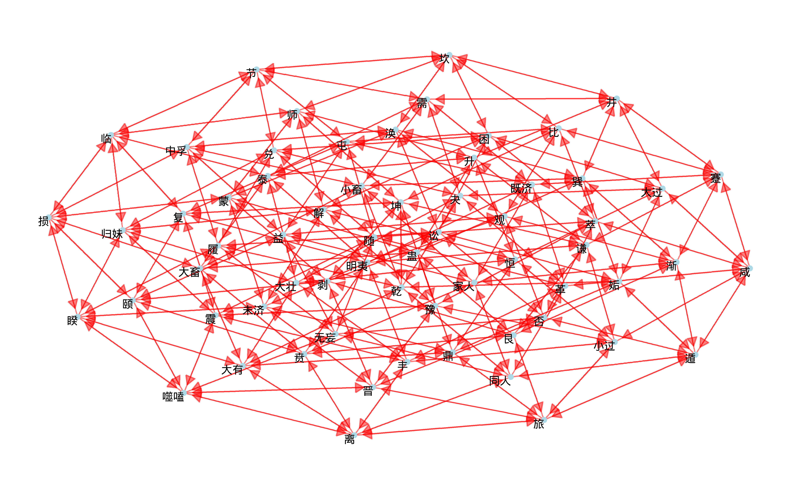

```{r global_options, include=FALSE}
knitr::opts_chunk$set(
  fig.width = 8, fig.asp = 0.618,
  out.width = "100%", fig.align = "center",
  fig.path = 'Figs/',fig.show = "asis",
  warning = FALSE, message = FALSE, 
  cache = T, cache.comments = F, comment = '', 
  options(digits = 4))
```

```{r setup, include=FALSE, cache=FALSE}
# use necessary packages
library('pacman')
p_load(tidyverse, reshape2, magrittr, readxl,
       ggthemes, showtext, ggrepel,
       lmtest, nycflights13, car, 
       rvest)

options(htmltools.dir.version = FALSE)

# 自定义偏好字体
pdf.options(family = "GB1")
windowsFonts(H = windowsFont("Microsoft YaHei"))
showtext_auto(enable = TRUE)
# 代码块需要fig.showtext=TRUE选项，ggplot2图形再加一行 + theme(text = element_text(family = 'H'))来定义字体，才能正常显示图中的中文。

# 自定义主题
mytheme <- theme_economist_white() +
  theme(text = element_text(family = 'H'),
        plot.title = element_text(face = 'bold', size = 14), 
        plot.subtitle = element_text(size = 12),
        plot.caption = element_text(hjust = 0, size = 10, margin = margin(2,0,0,0,'pt')),
        plot.margin = margin(12,10,12,0,'pt'),
        legend.position = 'top',
        legend.justification = 'left',
        legend.margin = margin(4,0,0,0,'pt'),
        legend.key.size = unit(1,'lines'),
        legend.title = element_text(size = 12),
        legend.text = element_text(size = 10, margin = margin(0,0,0,0,'pt')),
        axis.text = element_text(size = 10, margin = margin(2,0,2,0,'pt')),
        axis.ticks.length = unit(-4,'pt')
        )
```

class: inverse, center, middle

# 富有之谓大业
# 日新之谓盛德
# 生生之谓易

## &nbsp;

## .right[——《周易·系辞传》]

---

layout: false
class: inverse, center, middle, animated, zoomIn

# 易学概论

---

# 易的源流

--

- 易的政治地位

  - 三代主流意识形态，周文王就是周国的大巫师、大祭司
  
  - 占卜的话语权由统治集团把持，卜者是汉字（甲骨文）的发明者

--

- 易的思想地位

  - 中国哲学的底色是占卜哲学。
  
  - life 与 fate 在汉语中的合一：死生有命，富贵在天

--

- 易的演变

  - 三代阶段：易象、易占
  
  - 春秋战国：易理
  
  - 秦汉易学革命：易数（背景是天文学大发展）

---

# 易的思维

--

- “易”的含义

  - 变，change

--

- 感应思维

  - 非因果律
  
  - 天人合一，我通宇宙
  
  - 逻辑（理性）思维：绝地天通

--

- 修为大于技术
  
  - “易为君子谋，不为小人谋。”——张载
  
  - “君子居则观其象而玩其辞，动则观其变而玩其占。是以自天佑之，吉无不利。”——《周易·系辞传》
  
  - 易占应验与否，与占具关系不大，关键在人。其难在修身悟道，其乐亦在修身悟道。

---

background-image: url(Figs/后天八卦.jpg)
background-size: 500px
background-position: 90% 60% 

# 阴阳爻和八卦、六十四卦

--

- 阳爻和阴爻

- 后天八卦方位

  - 乾，天，西北
  - 坤，地，西南
  - 震，雷，东
  - 巽，风，东南
  - 坎，水，北
  - 离，火，南
  - 艮，山，东北
  - 兑，泽，西

- 八卦两两组合为六十四卦

- 六十四卦的简便称呼方法
  - 《师》上坤下坎，地水《师》
  - 《家人》上巽下离，风火《家人》

---

# 八卦是象征万物的抽“象”符号

- 《朱子语类》：“《易》难看，不比他书。《易》说一个物，非真是一个物，如说龙，非真龙。”

八卦|性质|自然现象|家庭成员|动物|事物
--|--|--|--|--|--
乾|健|天（体）|父|马|高贵、领导
坤|顺|地|母|牛|接地气、百姓
震|动|雷|长子|龙|果断、主动、情绪易激动
巽|入、退|风|长女|鸡|向内发展、犹豫纠结、手艺好
坎|陷|水、河流|中子|鱼、猪|溺于思索、不断劳碌
离|明亮、依附|火|中女|虾蟹龟|外实内虚、鲜艳美丽重表现
艮|止|山|少子|狗|保守、沉稳
兑|悦、说|泽|少女|羊|雄辩、亲和力

---

# 《周易》的结构

.pull-left[

- 易经
  - 卦辞
  - 爻辞
  - 传说分别为周文王和周公所作<sup>1</sup>

]

.pull-right[

- 易传（又称“十翼”）
  - 《彖》上下篇，注解卦辞
  - 《象》上下篇，注解卦爻辞
  - 《系辞》上下篇，易学总纲
  - 《文言》，详解《乾》《坤》二卦
  - 《说卦》，详解八卦性质
  - 《序卦》，解释卦序
  - 《杂卦》，说明各卦主旨和卦与卦之间的错综关系
  - 传说是孔子及其后学的作品<sup>2</sup>

]

.footnote[
[1] 这两个名字应该是西周两代精英团队的代称；就像毛泽东思想并非毛泽东一个人的创造，而是党的集体智慧的结晶。

[2] 长沙马王堆出土材料表明：孔子早年对易不感兴趣，中年以后兴趣大增，手不释卷。《易传》即使不是孔子亲作，可能仍然包含了孔子口述的研易心得。
]

---

layout: false
class: inverse, center, middle, animated, zoomIn

# 占卜实操

---

# 大衍筮法

- 取 55 根蓍草或小棍，55 为 1 至 10 之和，代表天地自然之数。拿出六根敬六爻，余 49 根

- 手夹 1 根，余 48 根，随机分成两堆，选其中一堆，看其除以 4 的余数，将余数取出。余 1 则再取 3 根，余 2 则再取 2 根，余 3 则再取 1 根，余 4 则再取 4 根

- 手再夹 1 根，随机分成两堆，选其中一堆，看其除以 4 的余数，将余数取出。余 1 再取出 2 根，余 2 再取出 1 根，余 3 再取出 4 根，余 4 再取出 3 根

- 手再夹 1 根，随机分成两堆，选其中一堆，看其除以 4 的余数，将余数取出。余 1 再取出 2 根，余 2 再取出 1 根，余 3 再取出 4 根，余 4 再取出 3 根

- 计算未被取出的根数除以 4 的倍数并记录，结果只可能以下四个数字之一：6、7、8、9。6 为老阴，7 为少阳，8 为少阴，9 为老阳，这样便得出了一爻

- 如是者六次，得到六个爻，按从下到上的顺序排列，得到本卦。然后将老阴变为阳、老阳变为阴，得到变卦

- 本卦代表当前的状态，变卦代表之后的发展。

- 变爻是占卜的主要着眼点

---

# 金钱卦

- 用三枚铜钱或硬币

- 抛掷一次，三个正面朝上为老阳，三个反面为老阴，两正一反为少阳，两反一正为少阴，如此得到一爻

- 反复抛掷六次，得到六爻，从下到上可以排出本卦和变卦

---

# 所有可能的单爻变卦变网络

```{r, echo=FALSE, fig.showtext=TRUE}
rm(list = ls())
load("./Data/64gua.Rdata")

# 自定义网络图主题
mytheme_graph <- theme_void() + 
  theme(text = element_text(family = 'H'), # 所有的文本字体
        plot.title = element_text(face = 'bold', size = 14), 
        plot.subtitle = element_text(size = 10),
        plot.caption = element_text(hjust = 0, size = 8,
                                    margin = margin(8,0,0,0,'pt')),
        plot.margin = margin(12,0,12,10,'pt'),
        legend.position = 'right',
        legend.justification = 'left',
        legend.margin = margin(4,0,0,0,'pt'),
        legend.key.size = unit(0.7,'lines'),
        legend.title = element_text(size = 8, 
                                   margin = margin(0,8,0,4,'pt')),
        legend.text = element_text(size = 8, 
                                   margin = margin(0,8,0,4,'pt'))
        )

library(igraph)
library(ggraph)

graph <- graph_from_data_frame(edges, vertices = points, directed = T)

set.seed(123) 
a <- grid::arrow(type = "closed", length = unit(0.1, "inches"))
p <- ggraph(graph, layout = "fr") + 
  geom_edge_link(edge_alpha = 0.5, arrow = a, color = 'red',
                 end_cap = circle(0.09, 'inches'),
                 show.legend = T) + 
  geom_node_point(color = 'lightblue') + 
  geom_node_text(aes(label = name), size = 18, 
                 vjust = 1, hjust = 1) + 
  labs(title = '', subtitle = '', caption = '') +
  mytheme_graph


ggsave('Figs/64gua.png', p, dpi = 600)

```


---

# 解卦流派

- 易理派
  - 主要根据卦爻辞的引申。毕竟卦爻辞及其解读是历代卜者、学者（尤其是孔子和孔门弟子）研究心血的结晶
  - 比较简单，适合初学者

- 易象派
  - 主要根据八卦符号所象征的性质
  - 这是感应思维的原始面貌，难度较大
  - 高手应结合象、理

- 偷懒派
  - 《高岛易断》中现成的断语

- 从实践中学
  - 记录每一卦例，根据事件的后续发展揣摩卦义
  - 跟中医的培养一样，占卜需要长期的经验积累
  - 人而无恒，不可以作巫医。——《论语》

---

layout: false
class: inverse, center, middle, animated, zoomIn

# 六十四卦

---

# 记诵诀窍：六十四卦歌

.pull-left[

- 《乾》《坤》《屯》《蒙》《需》《讼》《师》  

- 《比》《小畜》兮《履》《泰》《否》  

- 《同人》《大有》《谦》《豫》《随》  

- 《蛊》《临》《观》兮《噬嗑》《贲》  

- 《剥》《复》《无妄》《大畜》《颐》  

- 《大过》《坎》《离》三十备  

]

.pull-right[

- 《咸》《恒》《遁》兮及《大壮》  

- 《晋》与《明夷》《家人》《睽》  

- 《蹇》《解》《损》《益》《夬》《姤》《萃》  

- 《升》《困》《井》《革》《鼎》《震》继  

- 《艮》《渐》《归妹》《丰》《旅》《巽》  

- 《兑》《涣》《节》兮《中孚》至  

- 《小过》《既济》兼《未济》  

- 是为下经三十四  

]

---

class: inverse, center, middle, animated, zoomInDown

## “一命二运三风水，四积阴德五读书，六名七相八敬神，九交贵人十养生。”

## 不知命，无以为君子——《论语》