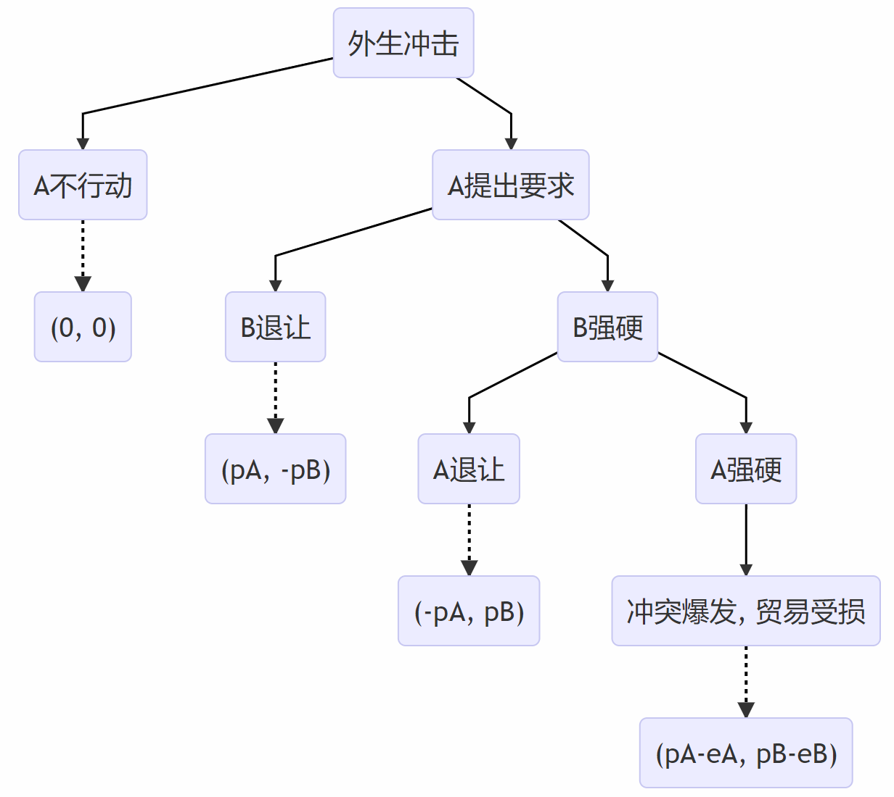

```{r global_options, include=FALSE}
knitr::opts_chunk$set(
  fig.width = 8, fig.asp = 0.618,
  out.width = "100%", fig.align = "center",
  fig.path = 'Figs/',fig.show = "asis",
  warning = FALSE, message = FALSE, 
  cache = T, cache.comments = F, comment = '', 
  options(digits = 4))
```
```{r setup, include=FALSE, cache=FALSE}
# use necessary packages
library('pacman')
p_load(tidyverse, reshape2, magrittr, readxl,
       ggthemes, showtext, ggrepel,
       lmtest, nycflights13, car, 
       rvest)

options(htmltools.dir.version = FALSE)

# 自定义偏好字体
pdf.options(family = "GB1")
windowsFonts(H = windowsFont("Microsoft YaHei"))
showtext_auto(enable = TRUE)
# 代码块需要fig.showtext=TRUE选项，ggplot2图形再加一行 + theme(text = element_text(family = 'H'))来定义字体，才能正常显示图中的中文。

# 自定义主题
mytheme <- theme_economist_white() +
  theme(text = element_text(family = 'H'),
        plot.title = element_text(face = 'bold', size = 14), 
        plot.subtitle = element_text(size = 12),
        plot.caption = element_text(hjust = 0, size = 10, margin = margin(2,0,0,0,'pt')),
        plot.margin = margin(12,10,12,0,'pt'),
        legend.position = 'top',
        legend.justification = 'left',
        legend.margin = margin(4,0,0,0,'pt'),
        legend.key.size = unit(1,'lines'),
        legend.title = element_text(size = 12),
        legend.text = element_text(size = 10, margin = margin(0,0,0,0,'pt')),
        axis.text = element_text(size = 10, margin = margin(2,0,2,0,'pt')),
        axis.ticks.length = unit(-4,'pt')
        )
```


layout: false
class: inverse, center, middle, animated, zoomIn

# 一 选题背景和意义

---

## 选题背景

.pull-left[

- 理论层面

  - 贸易依赖 $\Rightarrow$ 合作/冲突？

  - 近代国家兴起以来，国际政治经济学中最长久的争论之一
  
  - 自由主义学派 vs 现实主义学派

]

--

.pull-right[

- 实践层面

  - 20 世纪 90 年代以来，特别是中国加入 WTO 以来，中美经贸往来在两国关系中屡屡发挥“压舱石”的作用

  - 2017 年，风云突变；2021年，未见好转
  
  - 贸易依赖程度更深，抑制冲突的作用反而消失了

]

---

## 选题意义

.pull-left[

- 理论意义

  - 深入探究贸易依赖影响国家间冲突的路径和机制，为这个国际问题奠定结构化的国内基础
  
  - 对既有理论的整合和发展

]

--

.pull-right[

- 实践意义

  - 有助于使中美关系回到相向而行的轨道上
  
  - 有助于我国运用贸易杠杆建设更加友好的外部环境
  
  - 有助于推进人类命运共同体建设

]

---

layout: false
class: inverse, center, middle, animated, zoomIn

# 二 文献综述

---

## 不同学派的观点


- **现实主义**：贸易依赖或者不重要，或者会增加冲突的机率

  - 高度聚焦“power”概念，特别是相对实力，低估经济因素
  
--


- **自由主义**：贸易依赖会减少冲突的机率，最极端的发展是“商业和平论”或“贸易和平论”

  - 两次世界大战构成了该理论严峻的反例

--

- **贸易地位论**：不对称的贸易依赖加剧冲突。

  - “不对称”，一般指两国在贸易依赖中的敏感性和脆弱性不同。“敏感性”和“脆弱性”程度较低的国家将拥有相对优势的权力杠杆，来对“敏感性”和“脆弱性”程度较高的国家实施不对等的影响力。


---
## 经验事实

--
  
- 经验证据表明，事情远比想象的更复杂。有如下特征事实：

  - 贸易依赖程度与国家间冲突可能呈 $\cup$ 型
  
  - 贸易依赖的非对称性与国家间冲突可能呈 $\cap$ 型
  
  - 贸易依赖能够缩短冲突的持续时间
  
  - 贸易依赖能够降低冲突复发的概率
  
  - ......
  
--

- 如何将如此多的特征事实尽量整合到一个框架中？

--

- 本文的模型希望尽可能囊括更多的特征事实。

---

layout: false
class: inverse, center, middle, animated, zoomIn

# 三 研究内容

---

## 研究内容

- 影响方向（激励 or 抑制？）依赖于：

- 影响机制

  - 国内层面：产业部门 $\Rightarrow$ 利益集团 $\Rightarrow$ 主导利益集团

  - 国际层面：两国博弈 $\Rightarrow$ 主导利益集团的损益

---

### 博弈模型


.pull-left[



]

.pull-right[

1. 若 $eA>2pA$，均衡结果为 $(0,0)$，A 不行动

2. 若 $eA<2pA$ 且 $eB>2pB$，均衡结果为 $(pA, -pB)$，A 提出要求而 B 妥协

3. 若 $pA<eA<2pA$ 且 $eB<2pB$，均衡结果为 $(0,0)$，A 不行动 

4. 若 $eA<pA$ 且 $eB<2pB$，均衡结果为 $(pA-eA, pB-eB)$，冲突<sup>1</sup>爆发

]


.footnote[
[1] “冲突”并非专指战争。在现代条件下，制裁和脱钩也是一种冲突。
]

---
layout: false
class: inverse, center, middle, animated, zoomIn

# 四 研究框架

---

## 章节安排

- 第一章 导论 

- 第二章 文献综述

--

- 第三章 基本博弈模型（两国两部门）的构建
  - 推演出最基本的定性结论。
  - 贸易的发生如何在两国国内各自塑造观点相反的两大利益集团，以及哪一方会成为主导利益集团。
  - 因此，随着主导利益集团的更替，两国博弈的结果可能不同。

--

- 第四章 扩展博弈模型（三国多部门）的构建
  - 将两国之外的所有其余国家抽象为第三国。两国博弈的结果不仅受到两国产业结构的影响，还会受到第三国的影响。
  - 一般化的三方博弈过于复杂，拟探索求解特殊边界条件下的三方博弈，如第三方与其中一方始终保持战略协调等。

---

## 章节安排（续）

- 第五章 实证数据来源和变量选择 
  - 自变量一方的贸易数据、宏观经济数据和产业结构数据相对规范，但作为因变量一方的两国关系数据需要针对本文的研究环境进行评估和筛选。
  - 从数据到模型，还需要构建合适的代理变量。本章还将比较各种代理变量的优劣，评估其信度、效度，选择最优的代理变量。
  
- 第六章 实证分析
  - 使用多套数据，检验模型推论，如：1961年以来的全球军事冲突数据库；清华“大国关系季度数据库”，中国与其他国家的政治关系数据
  
- 第七章 中国运用贸易杠杆维护和平发展环境的战略
  - 通过反事实模拟，评估当前形势下，我国的对外贸易在主要贸易伙伴国产生的政治影响。
  - 针对不同国家的产业结构和主导利益集团，我国在贸易政策上应有不同的对策，以尽可能加强双边关系、营造良好的国际环境。
  
- 第八章为结论和展望。

---

layout: false
class: inverse, center, middle, animated, zoomIn

# 五 可能的创新点

---

## 创新之处


- 研究内容的创新。
  - 对于贸易依赖对国家间冲突的影响，既有的研究大多为非结构化的实证研究。少量以博弈论为基础的结构化研究，其贸易模型也是高度简化的，往往用贸易总量与GDP的比值作为相互依赖的代理变量。本文深入到国家内部，划分出利益集团，明确提出了主导利益集团的概念，认为主导利益集团的损益才是国际博弈中的关键因素，从而将对国际行为的分析建筑在坚实的国内基础之上。
  - 本文借用贸易理论中已有的成熟模型，建立了一个具有部门结构的一般均衡框架，由此更加细致地划分利益集团。


- 研究方法的创新。
  - 既有研究对利益集团的划分大多基于S-S定理，停留在粗浅的要素所有者层面，不能反映现实的复杂程度。本文构建了一个多部门模型，，认为部门和行业才是划分利益集团的更合适的标准。
  - 本文综合了理论建构、实证检验和反事实模拟，在方法上更加全面，并可以给出更具体的政策建议。

---

class: inverse, center, middle, animated, zoomInDown

# That's All. 

# Thank You!